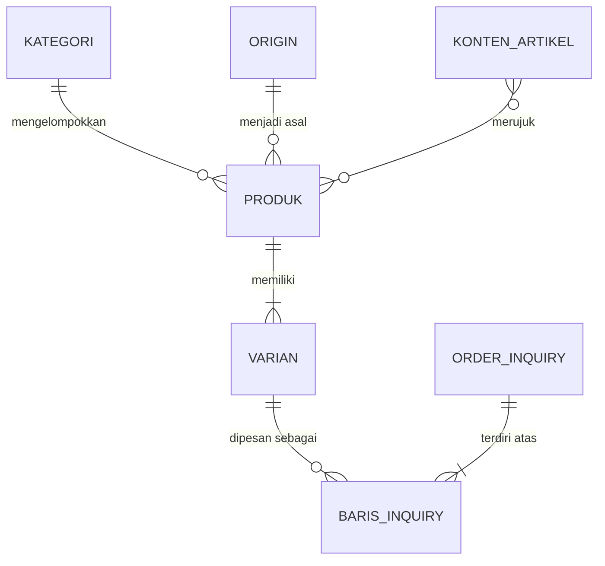

# 02 — Business Requirements Document (BRD)
## Titik Asal Kopi — Website titikasalkopi.id (Fase 1)

---

## 0. Kendali Dokumen

| Atribut | Isi |
|---|---|
| Judul dokumen | Business Requirements Document — Website titikasalkopi.id Fase 1 |
| Versi | **1.1** |
| Tanggal | 7 September 2026 |
| Penulis | Business Analyst |
| Pemberi persetujuan | CEO / Owner Titik Asal Kopi |
| Status | **Draft for Approval** (revisi v1.1 — menutup tiga open question penghambat rilis dan menjawab catatan arsitek) |
| Dokumen sumber | `docs/00-brand-brief.md` (sumber kebenaran brand, katalog, harga, keputusan CEO), `docs/00b-ceo-decisions.md` (keputusan D-01, D-02, D-03 di berkas itu — dirujuk di sini sebagai KD-01, KD-02, KD-03; mengalahkan BRD bila bertentangan), dan `docs/01-business-requirements-input.md` (input bisnis) |
| Masukan yang diserap | `docs/03-architecture.md` Bagian 16 "Catatan Arsitek" (CA-01 sampai CA-10) |
| Konvensi penomoran | Keputusan CEO pada `00b-ceo-decisions.md` bernomor D-01, D-02, dan D-03. Karena penomoran itu bertabrakan dengan dependensi D-01 sampai D-07 pada Bagian 14.2 dokumen ini, seluruh rujukan ke keputusan CEO ditulis **KD-01, KD-02, KD-03** — KD-01 = paket 3 pack satu origin, KD-02 = houseblend kelipatan 0,5 kg, KD-03 = jam balas 08.00–21.00 WIB. Tulisan `D-01` sampai `D-07` tanpa awalan KD selalu berarti dependensi Bagian 14.2 |
| Dokumen turunan | `docs/03-architecture.md`, `docs/04-frontend.md`, `docs/05-backend.md`, `docs/06-qa-test-plan.md` |
| Bahasa | Bahasa Indonesia |

### 0.1 Riwayat revisi

| Versi | Tanggal | Penulis | Perubahan |
|---|---|---|---|
| 0.1 | 5 September 2026 | Business Analyst | Kerangka awal dari input bisnis |
| 1.0 | 7 September 2026 | Business Analyst | Konsolidasi penuh, pemangkasan ruang lingkup Fase 1a, penomoran FR/NFR/BR, matriks keterlacakan |
| **1.1** | **7 September 2026** | **Business Analyst** | **Menutup OQ-01, OQ-02, dan OQ-07 sesuai `00b-ceo-decisions.md`; menurunkan aturan houseblend ke kelipatan 0,5 kg; menarik FR-49 ke Fase 1a; mengubah kriteria kontras warna menjadi aturan pemakaian yang dapat diuji; menyelesaikan pertentangan 11.1 vs NFR-12; menambahkan medan alias pencarian per produk** |

**Rincian perubahan v1.1** — setiap baris menyebut lokasi yang disunting dan alasannya. Dokumen selain baris-baris ini tidak diubah.

| # | Lokasi yang disunting | Perubahan | Alasan |
|---|---|---|---|
| C-01 | Bagian 16.2 (OQ-01, OQ-02, OQ-07); Bagian 0.2 | Ketiga open question ditandai **Tertutup** beserta keputusan dan tanggalnya, dan dikeluarkan dari daftar penghambat rilis | Ditutup CEO pada `00b-ceo-decisions.md`, 7 September 2026 |
| C-02 | BR-13, BR-17, FR-21, FR-08, Bagian 4 (Persona B), Bagian 5.2, Bagian 11.2 (contoh pesan), Bagian 12 (kriteria keranjang), Bagian 16.1 (US-18) | Aturan "minimum 1 kg, kelipatan 1 kg" diganti **minimum 0,5 kg, kelipatan 0,5 kg**, dengan harga 0,5 kg tepat setengah harga per kg | KD-02. Aturan 1 kg sudah dibatalkan; teks lama akan menghasilkan test case yang salah (CA-06) |
| C-03 | G-08 (cara ukur), BA-05 | Aritmetika nilai order ritel disesuaikan: order houseblend 0,5 kg mulai Rp87.500 kini masuk campuran order ritel, dan jalur "paket campur" yang dulu diandaikan menaikkan G-08 sudah ditutup KD-01 | Konsekuensi langsung KD-01 dan KD-02 terhadap asumsi KPI |
| C-04 | BR-11, FR-11, Bagian 12 (kriteria detail produk) | 3 pack ditegaskan **satu origin**, tanpa pemilih origin campur di UI, dan salinan teks kartu 3 pack menonjolkan penghematan | KD-01 |
| C-05 | FR-36, FR-26, FR-35, BR-19 (baru), Bagian 11.4, Bagian 12, A-01, D-04, R-03 | Jam balas WhatsApp ditetapkan **setiap hari 08.00–21.00 WIB** dan indikator "di luar jam balas" diwajibkan di Kontak, blok checkout keranjang, dan footer | KD-03 |
| C-06 | Bagian 12 (kriteria aksesibilitas), NFR-07, Bagian 12.1 (lampiran baru) | Kriteria "seluruh kombinasi warna brand memenuhi WCAG AA" diganti daftar pasangan warna yang disetujui, terbatas teks besar, dan dilarang | Kriteria lama terbukti mustahil dicentang (CA-02); palet brand tidak diubah, hanya aturan pemakaiannya |
| C-07 | FR-49, Bagian 5.2, Bagian 5.5, Bagian 7.8 (rekapitulasi), Bagian 13.1, Bagian 13.2, Bagian 16.1 (US-32) | Structured data `Product`, `Offer`, `Organization`, dan `BreadcrumbList` ditarik ke **Fase 1a**; `FAQPage` tetap Fase 1b | CA-03: biaya mendekati nol dan langsung melayani KPI G-05 dan G-06 yang diukur sejak bulan pertama |
| C-08 | FR-41, FR-44, BR-20 (baru), G-06, OQ-12 (baru) | Ditambahkan medan `searchTerms` (alias pencarian) per produk yang terpisah tegas dari atribut origin, dengan nilai alias wajib dikonfirmasi owner secara tertulis | CA-04: G-06 menargetkan "kopi Gayo" sementara tidak ada produk bernama Gayo, dan FR-07 melarang mengarang atribut origin |
| C-09 | Bagian 11.1, Bagian 10.1 (entitas Baris Inquiry) | Keranjang menyimpan hanya `{slug, variantId, qty}`; harga selalu di-resolve ulang saat render. Konsekuensinya dinyatakan terbuka | CA-01: BRD 11.1 lama bertentangan dengan NFR-12; NFR-12 dimenangkan |
| C-10 | Bagian 12 (kelengkapan katalog), Bagian 5.1, Bagian 5.3, BA-07, BA-08 | Angka "13 SKU / 13 produk" diperbaiki menjadi **10 halaman produk dan 23 varian jual** | Kontradiksi aritmetika yang ditemukan saat revisi: daftar pada kriteria penerimaan berjumlah 16 butir, bukan 13 |
| C-11 | Bagian 15 (BA-05 diperbarui; BA-12, BA-13, BA-14 baru) | Catatan kritis BA dibawa utuh; butir yang sudah terjawab diperbarui dan tiga butir baru ditambahkan | Catatan kritis tidak dihapus, hanya dimutakhirkan |
| C-12 | Bagian 0 (baris "Konvensi penomoran"); seluruh rujukan keputusan CEO di dokumen ini | Keputusan CEO dirujuk sebagai **KD-01, KD-02, KD-03**, bukan D-01…D-03 | Kontradiksi penomoran yang ditemukan saat revisi: `00b-ceo-decisions.md` memakai D-01…D-03 sementara Bagian 14.2 BRD sudah memakai D-01…D-07 untuk dependensi. Tanpa pemisahan ini, "D-02" bisa berarti dua hal yang berbeda dan QA akan salah menautkan test case |

### 0.2 Yang harus disetujui CEO pada dokumen ini

1. Pemangkasan ruang lingkup Fase 1a dan penurunan empat butir **Must** ke Fase 1b (Bagian 5.3).
2. Aturan bisnis pada Bagian 9, khususnya perlakuan bundling 3 pack, satuan pemesanan houseblend per 0,5 kg, dan makna ganda label "Signature/Reguler".
3. Perubahan v1.1 pada tabel di atas, khususnya penarikan FR-49 ke Fase 1a dan penggantian kriteria kontras warna pada Bagian 12.
4. Sisa keputusan terbuka pada Bagian 16.2. Setelah OQ-01, OQ-02, dan OQ-07 ditutup, **tidak ada lagi butir berstatus penghambat rilis**; yang tersisa menghambat Fase 1b atau kelengkapan konten, kecuali OQ-12 yang menentukan sah tidaknya satu kata kunci pada G-06.

---

## 1. Ringkasan Eksekutif

Titik Asal Kopi menjual kopi single origin dan houseblend lewat WhatsApp, Instagram, dan Shopee. Tidak satu pun dari ketiganya memuat katalog yang utuh dan permanen. Akibatnya calon pembeli tidak pernah melihat seluruh pilihan, varian bermargin baik jarang tertawarkan, dan waktu owner habis menjawab pertanyaan yang sama setiap hari. Cerita asal biji — yang justru membenarkan harga premium Rp125.000 per 200 gr — tidak punya tempat untuk diceritakan.

Website titikasalkopi.id dibangun bukan untuk menggantikan WhatsApp dan Shopee, melainkan menjadi lapisan informasi dan kualifikasi di depan keduanya. Pengunjung datang, melihat katalog lengkap beserta harga resmi, membaca asal-usul biji, menyusun pesanan di keranjang, lalu menekan satu tombol yang membuka WhatsApp dengan pesan pesanan yang sudah terisi rapi. Transaksi tetap ditutup di WhatsApp; tidak ada payment gateway di Fase 1 sesuai keputusan CEO.

Input bisnis menetapkan 22 user story berstatus **Must**. Sebagai Business Analyst saya menilai jumlah itu terlalu besar untuk satu rilis pertama sebuah roaster kecil, dan sebagian di antaranya terhambat oleh keputusan operasional yang belum diambil owner. Fase 1 karena itu dipecah menjadi dua rilis. **Fase 1a (MVP)** memuat apa yang benar-benar menghasilkan nilai sejak hari pertama: katalog lengkap, halaman detail produk dan origin, halaman houseblend dengan tabel rasio–harga untuk segmen kedai, keranjang dan alur pesan via WhatsApp, cerita brand, kontak, serta dasar SEO dan analitik. **Fase 1b** menyusul dua sampai tiga minggu kemudian dengan konten yang memerlukan keputusan owner: FAQ, kebijakan pengiriman, panduan cara seduh, filter katalog, penanda stok, serta blok kemitraan dan pesanan jumlah banyak.

Empat butir Must diturunkan ke Fase 1b: filter katalog, FAQ, kebijakan pengiriman, dan pelaporan analitik per produk. Tiga di antaranya diturunkan bukan karena mahal, melainkan karena isinya belum bisa ditulis tanpa keputusan owner — menerbitkan kebijakan pengiriman yang dikarang lebih berbahaya daripada tidak menerbitkannya sama sekali. Seluruh penurunan tercatat pada Bagian 5.3 lengkap dengan alasan; tidak ada satu pun kebutuhan yang dihilangkan diam-diam.

Ruang lingkup ini terdiri atas **50 kebutuhan fungsional (FR)**, **16 kebutuhan non-fungsional (NFR)** dengan angka target yang bisa diuji, dan **20 aturan bisnis (BR)** — dua di antaranya (BR-19 dan BR-20) ditambahkan pada revisi v1.1. Keberhasilan diukur dengan sepuluh KPI; yang paling menentukan adalah jumlah inquiry WhatsApp yang berasal dari website (target 120 chat per bulan pada bulan ke-6) dan tingkat konversi halaman produk ke klik tombol pesan (target 8%). Setiap KPI dalam dokumen ini dilengkapi cara ukur dan alat ukurnya, karena tanpa itu angka target hanya menjadi harapan.

Satu peringatan yang perlu CEO baca sekarang: sebagian target pertumbuhan organik dan target penghematan waktu owner saling bertentangan secara aritmetika, dan sebagian lagi terlalu optimistis untuk domain baru tanpa belanja iklan. Penjelasan lengkapnya ada pada Bagian 15 — "Catatan kritis dari BA".

---

## 2. Latar Belakang dan Pernyataan Masalah

### 2.1 Konteks bisnis

Titik Asal Kopi adalah roaster kopi specialty Indonesia dengan positioning kopi single origin dan houseblend dari titik terbaik di Indonesia, berfokus pada Indonesia Timur — Kupang NTT, Pegunungan Bintang dan Jayawijaya Papua — serta pilihan Nusantara dari Garut, Kerinci, dan Bener Meriah Aceh. Tagline brand adalah *"Pilih rasa, temukan asalnya, nikmati setiap momen."*

Penjualan hari ini berjalan di tiga kanal yang masing-masing pincang untuk perannya. WhatsApp (087777939567) menjadi kanal transaksi utama tetapi tidak punya etalase. Instagram (@Titikasalkopi) menjadi kanal awareness tetapi unggahannya tenggelam dan hanya memuat sebagian produk. Shopee (Titikasalkopi) menangani pembayaran dan pengiriman ritel tetapi tidak memuat seluruh varian houseblend per kilogram, yang justru merupakan lini bernilai order terbesar.

### 2.2 Pernyataan masalah

Tujuh masalah yang diangkat input bisnis pada dasarnya adalah tiga masalah struktural yang saling memperkuat.

**Masalah pertama — brand tidak punya etalase permanen, sehingga penjualan bergantung sepenuhnya pada waktu owner.** Katalog hanya hidup di kepala owner dan di pesan broadcast. Setiap percakapan dimulai dari nol dengan pertanyaan yang sama: harga berapa, ada apa saja, apa bedanya Abmisibil dan Sabin, bisa kirim ke luar kota, bisa minta digiling. Dampaknya berlapis: waktu produktif owner tersedot, respons melambat justru pada jam roasting, dan varian bermargin baik seperti BOLD 70:30 atau BRIGHT Signature jarang tertawarkan karena tidak pernah terlihat. Ini menggabungkan M-01 dan M-02 dari dokumen input.

**Masalah kedua — nilai jual utama brand tidak tersampaikan, sehingga produk premium bersaing seperti komoditas.** Yang membedakan Titik Asal Kopi adalah asal-usul biji: Abmisibil dari 1900 MASL dengan proses Natural Anaerob, Sabin Washed oleh Elias Kaladana, Pondok Baru Natural Classic oleh BBMC di 1400 MASL. Caption Instagram terlalu pendek untuk memuat itu. Pada segmen kedai masalahnya berbentuk lain tetapi berakar sama: pemilik kedai membutuhkan perbandingan rasio Arabica–Robusta beserta harga per kilogram untuk menghitung HPP per cangkir, dan informasi itu hanya tersedia lewat tanya-jawab manual sehingga siklus penjualan B2B menjadi panjang dan tidak konsisten. Ini menggabungkan M-03 dan M-04.

**Masalah ketiga — brand tidak punya alamat resmi yang bisa ditemukan dan diukur.** Pencarian "kopi Papua", "kopi Kupang", "kopi Gayo", atau "biji kopi roasted" tidak memunculkan Titik Asal Kopi, sehingga seluruh trafik bergantung pada Instagram dan rekomendasi mulut ke mulut tanpa pertumbuhan yang bisa diprediksi. Saat memperkenalkan diri ke kedai, calon reseller, atau pembeli korporat, tidak ada satu tautan yang membuktikan brand ini serius. Dan karena tidak ada properti digital milik sendiri, tidak ada satu pun data perilaku pembeli: produk mana yang paling dilihat, dari kota mana peminat terbanyak, kata kunci apa yang membawa orang datang. Keputusan roasting, stok, dan promosi karena itu diambil berdasarkan perkiraan. Ini menggabungkan M-05, M-06, dan M-07.

### 2.3 Peran website dalam memecahkan masalah

Website berperan sebagai lapisan informasi dan kualifikasi di depan kanal transaksi yang sudah berjalan, bukan penggantinya. Perannya ada lima: menjadi katalog resmi yang lengkap dan selalu tersedia; menjadi rumah cerita origin yang membenarkan harga premium; menjadi alat bantu jual segmen kedai lewat tabel rasio dan harga per kilogram; menjadi aset SEO lokal yang mendatangkan pembeli baru tanpa iklan; dan menjadi sumber data perilaku pembeli lewat analitik.

Sesuai keputusan CEO, transaksi Fase 1 tetap ditutup di WhatsApp dengan keranjang di sisi klien yang dikirim sebagai pesan terstruktur, dan Shopee tersedia berdampingan sebagai alternatif bagi pembeli yang lebih nyaman membayar di marketplace.

### 2.4 Definisi sukses secara kualitatif

Fase 1 dinyatakan berhasil apabila owner bisa membalas chat dengan satu tautan alih-alih mengetik ulang daftar harga; calon pembeli tiba di WhatsApp sudah tahu persis produk apa yang dia inginkan beserta variannya; dan owner sendiri bisa mengubah harga atau menambah varian tanpa memanggil developer.

---

## 3. Tujuan Bisnis dan KPI

Periode pengukuran adalah enam bulan sejak website tayang. Baseline berasal dari catatan operasional owner. Berbeda dengan dokumen input, setiap KPI di sini dilengkapi **cara ukur** yang bisa dieksekusi dan **alat ukur** yang konkret, karena target tanpa instrumen pengukuran tidak dapat diaudit pada akhir periode.

### 3.1 Alat ukur yang dipasang

| Alat | Fungsi | Fase |
|---|---|---|
| **Google Analytics 4 (GA4)** | Mencatat kunjungan halaman, tampilan produk, penambahan ke keranjang, dan klik tombol WhatsApp maupun Shopee sebagai event terstruktur | 1a |
| **Google Search Console (GSC)** | Mencatat tayangan, klik, posisi rata-rata, dan status indeks untuk kata kunci target | 1a |
| **Kode order pada badan pesan WhatsApp** | Menandai bahwa sebuah chat berasal dari website dan menautkannya ke satu sesi tertentu | 1a |
| **Buku order owner (spreadsheet)** | Mencatat setiap order beserta kolom sumber dan nilai order, untuk KPI yang tidak bisa diukur dari sisi web | 1a |
| **Laporan bulanan GA4 + GSC** | Peninjauan rutin oleh BA/owner setiap awal bulan | 1b |

**Catatan teknis penting tentang tautan `wa.me`.** Tautan `wa.me` membuka aplikasi WhatsApp, bukan halaman web. Parameter UTM tidak ikut dan tidak pernah sampai ke owner. Satu-satunya parameter yang berguna adalah `text`, yaitu isi pesan itu sendiri. Karena itu penanda sumber **ditanam di dalam badan pesan** (baris "Dikirim dari titikasalkopi.id" dan kode order `TAK-YYMMDD-XXXX`), sementara pengukuran di sisi web dilakukan lewat event GA4 yang dipicu tepat sebelum tautan dibuka. Dua jalur ini harus dipakai bersama: GA4 mengukur niat (klik), buku order mengukur hasil (order jadi).

### 3.2 Daftar KPI

| Kode | Tujuan | Baseline | Target bulan ke-3 | Target bulan ke-6 | Cara ukur | Alat ukur |
|---|---|---|---|---|---|---|
| **G-01** | Inquiry WhatsApp yang berasal dari website per bulan | 0 | 60 chat/bulan | 120 chat/bulan | Jumlah event `click_whatsapp_order` + `click_whatsapp_ask` + `click_whatsapp_b2b` per bulan, divalidasi silang dengan jumlah chat masuk yang memuat baris "Dikirim dari titikasalkopi.id" | GA4 (event kustom) + buku order owner |
| **G-02** | Total inquiry WhatsApp seluruh kanal per bulan | ± 70 chat/bulan | 130 chat/bulan | 180 chat/bulan | Hitungan manual chat baru per bulan pada buku order, dipilah kolom sumber (web / Instagram / Shopee / lain) | Buku order owner; label WhatsApp Business direkomendasikan |
| **G-03** | Conversion rate halaman produk ke klik tombol pesan/tanya | Belum terukur | 5% | 8% | `(sesi yang memicu minimal satu event klik WhatsApp) ÷ (sesi yang memicu minimal satu event view_item)` × 100. Dihitung per sesi, bukan per klik, agar klik ganda tidak menggelembungkan angka | GA4 — eksplorasi funnel `view_item` → `click_whatsapp_*` |
| **G-04** | Share of order yang berasal dari website | 0% | 15% dari jumlah order | 30% dari jumlah order | `(order dengan kolom sumber = web) ÷ (total order bulan itu)` × 100. Sebuah order ditandai "web" bila pesan pembukanya memuat kode order `TAK-…` atau baris penanda sumber | Buku order owner |
| **G-05** | Sesi organik dari Google per bulan | ± 0 | 400 sesi/bulan | 1.200 sesi/bulan | Jumlah sesi dengan channel group `Organic Search`, divalidasi dengan total klik pada GSC | GA4 + GSC (lihat catatan kritis BA-02) |
| **G-06** | Kata kunci target di halaman 1 Google | 0 | 1 kata kunci | 3 kata kunci | Posisi rata-rata ≤ 10 selama 28 hari terakhir untuk kueri: "kopi Papua", "kopi Kupang", "kopi Gayo", "biji kopi roasted", "houseblend kopi per kg". **Kueri "kopi Gayo" hanya sah dihitung bila owner mengonfirmasi alias pemasarannya lebih dulu (OQ-12, BR-20); bila tidak dikonfirmasi, kueri itu dicoret dari daftar dan target tetap 3 kata kunci dari empat kueri sisanya** | GSC — laporan Performance, filter per kueri |
| **G-07** | Kedai/B2B baru yang order pertama lewat jalur website | ± 1 kedai/bulan | 2 kedai/bulan | 4 kedai/bulan | Jumlah pelanggan B2B baru pada buku order yang chat pertamanya membawa kode order atau berasal dari CTA B2B | Buku order owner + GA4 event `click_whatsapp_b2b` |
| **G-08** | Rata-rata nilai order ritel | ± Rp125.000 | Rp180.000 | Rp210.000 | Total nilai order ritel dibagi jumlah order ritel per bulan. Dipantau bersama rasio pemilihan varian 3 pack dari parameter `item_variant` pada event `add_to_cart`. **Sejak KD-02, order houseblend 0,5 kg (mulai Rp87.500) ikut masuk hitungan order ritel dan menarik rata-rata ke bawah; order ritel houseblend karena itu dilaporkan terpisah dari order ritel single origin agar penurunan rata-rata tidak salah dibaca sebagai kegagalan (lihat BA-05)** | Buku order owner + GA4 |
| **G-09** | Waktu owner menjawab pertanyaan berulang | ± 8 jam/minggu | 5 jam/minggu | 3 jam/minggu | Pencatatan mandiri owner selama satu minggu sampel setiap bulan; dilaporkan juga dalam menit per chat agar tetap adil saat volume chat naik | Catatan owner (lihat catatan kritis BA-04) |
| **G-10** | Waktu update harga/produk oleh owner sendiri | Belum mungkin | ≤ 30 menit per perubahan | ≤ 15 menit per perubahan | Uji terukur: owner mengubah satu harga mengikuti panduan tertulis, dihitung dari membuka berkas data sampai perubahan tayang di situs produksi | Stopwatch pada sesi uji + waktu build Vercel |

### 3.3 Baseline yang perlu ditetapkan sebelum rilis

Baseline G-02 dan G-09 berasal dari estimasi, bukan pencatatan. Sebelum website tayang, owner perlu mencatat secara manual selama **satu bulan penuh** jumlah chat masuk dan estimasi waktu menjawab pertanyaan berulang. Tanpa itu, evaluasi bulan ke-6 tidak akan bisa membuktikan apa pun. Ini adalah dependensi bisnis, bukan pekerjaan teknis, dan dicatat sebagai D-05 pada Bagian 14.2.

Seluruh target G-05 dan G-06 mengasumsikan tidak ada belanja iklan berbayar pada Fase 1; pertumbuhan sepenuhnya organik ditambah dorongan dari Instagram.

---

## 4. Persona dan Prioritasnya

Empat persona diwarisi dari dokumen input dan tidak diubah substansinya. Yang ditambahkan di sini adalah konsekuensi ruang lingkupnya.

| Persona | Ringkasan | Yang harus disediakan Fase 1a | Prioritas |
|---|---|---|---|
| **A — Rani, home brewer** | 27 tahun, beli 200 gr tiap 3–4 minggu, menjelajah dari HP, takut salah beli kopi seharga Rp110.000–125.000 | Katalog dengan harga terlihat, detail origin lengkap (proses, ketinggian, varietas, catatan rasa), pilihan 1 pack / 3 pack satu origin (KD-01), pilihan houseblend mulai 0,5 kg (KD-02), keranjang, pesan WhatsApp otomatis | 1 — volume trafik terbesar, konversi tercepat |
| **B — Mas Dwi, pemilik kedai** | 34 tahun, beli 5–15 kg per bulan, membandingkan dua sampai tiga roaster, menghitung HPP per cangkir | Halaman houseblend dengan penjelasan tiga lini, tabel rasio–harga per kg yang terbaca di HP, konfigurator jumlah dengan kelipatan 0,5 kg (minimum 0,5 kg, KD-02), checkout WhatsApp bernuansa B2B | 2 — nilai order terbesar per transaksi |
| **C — Bu Lestari, pembeli hadiah/korporat** | 41 tahun, butuh 20–100 paket, terikat tanggal acara, tidak akrab istilah kopi | Beranda dan Cerita Kami tanpa jargon, kontak resmi yang jelas, URL produk yang bisa dibagikan ke atasan dengan pratinjau rapi | 3 — musiman, bernilai tinggi. Blok pesanan jumlah banyak menyusul di Fase 1b |
| **D — Yoga, reseller** | 29 tahun, punya toko daring kecil, butuh margin dan pasokan stabil | Cukup satu blok informasi kemitraan dengan CTA ke WhatsApp. Harga reseller tidak pernah ditampilkan | 4 — dilayani Fase 1b, tanpa fitur khusus |

Konsekuensi prioritas ini pada desain: seluruh keputusan tata letak dan performa Fase 1a dioptimalkan untuk Persona A di layar HP, dan halaman houseblend adalah satu-satunya halaman yang boleh berkompromi ke arah tampilan tabel padat demi Persona B.

---

## 5. Ruang Lingkup

### 5.1 Prinsip pemenggalan Fase 1

Input bisnis menetapkan 22 user story berstatus Must dan mensyaratkan rilis tidak diumumkan sebelum seluruh Must selesai. Diterapkan apa adanya, aturan itu menghasilkan rilis yang tertahan berminggu-minggu oleh butir-butir yang tidak menghasilkan penjualan dan sebagian bahkan tidak bisa ditulis tanpa keputusan owner yang belum ada. Sebagai Business Analyst saya mengusulkan pemenggalan Fase 1 menjadi dua rilis, dengan kriteria masuk Fase 1a yang tegas.

Sebuah kebutuhan masuk **Fase 1a** hanya jika memenuhi ketiga syarat berikut: (a) tanpanya pengunjung tidak bisa menemukan produk, memahami harganya, atau memesan — atau tanpanya website kehilangan kredibilitas dasar sebagai alamat resmi brand; (b) isinya dapat diselesaikan dengan data yang sudah pasti di `00-brand-brief.md`, tanpa menunggu keputusan operasional baru; dan (c) biaya pembuatannya sepadan dengan katalog berukuran **10 halaman produk dan 23 varian jual**, bukan katalog ratusan SKU.

Segala sesuatu yang gagal memenuhi salah satu syarat itu turun ke **Fase 1b** atau keluar dari ruang lingkup, dengan alasan tercatat.

### 5.2 In-scope Fase 1a (MVP)

Fase 1a menghasilkan website yang lengkap secara komersial: pengunjung bisa menemukan, memahami, dan memesan seluruh produk.

**Halaman yang tayang pada Fase 1a**

| Halaman | Isi inti |
|---|---|
| Beranda | Tagline, kalimat positioning, tombol utama ke katalog, sorotan single origin Signature, blok singkat untuk kedai, kanal resmi |
| Katalog | Seluruh produk, dikelompokkan per kategori, dengan nama, kategori, tier, harga, dan foto |
| Detail Single Origin (7 halaman) | Nama, daerah asal, proses, ketinggian, varietas, catatan rasa, harga 1 pack dan 3 pack, tombol pesan dan tanya, tautan Shopee |
| Houseblend (halaman lini + detail) | Tiga lini (BOLD, BRIGHT, Full Robusta), komposisi, catatan rasa, tabel rasio–harga per kg, konfigurator jumlah dengan kelipatan 0,5 kg |
| Cerita Kami | Asal-usul brand, alasan fokus Indonesia Timur dan Nusantara, kanal resmi |
| Kontak | WhatsApp, Instagram, Shopee, blok ekspektasi cara pesan, jam balas setiap hari 08.00–21.00 WIB beserta indikator di luar jam balas |
| Keranjang | Daftar item dengan varian dan jumlah, subtotal dan total, catatan pembeli, tombol Pesan via WhatsApp, alternatif Shopee |

**Kemampuan yang tayang pada Fase 1a**

Katalog lengkap dengan harga resmi yang terlihat tanpa membuka detail; halaman detail per produk dengan URL permanen yang bisa dibagikan; pemilihan varian dengan harga yang ikut berubah; keranjang sisi klien yang bertahan setelah halaman ditutup; konfigurator houseblend dengan kelipatan 0,5 kg mulai 0,5 kg; pembuatan pesan WhatsApp terstruktur berisi rincian pesanan, total, kode order, dan penanda sumber; tautan Shopee sebagai alternatif; blok ekspektasi pemesanan yang menyatakan ongkir dihitung saat konfirmasi; footer kanal resmi di seluruh halaman; tombol WhatsApp yang selalu terjangkau di layar HP; sumber data produk tunggal di repositori beserta panduan penyuntingan berbahasa Indonesia; serta dasar SEO dan analitik berupa metadata unik per halaman, sitemap, Open Graph, structured data `Product`, `Offer`, `Organization`, dan `BreadcrumbList` (FR-49, ditarik ke Fase 1a pada v1.1), GA4, dan pendaftaran Google Search Console.

### 5.3 Butir Must yang diturunkan ke Fase 1b — dan alasannya

Tidak ada kebutuhan yang dihilangkan. Empat butir berstatus Must pada dokumen input diturunkan ke Fase 1b dengan alasan berikut, dan penurunan ini memerlukan persetujuan CEO.

| User story | Judul | Status semula | Status baru | Alasan penurunan | Penambal di Fase 1a |
|---|---|---|---|---|---|
| **US-02** | Memfilter katalog berdasarkan kategori dan tier | Must | Should — Fase 1b | Katalog Fase 1 berisi 10 halaman produk (23 varian jual) dalam dua kategori. Pada ukuran ini, filter berfaset tidak memperbaiki penemuan produk secara berarti, tetapi menambah state UI, sinkronisasi URL, dan permukaan pengujian. Biayanya tidak sebanding dengan manfaatnya sebelum katalog tumbuh | Katalog Fase 1a dikelompokkan menjadi bagian Single Origin dan Houseblend dengan navigasi lompat di bagian atas (FR-03), sehingga pengunjung tetap sampai ke kelompok yang relevan dalam satu ketukan |
| **US-25** | Membaca FAQ | Must | Must — Fase 1b | Isi FAQ bergantung pada kebijakan yang belum ditetapkan owner: ongkir, metode pembayaran, ketentuan sampel, dan pilihan gilingan (lihat A-02, A-10, OQ-03). FAQ yang setengah terisi merusak kepercayaan lebih parah daripada tidak adanya FAQ. Hambatannya adalah keputusan bisnis, bukan kapasitas developer | Blok "Cara pesan dalam 4 langkah" beserta pernyataan bahwa ongkir dan total akhir dikonfirmasi lewat WhatsApp, dipasang di halaman Keranjang dan Kontak (FR-26) |
| **US-26** | Membaca kebijakan pengiriman | Must | Must — Fase 1b | Seluruh isi halaman ini berstatus `[ASUMSI]` pada dokumen input: wilayah layanan, kurir, estimasi proses, dan siapa menanggung ongkir semuanya belum diputuskan. Menerbitkan kebijakan yang dikarang menciptakan kewajiban yang tidak bisa dipenuhi dan berpotensi menjadi sengketa dengan pembeli | Sama seperti di atas: FR-26 menyatakan secara jujur bahwa ongkir dihitung dan disepakati saat konfirmasi WhatsApp, sehingga pembeli tidak terkejut |
| **US-31** | Melihat data pengunjung dan klik pesan | Must | Diturunkan **sebagian** — Fase 1b | Instrumentasi dasar tetap di Fase 1a karena KPI G-01, G-03, dan G-04 mustahil diukur tanpanya. Yang diturunkan adalah lapisan pelaporannya: eksplorasi per produk, dasbor ringkas, dan rutinitas laporan bulanan. Membangun pelaporan sebelum ada data yang masuk adalah pekerjaan tanpa objek | GA4 terpasang penuh dengan event `view_item`, `add_to_cart`, `click_whatsapp_order`, `click_whatsapp_ask`, dan `click_shopee` beserta parameter `product_id` (FR-47), sehingga data sudah terkumpul sejak hari pertama |

### 5.4 Penyesuaian ruang lingkup lain (bukan penundaan penuh)

Tiga butir tetap berada di Fase 1a tetapi dengan cakupan yang disederhanakan, dan satu butir justru dinaikkan.

| User story | Penyesuaian | Alasan |
|---|---|---|
| **US-17** | Aksi per baris pada tabel rasio BOLD disederhanakan: menekan sebuah baris memilih rasio pada konfigurator di bawah tabel, lalu satu tombol tambah ke keranjang — bukan enam kontrol jumlah yang berdiri sendiri per baris | Menghindari enam kontrol paralel pada layar sempit, yang justru merusak keterbacaan tabel — tujuan utama story ini |
| **US-20** | Penjelasan komposisi dan catatan rasa tiga lini tayang penuh di Fase 1a. "Panduan singkat penggunaan per lini" (cocok untuk kopi susu atau manual brew) menyusul di Fase 1b | Rekomendasi penggunaan berstatus `[ASUMSI]` dan harus divalidasi roaster. Klaim rasa yang salah pada segmen kedai merusak kredibilitas B2B |
| **US-29** | Sumber data tunggal dan panduan tertulis tayang di Fase 1a. Ditambahkan validasi data saat build (FR-43) yang tidak diminta dokumen input | Tanpa validasi otomatis, kesalahan ketik owner pada berkas data bisa menayangkan harga salah atau merusak build. Ini pengaman untuk NFR-12 |
| **US-13** | **Dinaikkan** dari Should ke Fase 1a | Persistensi keranjang di penyimpanan lokal peramban berbiaya sangat rendah dan mencegah hilangnya pesanan yang sudah disusun — kegagalan yang langsung memotong konversi Persona A yang berbelanja sambil di perjalanan |

### 5.5 Isi Fase 1b

FAQ; kebijakan pengiriman; panduan cara seduh; filter katalog kategori dan tier; pencarian nama dan daerah; produk terkait; pilihan biji utuh atau digiling beserta metode seduh; penanda produk sedang kosong; pernyataan kesegaran; CTA konsultasi dan permintaan sampel B2B; blok kemitraan reseller; blok pesanan jumlah banyak dan hadiah; structured data `FAQPage` (sisa FR-49 yang menunggu halaman FAQ-nya sendiri); serta pelaporan analitik per produk dan rutinitas laporan bulanan.

### 5.6 Out of scope Fase 1 (tegas, tidak dibuka ulang)

Butir-butir berikut **tidak dikerjakan** pada Fase 1a maupun 1b. Permintaan baru yang menyentuh daftar ini masuk antrean Fase 2 dan memerlukan persetujuan CEO.

| # | Tidak termasuk | Alasan |
|---|---|---|
| O-01 | Payment gateway, pembayaran online, konfirmasi pembayaran otomatis | Keputusan CEO. Volume belum membenarkan biaya dan kerumitan |
| O-02 | Akun pengguna, login, riwayat pesanan | Menambah hambatan; tidak dibutuhkan untuk checkout via WhatsApp |
| O-03 | Sistem manajemen stok real-time | Stok dikelola manual; cukup penanda "sedang kosong" pada Fase 1b |
| O-04 | CMS eksternal atau dasbor admin | Keputusan CEO: data produk cukup satu berkas sumber di repositori |
| O-05 | Program loyalitas, poin, voucher | Fitur spekulatif; dilarang keputusan CEO |
| O-06 | Langganan kopi bulanan | Fitur spekulatif; operasional belum siap |
| O-07 | Multi-mata uang dan penjualan ekspor | Pasar Fase 1 adalah Indonesia |
| O-08 | Situs dwibahasa (Inggris) | Bahasa utama situs adalah Bahasa Indonesia |
| O-09 | Kalkulator ongkir otomatis dan integrasi kurir | Ongkir dihitung manual saat konfirmasi WhatsApp |
| O-10 | Ulasan dan rating produk dari pembeli | Belum ada mekanisme verifikasi pembeli |
| O-11 | Blog atau artikel berkala | Menuntut komitmen produksi konten yang belum ada (lihat catatan kritis BA-02) |
| O-12 | Live chat di website selain WhatsApp | Menduplikasi kanal dan menambah beban balasan owner |
| O-13 | Katalog harga khusus reseller yang tampil publik | Harga kemitraan bersifat negosiasi |
| O-14 | Produk hampers atau gift box sebagai SKU tersendiri | Belum ada SKU resmi di brand brief |
| O-15 | Integrasi otomatis dengan Shopee | Cukup tautan manual ke toko Shopee |
| O-16 | Aplikasi seluler | Website mobile-first sudah menjawab kebutuhan |
| O-17 | Newsletter dan pengumpulan alamat email | Menambah kewajiban pengelolaan data pribadi tanpa manfaat jelas |
| O-18 | Fitur langganan roasting terjadwal untuk kedai | Operasional roasting belum siap |
| O-19 | Formulir kontak berbasis server dan penyimpanan data pembeli | Konsekuensi NFR-16: Fase 1 tidak menyimpan data pribadi di server; seluruh percakapan terjadi di WhatsApp |

---

## 6. Stakeholder dan RACI

### 6.1 Daftar stakeholder

| Peran | Siapa | Kepentingan utama | Wewenang keputusan |
|---|---|---|---|
| **CEO / Owner** | Pemilik Titik Asal Kopi | Penjualan naik, waktu terbebaskan, brand terlihat kredibel | Menyetujui BRD, harga, kebijakan pengiriman, ruang lingkup, dan rilis |
| **Business Analyst (BA)** | Penyusun dokumen ini | Kebutuhan konsisten, terlacak, dan realistis | Merumuskan FR/NFR/BR dan mengusulkan prioritas; tidak boleh mengubah harga atau keputusan CEO |
| **Arsitek** | Penyusun `03-architecture.md` | Struktur data, routing, dan strategi rendering yang mendukung SEO dan performa | Memutuskan pendekatan teknis dalam batas keputusan CEO (Next.js App Router, TypeScript, Tailwind, Vercel) |
| **Frontend Developer (FE)** | Penyusun `04-frontend.md` + kode `web/` | Antarmuka mobile-first, keranjang, generator pesan WhatsApp, aksesibilitas | Memutuskan implementasi komponen dan interaksi |
| **Backend Developer (BE)** | Penyusun `05-backend.md` + kode `web/` | Lapisan data produk, validasi build, metadata, sitemap | Memutuskan bentuk berkas data dan skema validasi |
| **QA** | Penyusun `06-qa-test-plan.md` | Bukti bahwa kriteria penerimaan terpenuhi | Memblokir rilis bila kriteria Bagian 11 tidak terpenuhi |
| **Admin toko / operator WhatsApp** | Owner sendiri pada Fase 1 | Membalas chat, mengonfirmasi ongkir dan total, mencatat order | Menentukan SOP balasan dan pencatatan order |

### 6.2 Matriks RACI

R = Responsible (mengerjakan), A = Accountable (bertanggung jawab akhir, satu orang), C = Consulted, I = Informed.

| Aktivitas | CEO | BA | Arsitek | FE | BE | QA | Admin toko |
|---|---|---|---|---|---|---|---|
| Menyetujui BRD dan ruang lingkup Fase 1a | **A/R** | R | C | I | I | I | C |
| Menetapkan harga dan katalog resmi | **A/R** | C | I | I | I | I | C |
| Menetapkan kebijakan pengiriman dan ketentuan sampel | **A/R** | R | I | I | I | I | C |
| Menyusun FR, NFR, BR, dan keterlacakan | I | **A/R** | C | C | C | C | I |
| Merancang arsitektur, model data, dan routing | I | C | **A/R** | C | C | I | I |
| Membangun antarmuka, keranjang, dan alur WhatsApp | I | C | C | **A/R** | C | C | I |
| Menyusun berkas data produk dan validasi build | I | C | C | C | **A/R** | C | I |
| Menyusun konten halaman (Cerita Kami, kontak) | C | **A/R** | I | R | I | C | C |
| Menyediakan foto produk | **A/R** | C | I | R | I | C | I |
| Memasang GA4, GSC, sitemap, dan metadata | I | C | C | R | **A/R** | C | I |
| Menguji kriteria penerimaan Fase 1a | I | C | C | C | C | **A/R** | C |
| Menyetujui rilis (go/no-go) | **A/R** | R | C | I | I | R | C |
| Membalas chat dan mencatat order pada buku order | **A** | C | I | I | I | I | **R** |
| Memperbarui harga dan status produk pasca-rilis | **A/R** | C | I | I | C | I | R |
| Memantau KPI bulanan | **A** | **R** | I | I | I | I | C |

---

## 7. Kebutuhan Fungsional

Penomoran `FR-xx` bersifat permanen dan menjadi acuan seluruh dokumen turunan. Kolom **Prioritas** memakai MoSCoW terhadap Fase 1 secara keseluruhan; kolom **Fase** menentukan rilis mana yang memuatnya. Kolom **Asal** menunjuk user story pada `01-business-requirements-input.md`; tanda "BA" menunjukkan kebutuhan yang ditambahkan Business Analyst sebagai konsekuensi analisis, bukan permintaan langsung bisnis.

### 7.1 Modul A — Katalog dan Penemuan Produk

| ID | Kebutuhan | Deskripsi | Prioritas | Fase | Asal |
|---|---|---|---|---|---|
| **FR-01** | Halaman katalog lengkap | Sistem menampilkan seluruh produk pada satu halaman katalog: tiga lini houseblend (BOLD dengan enam rasio, BRIGHT Signature dan Reguler, Full Robusta) dan tujuh single origin (Oelbiteno, Abmisibil, Sabin, Pyramid, Palimping, Kerinci, Pondok Baru). Katalog dapat dicapai maksimal satu ketukan dari beranda | Must | 1a | US-01 |
| **FR-02** | Kartu produk informatif | Setiap kartu produk menampilkan foto, nama, kategori, tier (bila berlaku), dan harga awal dalam format rupiah resmi, sehingga pengunjung tidak perlu membuka satu per satu untuk membandingkan | Must | 1a | US-01, US-03, US-10 |
| **FR-03** | Pengelompokan katalog dan navigasi lompat | Katalog disusun dalam dua bagian berjudul — Single Origin dan Houseblend — dengan tautan lompat di bagian atas halaman sehingga pengunjung mencapai kelompok yang relevan dalam satu ketukan | Must | 1a | US-01, US-02 (bentuk tereduksi) |
| **FR-04** | Filter kategori dan tier | Pengunjung dapat memfilter katalog berdasarkan kategori (Single Origin / Houseblend) dan tier (Signature / Reguler). Filter dapat digabungkan, dikosongkan dalam satu ketukan, dan hasilnya tampil tanpa memuat ulang halaman penuh | Should | 1b | US-02 |
| **FR-05** | Pencarian nama dan daerah asal | Pengunjung dapat mencari produk berdasarkan nama produk maupun nama daerah; pencarian tidak membedakan huruf besar-kecil (misalnya "Papua" memunculkan Abmisibil, Sabin, Pyramid). Hasil kosong menampilkan pesan beserta ajakan menghubungi WhatsApp | Could | 1b | US-04 |
| **FR-06** | Rekomendasi produk terkait | Halaman detail menampilkan dua sampai tiga produk lain dari kategori atau tier yang sama, tanpa mengulang produk yang sedang dibuka | Could | 1b | US-05 |

### 7.2 Modul B — Detail Produk dan Cerita Origin

| ID | Kebutuhan | Deskripsi | Prioritas | Fase | Asal |
|---|---|---|---|---|---|
| **FR-07** | Halaman detail single origin | Setiap single origin memiliki halaman detail yang memuat nama, daerah asal, proses, ketinggian (MASL), varietas, dan catatan rasa sejauh tersedia pada brand brief. Atribut yang belum tersedia (Oelbiteno, Pyramid, Palimping, Kerinci) **dikosongkan atau disembunyikan, tidak dikarang** | Must | 1a | US-06 |
| **FR-08** | Halaman houseblend per lini | Setiap lini houseblend memiliki halaman detail yang memuat komposisi, catatan rasa, daftar varian beserta harga per kilogram, dan konfigurator pemesanan berkelipatan 0,5 kg (FR-21) | Must | 1a | US-08, US-20 |
| **FR-09** | URL permanen dan mudah dibaca | Setiap produk memiliki URL sendiri berbasis slug yang bisa dibaca manusia dan tidak berubah meskipun urutan katalog berubah, sehingga tautan dapat dibagikan ke WhatsApp dan diteruskan ke atasan | Must | 1a | US-06, US-33 |
| **FR-10** | Catatan rasa sebagai label | Catatan rasa ditampilkan sebagai label pendek yang mudah dipindai, bukan paragraf. BOLD: choco, almond, caramel. BRIGHT: raisin, orange, lemon zest | Must | 1a | US-07 |
| **FR-11** | Pemilih varian dengan harga reaktif | Pengunjung memilih varian pada halaman detail dan harga yang ditampilkan langsung mengikuti pilihan: single origin 1 pack atau 3 pack; BOLD salah satu dari enam rasio; BRIGHT Signature atau Reguler. Varian terpilih terbawa ke keranjang dan ke pesan WhatsApp. **Varian 3 pack selalu berisi tiga kemasan dari origin yang sedang dibuka (BR-11, KD-01): antarmuka tidak boleh menyediakan pemilih origin campur dalam bentuk apa pun, dan salinan teks kartu maupun halaman 3 pack menonjolkan penghematan yang dihitung dari harga resmi (BR-10), bukan variasi origin** | Must | 1a | US-08, KD-01 |
| **FR-12** | Foto produk dan placeholder brand | Setiap produk menampilkan minimal satu foto dengan rasio aspek tetap agar tata letak tidak melompat saat gambar dimuat. Bila foto belum tersedia, ditampilkan placeholder bergaya brand, bukan gambar rusak | Must | 1a | US-10 |
| **FR-13** | Pilihan bentuk biji dan metode seduh | Pembeli dapat menyatakan biji utuh atau digiling, dan bila digiling memilih metode seduh dari daftar yang divalidasi owner. Pilihan ini ikut tertulis dalam pesan WhatsApp | Should | 1b | US-09 |
| **FR-14** | Penanda ketersediaan produk | Produk berstatus habis tetap tampil di katalog dengan label jelas, dan tombol pesannya berubah menjadi "Tanya ketersediaan". Medan data `status` sudah disediakan pada struktur data sejak Fase 1a agar perubahan Fase 1b bersifat tampilan saja | Should | 1b | US-30 |
| **FR-15** | Pernyataan kesegaran produk | Halaman produk memuat pernyataan kebijakan kesegaran sesuai praktik nyata roastery. Tanggal roasting spesifik per SKU tidak ditampilkan pada Fase 1 | Could | 1b | US-28 |

### 7.3 Modul C — Keranjang dan Checkout WhatsApp

| ID | Kebutuhan | Deskripsi | Prioritas | Fase | Asal |
|---|---|---|---|---|---|
| **FR-16** | Menambahkan produk ke keranjang | Produk beserta varian terpilih dapat ditambahkan ke keranjang dari halaman detail. Menambahkan produk dengan varian yang sama menambah jumlah pada baris yang ada, bukan membuat baris baru | Must | 1a | US-11 |
| **FR-17** | Indikator keranjang global | Jumlah item di keranjang terlihat pada header di seluruh halaman dan terbarui seketika saat isi keranjang berubah | Must | 1a | US-11 |
| **FR-18** | Mengubah isi keranjang | Jumlah tiap item dapat dinaikkan, diturunkan, atau item dihapus. Subtotal per baris dan total keseluruhan diperbarui seketika | Must | 1a | US-12 |
| **FR-19** | Keadaan keranjang kosong | Keranjang kosong menampilkan pesan yang ramah beserta ajakan kembali ke katalog | Must | 1a | US-12 |
| **FR-20** | Persistensi keranjang | Isi keranjang bertahan setelah halaman dimuat ulang atau peramban ditutup dan dibuka kembali pada perangkat yang sama, dengan masa simpan 7 hari lalu dikosongkan otomatis | Should (dinaikkan ke 1a) | 1a | US-13 |
| **FR-21** | Pemesanan houseblend dalam kelipatan 0,5 kg | Untuk houseblend, jumlah dipilih lewat konfigurator berkelipatan **0,5 kg** dengan nilai minimum **0,5 kg** (0,5 / 1 / 1,5 / 2 dan seterusnya); nilai default konfigurator adalah 1 kg dan tombol kurang nonaktif pada 0,5 kg. Harga 0,5 kg adalah **tepat setengah harga per kg**, dihitung dari harga per kg dan tidak pernah disimpan sebagai data terpisah (BR-13). Total dihitung otomatis — contoh: BOLD 60:40 sebanyak 5 kg = Rp1.000.000; BOLD 60:40 sebanyak 0,5 kg = Rp100.000; BOLD 50:50 sebanyak 1,5 kg = Rp292.500. Satuan ditulis apa adanya di keranjang dan pesan WhatsApp dengan koma desimal Indonesia ("0,5 kg", "1,5 kg"), tanpa satuan gram | Must | 1a | US-18, KD-02 |
| **FR-22** | Generator pesan WhatsApp dan deeplink | Tombol "Pesan via WhatsApp" membuka WhatsApp ke nomor resmi dengan pesan yang sudah terisi memuat daftar produk, varian, jumlah, harga satuan, subtotal per baris, total, catatan pembeli, kode order, dan penanda sumber. Struktur pesan lengkap didefinisikan pada Bagian 10 | Must | 1a | US-14 |
| **FR-23** | Catatan bebas untuk penjual | Keranjang menyediakan satu kolom catatan bebas (maksimal 200 karakter) yang ikut dikirim di dalam pesan WhatsApp, sehingga permintaan seperti tingkat gilingan, kota tujuan, atau kebutuhan hadiah tetap tersampaikan sebelum FR-13 tersedia | Must | 1a | US-14, US-09 (parsial), BA |
| **FR-24** | Kode order dan penanda sumber | Setiap pesan yang dihasilkan membawa kode order `TAK-YYMMDD-XXXX` yang dibuat di sisi klien dan baris penanda "Dikirim dari titikasalkopi.id", sehingga owner dapat memilah order yang berasal dari website untuk KPI G-01, G-04, dan G-07 | Must | 1a | BA (pendukung US-31) |
| **FR-25** | Alternatif pembelian lewat Shopee | Tautan ke toko Shopee tersedia pada halaman produk, halaman keranjang, dan footer; terbuka di tab baru dan memicu event analitik agar dapat dihitung | Must | 1a | US-15 |
| **FR-26** | Blok ekspektasi pemesanan | Halaman keranjang dan kontak memuat blok "Cara pesan dalam 4 langkah" beserta pernyataan tegas bahwa ongkir dan total akhir dikonfirmasi lewat WhatsApp dan pembayaran tidak dilakukan di website. Blok checkout pada halaman keranjang juga memuat janji jam balas **setiap hari 08.00–21.00 WIB** beserta indikator di luar jam balas (BR-19, FR-36) | Must | 1a | US-26 (parsial), mitigasi R-05, KD-03 |

### 7.4 Modul D — Segmen Kedai (B2B)

| ID | Kebutuhan | Deskripsi | Prioritas | Fase | Asal |
|---|---|---|---|---|---|
| **FR-27** | Penjelasan tiga lini houseblend | Halaman houseblend menjelaskan karakter dan komposisi tiap lini: BOLD (Arabica Natural dan Fine Robusta Natural; choco, almond, caramel), BRIGHT (Full Arabica natural dan washed; raisin, orange, lemon zest), dan Full Robusta, sehingga perbedaannya terbaca tanpa bertanya | Must | 1a | US-20 |
| **FR-28** | Tabel rasio dan harga per kilogram | Seluruh rasio BOLD beserta harga per kg tampil dalam satu tabel: 70:30 Rp210.000, 60:40 Rp200.000, 50:50 Rp195.000, 40:60 Rp190.000, 30:70 Rp185.000, 20:80 Rp175.000; ditambah BRIGHT Signature Rp260.000, BRIGHT Reguler Rp230.000, dan Full Robusta Rp175.000. Tabel terbaca di layar sempit tanpa memaksa halaman menggeser ke samping | Must | 1a | US-17 |
| **FR-29** | Aksi memilih rasio dari tabel | Menekan sebuah baris tabel memilih rasio tersebut pada konfigurator jumlah berkelipatan 0,5 kg (FR-21) di bawahnya, yang kemudian dapat ditambahkan ke keranjang atau ditanyakan lewat WhatsApp | Must | 1a | US-17, US-18 |
| **FR-30** | CTA konsultasi blend dan permintaan sampel | Halaman houseblend memuat ajakan khusus B2B yang mengarah ke WhatsApp dengan pesan pembuka bernuansa kedai, serta penjelasan singkat prosedur permintaan sampel sesuai ketentuan yang ditetapkan owner | Should | 1b | US-19 |

### 7.5 Modul E — Konten Edukasi dan Kepercayaan

| ID | Kebutuhan | Deskripsi | Prioritas | Fase | Asal |
|---|---|---|---|---|---|
| **FR-31** | Halaman Cerita Kami | Halaman memuat positioning, tagline, alasan fokus Indonesia Timur dan Nusantara, cara memilih origin, dan kanal resmi. Tidak memuat klaim sertifikasi, penghargaan, jumlah pelanggan, atau kapasitas produksi yang belum terbukti | Must | 1a | US-23 |
| **FR-32** | Halaman FAQ | FAQ mencakup minimal: cara memesan, metode pembayaran, pengiriman dan ongkir, kesegaran dan tanggal roasting, pilihan gilingan, pesanan per kg untuk kedai, pesanan jumlah banyak, dan kemitraan reseller. Setiap jawaban diakhiri jalan keluar ke WhatsApp | Must | 1b | US-25 |
| **FR-33** | Halaman kebijakan pengiriman | Halaman menjelaskan wilayah layanan, kurir, estimasi waktu proses roasting hingga kirim, cara ongkir dihitung, dan penanganan barang rusak; serta menyatakan bahwa pembayaran dikonfirmasi lewat WhatsApp | Must | 1b | US-26 |
| **FR-34** | Halaman cara seduh | Minimal tiga metode dijelaskan dengan rasio kopi-air, tingkat gilingan, suhu air, dan langkah singkat, memakai parameter yang disediakan owner atau roaster. Halaman dapat dijangkau dari halaman detail produk | Should | 1b | US-24 |

### 7.6 Modul F — Kontak dan Inquiry B2B

| ID | Kebutuhan | Deskripsi | Prioritas | Fase | Asal |
|---|---|---|---|---|---|
| **FR-35** | Kanal resmi di footer setiap halaman | Nomor WhatsApp 087777939567, Instagram @Titikasalkopi, dan toko Shopee Titikasalkopi tampil di footer seluruh halaman, disertai janji jam balas "Setiap hari, 08.00–21.00 WIB" dan indikator di luar jam balas (FR-36) | Must | 1a | US-27, KD-03 |
| **FR-36** | Halaman kontak dan jam balas WhatsApp | Halaman kontak memuat seluruh kanal resmi, blok ekspektasi pemesanan (FR-26), dan janji jam balas WhatsApp **setiap hari, 08.00–21.00 WIB** sesuai keputusan KD-03. Di luar rentang itu, situs menampilkan indikator berbunyi **"Di luar jam balas — pesan tetap masuk dan dibalas mulai pukul 08.00 WIB"**. Status jam balas dihitung dari waktu lokal pengunjung yang dikonversi ke WIB (UTC+7, tanpa DST) dan ditentukan di sisi klien setelah halaman dimuat, sehingga halaman tetap statis dan dapat di-cache. Pukul 08.00.00 WIB sudah termasuk di dalam jam balas; pukul 21.00.00 WIB sudah di luar. Janji dan indikator ini tampil di tiga tempat: halaman Kontak, blok checkout halaman Keranjang, dan footer (BR-19) | Must | 1a | US-27, KD-03 |
| **FR-37** | Tombol WhatsApp yang selalu terjangkau | Tersedia tombol WhatsApp yang mudah dijangkau ibu jari pada layar HP tanpa menutupi isi halaman atau menghalangi tombol utama | Must | 1a | US-27 |
| **FR-38** | Tanya produk tertentu | Setiap halaman detail memiliki tombol "Tanya produk ini" yang membuka WhatsApp dengan pesan pembuka menyebut nama produk dan varian yang sedang dilihat | Must | 1a | US-16 |
| **FR-39** | Blok kemitraan reseller | Tersedia blok atau halaman kemitraan yang menjelaskan bahwa kemitraan dibuka dan cara menghubunginya, dengan CTA WhatsApp bernuansa kemitraan. Harga reseller tidak ditampilkan | Should | 1b | US-21 |
| **FR-40** | Blok pesanan jumlah banyak dan hadiah | Tersedia blok yang menjelaskan jalur permintaan penawaran untuk pesanan jumlah banyak, termasuk informasi yang sebaiknya disiapkan pembeli (jumlah, tanggal acara, kota tujuan), dengan CTA WhatsApp yang membawa konteks tersebut | Should | 1b | US-22 |

### 7.7 Modul G — Pengelolaan Konten Mandiri (Admin)

| ID | Kebutuhan | Deskripsi | Prioritas | Fase | Asal |
|---|---|---|---|---|---|
| **FR-41** | Sumber data produk tunggal | Seluruh data produk, varian, harga, dan atribut origin berada pada satu berkas sumber di repositori (TypeScript/JSON) yang dibaca seluruh halaman, sesuai keputusan CEO. Tidak ada harga yang ditulis langsung pada komponen tampilan. Berkas sumber juga memuat medan **`searchTerms`** per produk — daftar alias pencarian untuk keperluan metadata SEO — yang terpisah tegas dari medan atribut origin dan tunduk pada BR-20 | Must | 1a | US-29, BA (CA-04) |
| **FR-42** | Panduan pengelolaan katalog | Tersedia panduan langkah demi langkah dalam Bahasa Indonesia untuk mengubah harga, menambah produk baru, menonaktifkan produk, dan mengganti foto, ditulis untuk pembaca non-teknis dan disertai contoh nyata | Must | 1a | US-29 |
| **FR-43** | Validasi data saat build | Proses build memeriksa berkas data dan gagal secara eksplisit bila ada produk tanpa harga, slug ganda, tier tidak dikenal, atau harga bukan bilangan bulat rupiah, sehingga kesalahan ketik tidak pernah tayang ke publik | Must | 1a | BA (pengaman NFR-12, US-29) |

### 7.8 Modul H — SEO dan Analytics

| ID | Kebutuhan | Deskripsi | Prioritas | Fase | Asal |
|---|---|---|---|---|---|
| **FR-44** | Metadata unik per halaman | Setiap halaman memiliki judul dan deskripsi meta yang unik; halaman produk memuat nama daerah asal pada judul dan deskripsinya (misalnya "Abmisibil — Kopi Papua, Pegunungan Bintang"). Metadata halaman produk boleh memakai alias pencarian dari medan `searchTerms` (FR-41) **hanya untuk alias yang sudah dikonfirmasi owner secara tertulis** (BR-20, OQ-12); alias tidak boleh muncul sebagai atribut origin pada badan halaman, karena FR-07 melarang mengarang atribut origin | Must | 1a | US-32, BA (CA-04) |
| **FR-45** | Sitemap dan keterindeksan | Situs menyediakan `sitemap.xml` yang memuat seluruh halaman produk dan konten, serta `robots.txt` yang mengizinkan pengindeksan. Setiap halaman memiliki URL kanonis | Must | 1a | US-32 |
| **FR-46** | Pratinjau tautan saat dibagikan | Setiap halaman menyediakan Open Graph dan Twitter Card berisi judul, deskripsi, dan gambar yang benar, sehingga tautan yang dibagikan di WhatsApp dan Instagram tampil sebagai kartu pratinjau, bukan teks polos | Must | 1a | US-32, NF-05 |
| **FR-47** | Instrumentasi analitik dasar | GA4 terpasang dan mencatat kunjungan halaman serta event: `view_item_list`, `view_item`, `select_variant`, `add_to_cart`, `view_cart`, `click_whatsapp_order`, `click_whatsapp_ask`, `click_whatsapp_b2b`, dan `click_shopee`. Event klik membawa parameter `product_id`, `variant`, `source_page`, `cart_value`, dan `order_code` bila tersedia. `click_whatsapp_order` ditandai sebagai konversi | Must | 1a | US-31 |
| **FR-48** | Pendaftaran Google Search Console | Domain titikasalkopi.id terverifikasi di GSC dan sitemap telah dikirimkan, sehingga G-05 dan G-06 dapat diukur sejak bulan pertama | Must | 1a | US-32 |
| **FR-49** | Structured data produk dan organisasi | Halaman produk menyertakan structured data `Product` dan `Offer` beserta `BreadcrumbList`; beranda menyertakan `Organization`. Bagian ini **dinaikkan ke Fase 1a pada v1.1** atas rekomendasi arsitek (CA-03): seluruh datanya sudah tersedia pada berkas data produk sehingga biayanya mendekati nol, sementara rich result harga di hasil pencarian langsung melayani KPI G-05 dan G-06 yang diukur sejak bulan pertama. `FAQPage` tetap Fase 1b karena halaman FAQ-nya sendiri baru tayang di Fase 1b (FR-32) | Must | 1a (`FAQPage` 1b) | US-32, CA-03 |
| **FR-50** | Pelaporan analitik per produk | Tersedia laporan atau eksplorasi tersimpan yang menampilkan tampilan halaman dan klik tombol pesan per produk, beserta rutinitas peninjauan bulanan bersama owner | Must | 1b | US-31 |

**Rekapitulasi (v1.1):** 50 FR. Fase 1a memuat **37 FR**; Fase 1b memuat **13 FR** (FR-04, FR-05, FR-06, FR-13, FR-14, FR-15, FR-30, FR-32, FR-33, FR-34, FR-39, FR-40, FR-50). FR-49 berpindah dari Fase 1b ke Fase 1a, kecuali bagian `FAQPage` yang mengikuti FR-32 di Fase 1b.

---

## 8. Kebutuhan Non-Fungsional

Setiap NFR dinyatakan dengan angka target yang dapat diuji dan metode pengujiannya. NFR tanpa angka tidak bisa dinyatakan lulus atau gagal, karena itu seluruh pernyataan kualitatif pada dokumen input diterjemahkan menjadi ambang yang terukur. Kecuali disebutkan lain, seluruh pengujian dilakukan pada profil perangkat baseline yang didefinisikan di NFR-06.

| ID | Kebutuhan | Target terukur | Cara uji | Asal |
|---|---|---|---|---|
| **NFR-01** | Kecepatan muat halaman utama | Largest Contentful Paint (LCP) ≤ **2,5 detik** dan Interaction to Next Paint (INP) ≤ **200 ms** pada beranda, katalog, dan halaman detail produk, diukur pada profil "Slow 4G" (throttling 1,6 Mbps turun / 750 kbps naik, RTT 150 ms) dengan CPU throttling 4×. Time to First Byte ≤ 600 ms | Lighthouse mobile pada mode lab; dipantau lanjut lewat data lapangan Core Web Vitals di GSC setelah trafik cukup | NF-01 |
| **NFR-02** | Stabilitas tata letak | Cumulative Layout Shift (CLS) ≤ **0,05** pada seluruh halaman. Seluruh gambar memiliki dimensi atau rasio aspek eksplisit sehingga halaman tidak melompat saat gambar dimuat | Lighthouse mobile; pemeriksaan manual dengan pemuatan gambar diperlambat | NF-01, US-10 |
| **NFR-03** | Berat halaman | Total transfer halaman beranda dan katalog ≤ **600 KB** (terkompresi) pada pemuatan pertama, dengan JavaScript awal ≤ **150 KB** terkompresi. Setiap gambar produk ≤ **150 KB**, disajikan dalam format modern (WebP atau AVIF) dan ukuran responsif | Panel Network peramban dengan cache dikosongkan; laporan ukuran bundel saat build | NF-01 |
| **NFR-04** | Skor Lighthouse (mobile) | Performance ≥ **90**, Accessibility ≥ **95**, Best Practices ≥ **95**, SEO ≥ **95** pada beranda, katalog, satu halaman detail single origin, halaman houseblend, dan keranjang | Lighthouse versi stabil terbaru, mode mobile, tiga kali jalan dan diambil nilai median | NF-01, NF-04 |
| **NFR-05** | Kenyamanan pada layar HP | Tidak ada penggeseran horizontal pada lebar viewport **320 px sampai 1920 px**. Seluruh target sentuh berukuran minimal **44 × 44 px** dengan jarak antar target minimal 8 px. Tabel rasio–harga terbaca penuh pada lebar 360 px, dan bila memerlukan geser, area gesernya ditandai secara visual | Uji pada peramban dengan lebar 320, 360, 390, 768, dan 1280 px; pengukuran target sentuh | NF-02, US-17 |
| **NFR-06** | Kompatibilitas peramban dan perangkat | Berfungsi penuh pada Chrome Android dan Safari iOS dua versi mayor terakhir, serta Chrome, Edge, dan Firefox desktop dua versi terakhir. Perangkat baseline pengujian: **HP Android kelas menengah** setara Snapdragon seri 6xx, RAM 4 GB, Android 11 — profil ini yang dipakai untuk menilai NFR-01 | Uji manual pada satu perangkat fisik kelas menengah plus emulasi perangkat pada peramban | NF-01, NF-02 |
| **NFR-07** | Aksesibilitas | Memenuhi **WCAG 2.1 level AA** minimal untuk: rasio kontras teks normal ≥ **4,5:1**, teks besar ≥ **3:1** (≥ 24 px reguler atau ≥ 18,66 px tebal), dan komponen antarmuka non-teks ≥ **3:1**. Yang diuji adalah **seluruh kombinasi warna yang benar-benar dipakai di situs**, sesuai ukuran teksnya, mengikuti daftar pasangan yang disetujui pada Bagian 12.1 — bukan seluruh kombinasi palet yang mungkin dibentuk, karena sebagian pasangan palet memang gagal secara aritmetika dan karena itu dilarang dipakai; seluruh fungsi dapat dioperasikan dengan papan ketik saja tanpa jebakan fokus; indikator fokus terlihat jelas; setiap gambar produk memiliki teks alternatif deskriptif; struktur heading berurutan tanpa melompati tingkat; formulir dan tombol memiliki nama yang dapat dibaca pembaca layar | Pemeriksaan otomatis (axe atau Lighthouse Accessibility) tanpa pelanggaran serius, ditambah pengujian manual navigasi papan ketik pada alur beli lengkap | BA (memperkuat NF-02, NF-09) |
| **NFR-08** | Ketersediaan layanan | Uptime bulanan ≥ **99,5%** pada domain titikasalkopi.id. Gangguan terdeteksi dan memicu pemberitahuan ke owner dalam ≤ **5 menit** lewat pemantauan berkala | Laporan pemantauan uptime bulanan | NF-06 |
| **NFR-09** | Keamanan transport | Seluruh trafik memakai HTTPS dengan pengalihan otomatis dari HTTP; sertifikat berlaku dan diperbarui otomatis; tidak ada konten campuran (mixed content) | Pemeriksaan header dan konsol peramban; Lighthouse Best Practices | NF-10 |
| **NFR-10** | Keterindeksan dan berbagi tautan | 100% halaman produk terindeks Google dalam **30 hari** sejak sitemap dikirim. Pratinjau tautan tampil benar di WhatsApp, Instagram, dan Facebook | GSC laporan Coverage; uji tempel tautan nyata di WhatsApp | NF-04, NF-05 |
| **NFR-11** | Konsistensi identitas brand | Seluruh warna dan tipografi mengambil dari token desain yang bersumber pada palet brand brief: cream `#F9F4EE` sebagai dasar halaman, hijau `#0E251F` sebagai primary, keluarga cokelat-rust untuk produk, gold hanya sebagai aksen dan tidak pernah sebagai warna teks normal maupun latar tombol berlabel teks normal (Bagian 12.1). **Nol** nilai warna yang ditulis langsung di luar berkas token, dan **nol** penambahan atau penggelapan warna baru di luar palet brand brief | Tinjauan kode dan pemeriksaan visual terhadap brand brief | NF-07 |
| **NFR-12** | Akurasi harga | **100%** harga dan nama produk di situs identik dengan `00-brand-brief.md`. Build gagal bila ada produk tanpa harga atau data tidak valid. Setiap perubahan harga wajib melewati pemeriksaan silang dua mata (owner dan satu pemeriksa) sebelum tayang | Skrip validasi saat build (FR-43) + daftar periksa rilis Bagian 12 | NF-08 |
| **NFR-13** | Kemudahan pembaruan mandiri | Owner dapat mengubah satu harga mengikuti panduan tertulis dalam ≤ **15 menit** tanpa bantuan, dan perubahan tayang otomatis dalam ≤ **5 menit** setelah disimpan | Uji terukur bersama owner sebelum rilis (juga mengukur G-10) | NF-03 |
| **NFR-14** | Kemudahan pemesanan tanpa hambatan | Tidak ada langkah wajib membuat akun, masuk, atau mengisi formulir panjang. Dari halaman detail produk sampai WhatsApp terbuka maksimal **3 ketukan** | Pengukuran jumlah ketukan pada alur beli Persona A dan Persona B | NF-09 |
| **NFR-15** | Keandalan pesan WhatsApp | Pesan yang dihasilkan tidak melebihi **1.500 karakter** setelah pengodean URL dan tetap utuh serta terbaca rapi pada WhatsApp Android, WhatsApp iOS, dan WhatsApp Web. Bila keranjang menghasilkan pesan lebih panjang, sistem meringkas rincian dan menyertakan tautan keranjang | Uji kirim nyata pada minimal tiga kombinasi perangkat dan versi WhatsApp (mitigasi R-04) | BA (mitigasi R-04, US-14) |
| **NFR-16** | Perlindungan data pribadi | Website tidak menyimpan nama, alamat, nomor telepon, atau data pribadi pembeli di server mana pun. Keranjang hanya berada di penyimpanan lokal peramban pengunjung. Analitik dikonfigurasi tanpa data identitas dan dengan anonimisasi IP; tersedia pemberitahuan singkat penggunaan analitik | Tinjauan kode dan konfigurasi GA4; pemeriksaan penyimpanan peramban | NF-10, NF-11 |

---

## 9. Aturan Bisnis

Aturan bisnis mengikat seluruh dokumen turunan dan implementasi. Bila terjadi perbedaan antara aturan di sini dan tampilan mana pun, aturan ini yang menang; bila terjadi perbedaan antara aturan ini dan `00-brand-brief.md`, brand brief yang menang.

### 9.1 Harga dan format

| ID | Aturan |
|---|---|
| **BR-01** | Seluruh nama produk, harga, dan detail origin diambil persis dari `00-brand-brief.md`. Website tidak memperkenalkan produk, harga, varian, atau lokasi baru. Bila terjadi selisih, brand brief adalah sumber kebenaran dan situs wajib dikoreksi |
| **BR-02** | Format rupiah: awalan `Rp` tanpa spasi, pemisah ribuan berupa titik, tanpa angka desimal, tanpa spasi sebelum satuan — contoh `Rp210.000`. Harga per kilogram ditulis dengan sufiks `/kg` dan harga kemasan ditulis dengan konteks jumlah pack, contoh `Rp350.000 / 3 pack` |
| **BR-03** | Tidak ada pembulatan yang dilakukan sistem. Seluruh harga resmi katalog merupakan kelipatan Rp5.000, dan seluruh perhitungan (jumlah × harga satuan) menghasilkan bilangan bulat rupiah. Perhitungan memakai bilangan bulat rupiah, bukan pecahan desimal, agar tidak muncul selisih pembulatan. Konsekuensi KD-02: harga turunan 0,5 kg adalah tepat setengah harga per kg sehingga sebagian di antaranya merupakan kelipatan **Rp2.500** (contoh Rp97.500 dan Rp87.500) — itu tetap bilangan bulat rupiah dan tidak boleh dibulatkan ke atas maupun ke bawah |
| **BR-04** | Tidak ada produk yang boleh ditampilkan tanpa harga. Produk yang belum berharga resmi tidak masuk katalog |
| **BR-05** | Website tidak menampilkan diskon, promo, kupon, atau harga coret pada Fase 1, kecuali penghematan bundling yang dihitung dari harga resmi (BR-09) |
| **BR-06** | Harga di website adalah harga resmi yang berlaku untuk semua pembeli ritel. Owner tidak memberikan harga berbeda lewat chat untuk transaksi ritel. Negosiasi harga hanya dimungkinkan pada jalur B2B dan kemitraan, dan hasilnya tidak pernah ditampilkan di website |
| **BR-07** | Harga khusus reseller dan kemitraan tidak ditampilkan di website dalam bentuk apa pun |

### 9.2 Single origin: kemasan, tier, dan bundling

| ID | Aturan |
|---|---|
| **BR-08** | Seluruh single origin dijual dalam kemasan **200 gr**. Tidak ada ukuran kemasan lain pada Fase 1 |
| **BR-09** | Tier **Signature** mencakup origin Indonesia Timur: Oelbiteno (Kupang NTT), Abmisibil, Sabin, dan Pyramid (Papua), dengan harga Rp125.000 per 1 pack dan Rp350.000 per 3 pack. Tier **Reguler** mencakup pilihan Nusantara: Palimping (Garut), Kerinci (Jambi), dan Pondok Baru (Bener Meriah, Aceh), dengan harga Rp110.000 per 1 pack dan Rp310.000 per 3 pack |
| **BR-10** | Harga 3 pack adalah **harga paket**, bukan kelipatan harga satuan. Penghematan yang boleh ditampilkan dihitung dari harga resmi: Signature hemat **Rp25.000** (3 × Rp125.000 = Rp375.000 menjadi Rp350.000) dan Reguler hemat **Rp20.000** (3 × Rp110.000 = Rp330.000 menjadi Rp310.000). Angka penghematan tidak boleh ditulis manual di konten; harus dihitung dari data harga |
| **BR-11** | Satu paket 3 pack berisi **tiga kemasan 200 gr dari origin yang sama**. Paket campur antar-origin **tidak ditawarkan di website** dan antarmuka tidak boleh menyediakan pemilih origin campur; permintaan campur diarahkan ke percakapan WhatsApp sebagai penanganan manual. Salinan teks kartu dan halaman 3 pack menonjolkan penghematan (BR-10), bukan variasi origin. (**Ditutup keputusan CEO KD-01, 7 September 2026** — sebelumnya menunggu OQ-01) |
| **BR-12** | Kelipatan 3 pack diperlakukan sebagai jumlah paket, bukan konversi otomatis. Pembeli yang memilih 6 kemasan memilih 2 × paket 3 pack; sistem tidak mengonversi 3 × 1 pack menjadi harga paket secara otomatis, agar pesan yang diterima owner mencerminkan pilihan pembeli apa adanya |

### 9.3 Houseblend: satuan, rasio, dan penamaan

| ID | Aturan |
|---|---|
| **BR-13** | Houseblend dijual dalam satuan **kilogram** dengan minimum **0,5 kg** per varian dan kelipatan **0,5 kg** (0,5 / 1 / 1,5 / 2 dan seterusnya). Tidak ada kemasan houseblend eceran di bawah 0,5 kg pada Fase 1. Harga 0,5 kg adalah **tepat setengah harga per kg**, tanpa premium kemasan kecil dan tanpa pembulatan sistem — seluruh harga katalog habis dibagi dua ke kelipatan Rp500: BOLD 70:30 Rp105.000, 60:40 Rp100.000, 50:50 Rp97.500, 40:60 Rp95.000, 30:70 Rp92.500, 20:80 Rp87.500, BRIGHT Signature Rp130.000, BRIGHT Reguler Rp115.000, dan Full Robusta Rp87.500. Harga per kg tetap **satu-satunya angka yang disimpan** pada berkas data; harga 0,5 kg selalu dihitung dan tidak boleh ditulis ulang sebagai data terpisah. Kuantitas disimpan sebagai bilangan bulat "jumlah setengah kilo" agar tidak ada aritmetika pecahan pada uang. (**Ditutup keputusan CEO KD-02, 7 September 2026** — menggantikan aturan lama "minimum 1 kg, kelipatan 1 kg" yang sudah dibatalkan; sebelumnya menunggu OQ-02) |
| **BR-14** | Lini BOLD wajib memilih salah satu dari enam rasio Arabica:Robusta, masing-masing dengan harga per kg tersendiri: 70:30 Rp210.000, 60:40 Rp200.000, 50:50 Rp195.000, 40:60 Rp190.000, 30:70 Rp185.000, 20:80 Rp175.000. Rasio adalah varian wajib; tidak ada BOLD tanpa rasio |
| **BR-15** | Label **Signature** dan **Reguler** memiliki dua makna berbeda dan tidak boleh dicampur. Pada single origin, keduanya adalah **tier** yang menentukan harga dan wilayah asal serta dipakai sebagai kriteria filter. Pada lini BRIGHT, keduanya adalah **nama varian blend** (Signature Rp260.000/kg, Reguler Rp230.000/kg) dan **tidak** ikut dalam filter tier katalog. Antarmuka wajib membedakan keduanya secara visual dan tekstual |
| **BR-16** | Full Robusta berharga Rp175.000/kg, sama dengan BOLD 20:80. Keduanya adalah produk berbeda dan wajib dibedakan lewat deskripsi komposisi dan catatan rasa, tidak boleh disajikan seolah pilihan yang setara demi menghindari kebingungan pembeli kedai |
| **BR-17** | Pemesanan B2B tidak memiliki minimum order khusus di luar minimum **0,5 kg** per varian pada BR-13 (turun dari 1 kg mengikuti KD-02). Ketentuan permintaan sampel — jumlah, berbayar atau gratis, dan penanggung ongkir — belum ditetapkan dan tidak boleh dituliskan di website sebelum diputuskan owner. Permintaan penawaran hadiah atau korporat diarahkan ke WhatsApp dan diminta menyertakan jumlah, tanggal acara, dan kota tujuan; ambang minimum untuk jalur ini adalah **20 paket**. (Menunggu konfirmasi OQ-03 dan OQ-04) |

### 9.4 Pemesanan dan ketersediaan

| ID | Aturan |
|---|---|
| **BR-18** | Website tidak menerima pembayaran dan tidak menghitung ongkir. Setiap total yang ditampilkan adalah **subtotal produk, belum termasuk ongkos kirim**, dan pernyataan itu wajib muncul di keranjang serta di dalam pesan WhatsApp yang dikirim. Total akhir ditetapkan owner pada percakapan WhatsApp. Produk berstatus habis tetap tampil di katalog dengan label jelas, dan tombol pesannya berubah menjadi "Tanya ketersediaan" (berlaku sejak Fase 1b) |
| **BR-19** | Janji balas WhatsApp yang ditulis di website adalah **setiap hari, 08.00–21.00 WIB** (KD-03). Website tidak boleh menuliskan janji balas lain, termasuk "balas cepat", "balas 24 jam", atau rentang jam yang berbeda per halaman. Di luar rentang tersebut, situs wajib menampilkan indikator "di luar jam balas" dengan pesan bahwa chat tetap masuk dan dibalas mulai pukul 08.00 WIB. Perhitungan status memakai zona WIB (UTC+7), bukan zona perangkat pengunjung; pukul 08.00.00 termasuk di dalam jam balas dan pukul 21.00.00 sudah di luar |
| **BR-20** | Alias pencarian pada medan `searchTerms` (FR-41) adalah **kata kunci pemasaran, bukan atribut origin**. Alias tidak boleh ditampilkan sebagai daerah asal, proses, ketinggian, atau varietas pada badan halaman produk, dan tidak boleh dipakai bila owner belum mengonfirmasinya secara tertulis. Contoh yang menjadi alasan aturan ini: Pondok Baru tercatat pada brand brief sebagai Bener Meriah, Aceh, sementara kata kunci target G-06 adalah "kopi Gayo" — kata yang tidak pernah ditulis brand brief. Nilai alias yang **diusulkan dan menunggu konfirmasi owner** untuk Pondok Baru adalah `["kopi Gayo", "kopi Aceh", "kopi Bener Meriah"]` (OQ-12). Selama belum dikonfirmasi, alias itu tidak dipakai dan kata kunci "kopi Gayo" dicoret dari G-06 |

---

## 10. Model Data Konseptual Tingkat Bisnis

Bagian ini menggambarkan entitas bisnis dan hubungannya, bukan skema basis data. Fase 1 tidak memakai basis data: seluruh data produk berada pada satu berkas sumber di repositori sesuai keputusan CEO, dan Order Inquiry hanya hidup sementara di peramban pengunjung.



### 10.1 Penjelasan entitas

| Entitas | Makna bisnis | Atribut tingkat bisnis | Contoh |
|---|---|---|---|
| **Kategori** | Pengelompokan besar katalog yang menentukan cara produk ditampilkan dan dipesan | Nama kategori, satuan jual (pack 200 gr atau kilogram), urutan tampil | Single Origin; Houseblend |
| **Origin / Titik Asal** | Tempat asal biji beserta cerita yang membenarkan harga premium. Inti dari positioning brand dan sumber utama kata kunci SEO lokal | Nama titik asal, desa/pegunungan, kabupaten, provinsi, ketinggian (MASL), proses pascapanen, varietas, nama petani atau prosesor bila ada | Pegunungan Bintang, Papua — 1900 MASL — Natural Anaerob — Arabica Bourbon & Typica |
| **Produk** | Satu barang yang dijual dan memiliki halaman sendiri di website | Nama, slug URL, kategori, tier (Signature/Reguler, hanya untuk single origin), lini (BOLD/BRIGHT/Full Robusta, hanya untuk houseblend), catatan rasa, deskripsi, daftar foto, status ketersediaan | Abmisibil; Houseblend BOLD |
| **Varian** | Bentuk konkret yang dibeli beserta harganya. Setiap produk memiliki satu atau lebih varian, dan **harga selalu melekat pada varian, bukan pada produk** | Label varian, satuan (pack atau kg), jumlah dasar, harga | "3 pack" Rp350.000; "60:40" Rp200.000/kg |
| **Order Inquiry** | Kumpulan barang yang disusun pengunjung untuk dikirim ke WhatsApp. Bersifat sementara, tersimpan di peramban pengunjung, tidak pernah dikirim ke server | Kode order, waktu dibuat, catatan pembeli, subtotal, halaman asal, penanda sumber | TAK-260907-4KP2 |
| **Baris Inquiry** | Satu baris pesanan di dalam Order Inquiry | Hanya **produk (slug), varian, dan jumlah**. Harga satuan dan subtotal baris **tidak disimpan**, melainkan diambil ulang dari katalog setiap kali baris ditampilkan atau dipakai menyusun pesan (Bagian 11.1, NFR-12) | Abmisibil — 3 pack — 1 paket (harga di-resolve saat tampil: Rp350.000) |
| **Konten Artikel** | Halaman konten non-produk yang mendukung kepercayaan dan SEO: Cerita Kami, FAQ, kebijakan pengiriman, cara seduh | Judul, slug, ringkasan, isi, produk yang dirujuk, metadata SEO | "Cara Seduh V60"; "Kebijakan Pengiriman" |

### 10.2 Aturan hubungan

Satu **Kategori** membawahi banyak **Produk**, dan setiap Produk hanya masuk satu Kategori. Satu **Origin** dapat menjadi asal beberapa Produk, dan setiap single origin merujuk tepat satu Origin; houseblend tidak wajib merujuk Origin karena merupakan campuran. Satu **Produk** wajib memiliki minimal satu **Varian** — konsekuensi langsung BR-04, karena harga hanya ada pada Varian, sehingga produk tanpa varian berarti produk tanpa harga dan tidak boleh tayang. Satu **Order Inquiry** terdiri atas satu atau lebih **Baris Inquiry**, dan setiap Baris menunjuk tepat satu Varian. **Konten Artikel** dapat merujuk banyak Produk dan sebaliknya, misalnya panduan V60 yang merekomendasikan beberapa single origin.

Dua konsekuensi penting untuk tim teknis. Pertama, harga tidak boleh disimpan pada tingkat Produk; halaman katalog yang menampilkan "harga mulai" mengambil nilai terkecil dari daftar Varian. Kedua, Order Inquiry tidak memiliki identitas di sisi server, sehingga pelacakan order sepenuhnya bergantung pada kode order yang tercetak di dalam pesan WhatsApp dan disalin owner ke buku order (Bagian 11.4).

---

## 11. Alur Checkout WhatsApp

Checkout WhatsApp adalah satu-satunya jalur transaksi yang dibangun pada Fase 1 dan karena itu didefinisikan secara eksplisit di sini. Tidak ada bagian sistem lain yang boleh menghasilkan pesan pesanan dengan format berbeda.

### 11.1 Alur langkah demi langkah

1. Pengunjung menyusun keranjang dari halaman detail produk. Setiap baris menyimpan **hanya tiga hal: slug produk, id varian, dan jumlah** (`{slug, variantId, qty}`). Harga **tidak** ikut disimpan; ia diambil ulang dari katalog terbaru setiap kali keranjang ditampilkan dan setiap kali pesan WhatsApp disusun.

   **Konsekuensi yang harus dipahami owner dan QA:** bila harga sebuah produk berubah sementara item itu masih tersimpan di keranjang pengunjung — keranjang bertahan sampai 7 hari (FR-20) — maka pada kunjungan berikutnya **pengunjung melihat harga yang baru**, bukan harga saat ia memasukkan item. Subtotal dan pesan WhatsApp ikut memakai harga baru, tanpa pemberitahuan khusus. Ini keputusan yang disengaja: alternatifnya adalah pesan pesanan berisi harga usang yang harus dikoreksi owner lewat chat, yang justru pekerjaan manual yang ingin dihapus proyek ini. Aturan ini memenangkan NFR-12 (100% harga di situs identik dengan brand brief) atas kenyamanan "harga terkunci", dan menutup pertentangan yang diangkat arsitek pada CA-01. Bila sebuah varian dihapus dari katalog, barisnya dikeluarkan dari keranjang beserta pemberitahuan yang terbaca pengunjung.
2. Di halaman keranjang, pengunjung meninjau isi, mengubah jumlah bila perlu, dan boleh mengisi satu kolom catatan bebas maksimal 200 karakter.
3. Pengunjung menekan tombol **"Pesan via WhatsApp"**. Sistem membuat kode order `TAK-YYMMDD-XXXX` (`YYMMDD` tanggal lokal pembeli, `XXXX` empat karakter acak alfanumerik huruf besar), menyusun teks pesan, dan mengirim event GA4 `click_whatsapp_order` beserta parameter `cart_value`, `cart_items`, `order_code`, dan `source_page`.
4. Sistem membuka `https://wa.me/6287777939567?text=<pesan terkode URL>` di tab baru. Nomor bisnis 087777939567 ditulis dalam format internasional 6287777939567 karena `wa.me` hanya menerima format itu.
5. Aplikasi WhatsApp pembeli terbuka dengan pesan sudah terisi. Pembeli menekan kirim. Website tidak pernah mengirim pesan atas nama pembeli dan tidak menyimpan data apa pun ke server.
6. Owner menerima pesan lengkap, membalas mengikuti SOP pada 11.3, lalu mencatat order pada buku order.

### 11.2 Isi pesan yang dihasilkan

Pesan disusun dalam Bahasa Indonesia, memakai baris kosong sebagai pemisah blok agar tetap terbaca di WhatsApp seluler maupun WhatsApp Web. Panjangnya dibatasi 1.500 karakter setelah pengodean URL sesuai NFR-15.

**Struktur pesan**

| Blok | Isi | Wajib |
|---|---|---|
| Salam pembuka | Sapaan singkat dan pernyataan maksud memesan | Ya |
| Kode order | `Kode order: TAK-YYMMDD-XXXX` | Ya |
| Rincian pesanan | Satu baris per item: nomor urut, nama produk, varian, jumlah beserta satuan, harga satuan, dan subtotal baris | Ya |
| Subtotal | Total seluruh baris dalam format rupiah resmi | Ya |
| Pernyataan ongkir | Kalimat tegas bahwa subtotal belum termasuk ongkos kirim dan total akhir dikonfirmasi lewat chat (BR-18) | Ya |
| Catatan pembeli | Isi kolom catatan bila diisi; blok dihilangkan bila kosong | Tidak |
| Penanda sumber | `Dikirim dari titikasalkopi.id` beserta URL halaman asal | Ya |

**Contoh pesan yang dihasilkan** (keranjang berisi Abmisibil 3 pack dan Houseblend BOLD 60:40 sebanyak 1,5 kg — kuantitas houseblend sengaja memakai kelipatan 0,5 kg agar formatnya tidak menyisakan tafsir):

```
Halo Titik Asal Kopi, saya ingin memesan:

Kode order: TAK-260907-4KP2

1. Abmisibil (Single Origin, Signature)
   Varian: 3 pack (200 gr)
   Jumlah: 1 paket x Rp350.000
   Subtotal: Rp350.000

2. Houseblend BOLD
   Varian: 60% Arabica : 40% Robusta
   Jumlah: 1,5 kg x Rp200.000/kg
   Subtotal: Rp300.000

Subtotal pesanan: Rp650.000
(Belum termasuk ongkos kirim. Total akhir dikonfirmasi lewat chat.)

Catatan: tolong digiling untuk V60, kirim ke Bandung.

Dikirim dari titikasalkopi.id
https://titikasalkopi.id/keranjang
```

**Aturan penulisan jumlah pada pesan.** Satuan ditulis persis seperti yang dipilih pengunjung: `1 pack`, `3 pack`, `1 paket` untuk single origin, dan `0,5 kg`, `1 kg`, `1,5 kg`, `5 kg` untuk houseblend — koma desimal Indonesia, tanpa konversi ke gram, dan tanpa membulatkan 0,5 kg menjadi 1 kg. Contoh baris houseblend minimum: `Jumlah: 0,5 kg x Rp200.000/kg` dengan `Subtotal: Rp100.000`. Seluruh harga pada pesan diambil dari katalog **pada saat tombol ditekan**, bukan pada saat item dimasukkan ke keranjang (Bagian 11.1).

Untuk tombol **"Tanya produk ini"** (FR-38), pesan jauh lebih pendek dan tidak membawa kode order karena belum ada pesanan:

```
Halo Titik Asal Kopi, saya ingin bertanya tentang Abmisibil (Single Origin, Signature) — Rp125.000 / 1 pack.

Dikirim dari titikasalkopi.id
https://titikasalkopi.id/produk/abmisibil
```

Untuk CTA B2B pada halaman houseblend (FR-30, Fase 1b), pesan pembuka menyebut konteks kedai dan lini yang sedang dilihat, sehingga owner langsung tahu percakapan ini bernilai order per kilogram.

### 11.3 Data yang ikut dan yang tidak ikut

Yang ikut dalam pesan: nama produk, kategori dan tier, label varian, jumlah beserta satuan, harga satuan, subtotal per baris, subtotal pesanan, catatan pembeli, kode order, penanda sumber, dan URL halaman asal.

Yang **tidak** ikut dan tidak boleh ikut: nama, alamat, nomor telepon, atau data pribadi pembeli lainnya — identitas pembeli otomatis diketahui owner dari akun WhatsApp pengirim, sehingga meminta ulang data itu di website hanya menambah hambatan dan kewajiban perlindungan data (NFR-16, O-19). Ongkos kirim juga tidak ikut karena tidak dihitung website (O-09, BR-18).

Perlu dipahami tim teknis dan owner: **parameter UTM tidak dapat dilewatkan lewat `wa.me`**. Tautan itu membuka aplikasi WhatsApp, bukan halaman web, sehingga satu-satunya muatan yang sampai ke owner adalah teks pesan. Karena itu penanda sumber dan kode order harus berada di dalam badan pesan, dan pengukuran di sisi web dilakukan lewat event GA4 sebelum tautan dibuka.

### 11.4 Respons admin dan pelacakan order

**SOP balasan admin (owner atau operator WhatsApp).** Balasan pertama dikirim di dalam jam balas yang dijanjikan website — **setiap hari, 08.00–21.00 WIB** (KD-03, BR-19). Chat yang masuk di luar rentang itu dibalas mulai pukul 08.00 WIB hari berikutnya, sesuai bunyi indikator yang dilihat pengunjung; janji ini melekat pada brand, bukan pada ketersediaan satu orang, sehingga bila admin berhalangan, balasan otomatis WhatsApp Business wajib menyampaikan hal yang sama (lihat BA-12 dan R-03). Balasan pertama memuat lima hal, dengan urutan: konfirmasi ketersediaan setiap item; konfirmasi rincian pesanan termasuk rasio atau tier yang diminta; ongkos kirim berdasarkan kota tujuan; total akhir; dan instruksi pembayaran beserta perkiraan waktu roasting sampai barang dikirim. Bila salah satu item habis, admin menawarkan penggantian yang setara sebelum membatalkan baris tersebut. Untuk order kedai, admin menambahkan tawaran jadwal roasting dan pengulangan order bulanan.

**Pelacakan order.** Karena Fase 1 tidak memiliki basis data pesanan, pelacakan sepenuhnya dilakukan pada buku order milik owner — sebuah spreadsheet dengan kolom minimum berikut, yang menjadi satu-satunya sumber untuk KPI G-02, G-04, G-07, dan G-08.

| Kolom | Isi | Dipakai untuk |
|---|---|---|
| Tanggal chat masuk | Tanggal pesan pertama diterima | G-02 |
| Kode order | Disalin dari pesan, misalnya `TAK-260907-4KP2`. Dikosongkan bila chat tidak berasal dari website | G-01, G-04 |
| Sumber | web / Instagram / Shopee / rujukan / lainnya. Diisi "web" bila pesan memuat kode order atau baris penanda sumber | G-01, G-02, G-04 |
| Segmen | ritel single origin / ritel houseblend / kedai (B2B) / hadiah-korporat / reseller. Pemisahan dua segmen ritel diwajibkan sejak KD-02 agar order houseblend 0,5 kg tidak mengaburkan pembacaan G-08 | G-07, G-08 |
| Isi pesanan | Ringkasan produk dan varian | Analisis produk terlaris |
| Nilai order final | Nilai setelah konfirmasi, di luar ongkir | G-08 |
| Status | menunggu konfirmasi / dibayar / dikirim / selesai / batal | Operasional |

Kode order menjadi jembatan antara data web dan data penjualan: setiap kode yang muncul di buku order pasti berasal dari satu klik `click_whatsapp_order` yang tercatat di GA4. Selisih antara jumlah klik di GA4 dan jumlah kode di buku order adalah angka drop-off yang berguna — ia menunjukkan berapa banyak pengunjung yang membuka WhatsApp tetapi tidak jadi menekan kirim, dan menjadi bahan perbaikan pada peninjauan bulanan.

---

## 12. Kriteria Penerimaan Tingkat Proyek (Definition of Done Fase 1a)

Daftar berikut dipakai QA sebagai daftar periksa go/no-go. Rilis Fase 1a hanya diumumkan bila **seluruh** butir tercentang. Butir yang gagal dan tidak dapat diperbaiki sebelum tanggal rilis harus diangkat ke CEO sebagai keputusan eksplisit, bukan diabaikan.

**Kelengkapan katalog dan data**

- [ ] Seluruh produk brand brief tayang di katalog: **10 halaman produk** — tiga lini houseblend (BOLD, BRIGHT, Full Robusta) dan tujuh single origin — yang mencakup **23 varian jual**: BOLD 6 rasio, BRIGHT 2 varian, Full Robusta 1 varian, serta 7 single origin masing-masing dengan varian 1 pack dan 3 pack.
- [ ] Setiap harga di situs identik dengan `00-brand-brief.md`, diverifikasi baris per baris oleh dua orang.
- [ ] Tidak ada produk yang tayang tanpa harga; build gagal bila ada data tidak lengkap (FR-43).
- [ ] Format rupiah seluruh situs sesuai BR-02, tanpa satu pun pengecualian.
- [ ] Tidak ada atribut origin yang dikarang; atribut yang belum tersedia disembunyikan, bukan diisi perkiraan.
- [ ] Seluruh produk memiliki foto atau placeholder bergaya brand; tidak ada gambar rusak.

**Detail produk dan navigasi**

- [ ] Setiap produk memiliki URL slug permanen yang dapat dibagikan dan dibuka langsung.
- [ ] Katalog dapat dicapai satu ketukan dari beranda; kedua kelompok kategori dapat dicapai lewat navigasi lompat.
- [ ] Memilih varian mengubah harga yang ditampilkan seketika, dan varian terpilih terbawa sampai ke pesan WhatsApp.
- [ ] Tabel rasio BOLD terbaca pada layar selebar 360 px tanpa memaksa halaman menggeser ke samping.
- [ ] Varian 3 pack tidak menyediakan pemilih origin campur di mana pun pada antarmuka; salinan teks 3 pack menampilkan penghematan yang dihitung dari harga resmi (Signature Rp25.000, Reguler Rp20.000), bukan janji variasi origin (BR-11, KD-01).

**Keranjang dan checkout**

- [ ] Menambahkan produk dengan varian sama menambah jumlah pada baris yang ada, bukan membuat baris baru.
- [ ] Jumlah dapat diubah dan item dapat dihapus; subtotal dan total terbarui seketika dan hasilnya benar secara aritmetika (diuji minimal lima kombinasi keranjang).
- [ ] Konfigurator houseblend menerima nilai berkelipatan 0,5 kg dengan minimum 0,5 kg dan menolak nilai di bawah atau di antara kelipatan itu; tombol kurang nonaktif pada 0,5 kg.
- [ ] Harga 0,5 kg tepat setengah harga per kg untuk **kesembilan varian houseblend** (Rp105.000, Rp100.000, Rp97.500, Rp95.000, Rp92.500, Rp87.500, Rp130.000, Rp115.000, Rp87.500), tanpa pembulatan.
- [ ] Contoh perhitungan lain benar: BOLD 60:40 sebanyak 5 kg = Rp1.000.000; BOLD 50:50 sebanyak 1,5 kg = Rp292.500.
- [ ] Jumlah houseblend ditulis sebagai "0,5 kg" / "1,5 kg" di keranjang dan di pesan WhatsApp, tanpa dibulatkan dan tanpa dikonversi ke gram.
- [ ] Keranjang bertahan setelah halaman dimuat ulang dan setelah peramban ditutup lalu dibuka kembali.
- [ ] Keranjang hanya menyimpan slug produk, id varian, dan jumlah. Diuji dengan mengubah satu harga pada berkas data lalu membuka kembali keranjang lama: baris yang tersimpan menampilkan **harga baru**, dan subtotal serta pesan WhatsApp ikut memakai harga baru (Bagian 11.1, NFR-12).
- [ ] Pesan WhatsApp yang dihasilkan sesuai struktur Bagian 11.2, memuat kode order dan penanda sumber, serta terkirim utuh dan terbaca rapi pada WhatsApp Android, iOS, dan Web.
- [ ] Pernyataan "belum termasuk ongkos kirim" muncul di keranjang dan di dalam pesan.
- [ ] Tautan Shopee tersedia di halaman produk, keranjang, dan footer, terbuka di tab baru, dan memicu event analitik.
- [ ] Dari halaman detail produk sampai WhatsApp terbuka, maksimal tiga ketukan.

**Konten dan kepercayaan**

- [ ] Halaman Cerita Kami tayang tanpa klaim sertifikasi, penghargaan, jumlah pelanggan, atau kapasitas produksi.
- [ ] Kanal resmi (WhatsApp, Instagram, Shopee) tampil di footer seluruh halaman.
- [ ] Blok "Cara pesan dalam 4 langkah" tayang di halaman keranjang dan kontak.
- [ ] Janji jam balas "Setiap hari, 08.00–21.00 WIB" tayang di halaman Kontak, blok checkout keranjang, dan footer, dengan bunyi yang sama persis di ketiganya (BR-19).
- [ ] Indikator "di luar jam balas — pesan tetap masuk, dibalas mulai pukul 08.00 WIB" muncul hanya di luar rentang tersebut. Diuji pada empat titik waktu WIB: 07.59 (muncul), 08.00 (hilang), 20.59 (tidak muncul), dan 21.00 (muncul), termasuk dari perangkat berzona waktu selain WIB.
- [ ] Seluruh salinan teks memakai Bahasa Indonesia yang sopan dan menjelaskan istilah teknis kopi sekali saat pertama muncul.

**Kualitas non-fungsional**

- [ ] Skor Lighthouse mobile memenuhi NFR-04 pada kelima halaman yang disebutkan.
- [ ] LCP ≤ 2,5 detik dan CLS ≤ 0,05 pada profil Slow 4G dengan CPU throttling 4×.
- [ ] Tidak ada penggeseran horizontal pada lebar 320–1920 px; seluruh target sentuh ≥ 44 × 44 px.
- [ ] Pemeriksaan aksesibilitas otomatis tanpa pelanggaran serius; alur beli lengkap dapat diselesaikan hanya dengan papan ketik.
- [ ] **Seluruh kombinasi warna yang dipakai di situs berasal dari daftar pasangan yang disetujui pada Bagian 12.1 dan memenuhi ambang WCAG 2.1 AA sesuai ukuran teksnya.** Tidak ada satu pun pemakaian pasangan berstatus "dilarang", dan tidak ada pasangan "hanya teks besar" yang dipakai pada teks di bawah 24 px reguler atau 18,66 px tebal. Diuji dengan menyisir seluruh halaman Fase 1a memakai alat pengukur kontras, bukan dengan menilai palet secara abstrak.
- [ ] Situs berjalan di HTTPS pada domain titikasalkopi.id dengan pengalihan otomatis dari HTTP.
- [ ] Diuji pada satu perangkat Android kelas menengah fisik dan pada Safari iOS.
- [ ] Website tidak menyimpan data pribadi pembeli; keranjang hanya di penyimpanan lokal peramban.

**SEO, analitik, dan operasional**

- [ ] Setiap halaman memiliki judul dan deskripsi meta unik; halaman produk memuat nama daerah asal.
- [ ] `sitemap.xml` dan `robots.txt` tersedia dan benar; setiap halaman punya URL kanonis.
- [ ] Tautan yang ditempel di WhatsApp menampilkan kartu pratinjau dengan judul, deskripsi, dan gambar yang benar.
- [ ] GA4 aktif dan seluruh event pada FR-47 terverifikasi terkirim melalui DebugView; `click_whatsapp_order` ditandai sebagai konversi.
- [ ] Domain terverifikasi di Google Search Console dan sitemap sudah dikirim.
- [ ] Owner berhasil mengubah satu harga sendiri mengikuti panduan tertulis dalam ≤ 15 menit, disaksikan BA, dan perubahan tayang otomatis.
- [ ] Buku order sudah dibuat dengan kolom sesuai Bagian 11.4 dan owner sudah memahami cara mengisinya.
- [ ] Pemantauan uptime aktif dan mengirim pemberitahuan ke owner.
- [ ] Structured data `Product`, `Offer`, `Organization`, dan `BreadcrumbList` tayang dan lolos Rich Results Test tanpa galat (FR-49, ditarik ke Fase 1a).
- [ ] Medan `searchTerms` tersedia pada berkas data. Alias yang belum dikonfirmasi owner secara tertulis dibiarkan kosong; tidak ada alias yang tayang sebagai atribut origin pada badan halaman (BR-20, OQ-12).

### 12.1 Lampiran mengikat — pasangan warna yang disetujui

Palet brand pada `00-brand-brief.md` **tidak diubah**. Yang ditetapkan di sini adalah aturan pemakaiannya, karena sebagian pasangan warna di dalam palet mana pun memang gagal memenuhi ambang kontras secara aritmetika. Rasio di bawah dihitung dengan rumus resmi WCAG 2.1 dan diverifikasi arsitek pada `03-architecture.md` Bagian 11; ambangnya 4,5:1 untuk teks normal, 3:1 untuk teks besar (≥ 24 px reguler atau ≥ 18,66 px tebal), dan 3:1 untuk komponen antarmuka non-teks.

**A. Disetujui untuk teks normal** (dan otomatis untuk teks besar serta elemen UI):

| Pasangan | Hex | Rasio | Pemakaian yang dimaksudkan |
|---|---|---|---|
| Hijau primary di atas cream | `#0E251F` / `#F9F4EE` | 14,74:1 | Warna teks utama situs |
| Hijau primary di atas surface | `#0E251F` / `#FDF8F2` | 15,26:1 | Teks di dalam kartu |
| Espresso di atas cream | `#2C1100` / `#F9F4EE` | 16,17:1 | Bebas dipakai |
| Olive di atas cream | `#474A2D` / `#F9F4EE` | 8,40:1 | Teks sekunder |
| Coffee di atas cream | `#7F4321` / `#F9F4EE` | 7,04:1 | Harga dan aksen teks |
| Rust di atas cream | `#A34215` / `#F9F4EE` | 5,74:1 | Label kategori, tautan, indikator fokus |
| Clay di atas cream | `#954E24` / `#F9F4EE` | 5,66:1 | Aksen teks |
| Cream di atas rust | `#F9F4EE` / `#A34215` | 5,74:1 | **Tombol utama** dan blok aksen |
| Cream di atas coffee | `#F9F4EE` / `#7F4321` | 7,04:1 | Tombol dan blok aksen |
| Cream di atas clay | `#F9F4EE` / `#954E24` | 5,66:1 | Blok aksen |
| Cream di atas olive | `#F9F4EE` / `#474A2D` | 8,40:1 | Blok gelap |
| Cream di atas hijau primary | `#F9F4EE` / `#0E251F` | 14,74:1 | Footer dan blok gelap |
| Cream di atas espresso | `#F9F4EE` / `#2C1100` | 16,17:1 | Blok gelap |

**B. Hanya untuk teks besar dan elemen non-teks** — dilarang untuk teks berukuran normal:

| Pasangan | Hex | Rasio | Batas pemakaian |
|---|---|---|---|
| Gold di atas cream | `#AC6D04` / `#F9F4EE` | 3,88:1 | Heading display, angka besar, garis aksen, ikon dekoratif |
| Gold di atas surface | `#AC6D04` / `#FDF8F2` | 4,02:1 | Sama |
| Cream di atas gold | `#F9F4EE` / `#AC6D04` | 3,88:1 | Sama. **Tombol berlatar gold dengan label teks normal dilarang** |
| Gold di atas hijau primary | `#AC6D04` / `#0E251F` | 3,79:1 | Garis aksen dan heading display saja |
| Hijau primary di atas gold | `#0E251F` / `#AC6D04` | 3,79:1 | Sama |

**C. Dilarang sepenuhnya**, termasuk untuk ikon, garis, dan teks besar:

| Pasangan | Hex | Rasio | Alasan |
|---|---|---|---|
| Hijau primary di atas rust | `#0E251F` / `#A34215` | 2,57:1 | Gagal pada seluruh ambang, termasuk 3:1 |
| `text-primary/60` di atas cream | — | 4,20:1 | Gagal untuk teks normal. Transparansi teks tidak boleh turun di bawah 70% (`text-primary/70` = 5,77:1, lulus) |

**D. Aturan turunan yang mengikat.**

1. Gold `#AC6D04` **tidak pernah** menjadi warna teks berukuran normal maupun latar tombol berlabel teks normal. Tombol utama memakai latar rust atau coffee.
2. Menambahkan varian gold yang lebih gelap agar lolos ambang **tidak diizinkan** tanpa persetujuan pemilik brand, karena itu berarti mengubah brand brief, bukan mengubah kode (NFR-11).
3. Garis tipis transparan (misalnya cincin primary 10%) boleh dipakai sebagai hiasan, tetapi **tidak boleh menjadi satu-satunya penanda batas** komponen interaktif; batas kartu juga dinyatakan lewat perbedaan latar dan jarak.
4. Indikator fokus memakai garis rust penuh di atas cream (5,74:1). `outline: none` tanpa pengganti dilarang tanpa pengecualian.
5. Pasangan baru yang belum tercantum di sini wajib dihitung lebih dulu dan ditambahkan ke tabel ini sebelum dipakai. Daftar ini, bukan intuisi desain, yang menjadi acuan QA.

---

## 13. Rencana Rilis Bertahap

Estimasi waktu bersifat indikatif dan mengasumsikan satu FE, satu BE, dan satu QA bekerja paralel dengan BA menyediakan konten.

### 13.1 Fase 1a — MVP (target: 3 minggu sejak BRD disetujui)

**Tujuan rilis:** website dapat dipakai berjualan hari itu juga. Pengunjung dapat menemukan seluruh produk, memahami harga dan asal-usulnya, menyusun pesanan, dan mengirimkannya ke WhatsApp.

**Isi:** FR-01, FR-02, FR-03, FR-07, FR-08, FR-09, FR-10, FR-11, FR-12, FR-16, FR-17, FR-18, FR-19, FR-20, FR-21, FR-22, FR-23, FR-24, FR-25, FR-26, FR-27, FR-28, FR-29, FR-31, FR-35, FR-36, FR-37, FR-38, FR-41, FR-42, FR-43, FR-44, FR-45, FR-46, FR-47, FR-48, FR-49 (kecuali `FAQPage`) — total **37 FR**. Seluruh NFR-01 sampai NFR-16 berlaku sejak Fase 1a.

**Halaman:** Beranda, Katalog, tujuh halaman detail single origin, halaman Houseblend beserta detail lini, Cerita Kami, Kontak, Keranjang.

**Syarat masuk:** BRD v1.1 disetujui CEO; foto produk minimal satu per produk tersedia atau placeholder disetujui; domain titikasalkopi.id aktif. Jam balas WhatsApp **sudah ditetapkan** lewat keputusan KD-03 (setiap hari 08.00–21.00 WIB), demikian pula aturan 3 pack (KD-01) dan kelipatan 0,5 kg (KD-02), sehingga tidak ada lagi keputusan terbuka yang menahan tanggal rilis.

**Syarat keluar:** seluruh butir Bagian 12 tercentang.

### 13.2 Fase 1b — Pelengkap (target: 2–3 minggu setelah Fase 1a tayang)

**Tujuan rilis:** memangkas beban chat owner dan membuka jalur segmen B2B, kemitraan, serta pesanan jumlah banyak — semuanya bergantung pada keputusan operasional yang diharapkan sudah diambil pada periode ini.

**Isi:** FR-32 (FAQ), FR-33 (kebijakan pengiriman), FR-34 (cara seduh), FR-04 (filter katalog), FR-05 (pencarian), FR-06 (produk terkait), FR-13 (bentuk biji dan metode seduh), FR-14 (penanda ketersediaan), FR-15 (pernyataan kesegaran), FR-30 (CTA sampel B2B), FR-39 (kemitraan reseller), FR-40 (pesanan jumlah banyak), FR-50 (pelaporan analitik per produk) — total **13 FR**, ditambah sisa FR-49 berupa structured data `FAQPage` yang mengikuti tayangnya FR-32. Ditambah panduan penggunaan per lini houseblend yang tertunda dari US-20.

**Syarat masuk:** owner telah menetapkan kebijakan pengiriman (OQ-06), ketentuan sampel (OQ-03), daftar metode gilingan (OQ-05), parameter resep seduh (OQ-09), kebijakan kesegaran (OQ-08), dan kebijakan penanganan keluhan (OQ-10). Fase 1b **tidak dimulai** sebelum keputusan-keputusan itu tertulis, karena seluruh isinya bergantung pada jawaban tersebut.

**Syarat keluar:** seluruh halaman baru memenuhi NFR yang sama dengan Fase 1a; tidak ada satu pun kalimat kebijakan yang tidak berasal dari keputusan owner tertulis.

### 13.3 Urutan pengerjaan yang disarankan dalam Fase 1a

Minggu pertama: struktur data produk beserta validasi build, routing dan halaman detail, komponen kartu produk, token warna dan tipografi. Minggu kedua: katalog, halaman houseblend beserta tabel rasio, keranjang, generator pesan WhatsApp, konten Cerita Kami dan Kontak. Minggu ketiga: SEO dan metadata termasuk structured data (FR-49), analitik, optimasi performa dan aksesibilitas, pengujian QA lintas perangkat, sesi latihan owner mengubah harga, dan perbaikan temuan.

### 13.4 Yang ditinjau ulang sebelum Fase 2

Fase 2 tidak direncanakan pada dokumen ini. Peninjauan pertama dilakukan pada bulan ke-3 setelah rilis dengan bahan berupa capaian G-01 sampai G-10. Butir-butir out of scope Bagian 5.6 hanya boleh dibuka kembali setelah peninjauan itu dan dengan persetujuan CEO.

---

## 14. Asumsi, Dependensi, dan Risiko

### 14.1 Asumsi

Seluruh asumsi berikut harus dikonfirmasi Product Owner sebelum BRD disetujui. Asumsi yang tidak dikonfirmasi tetap menjadi asumsi, dan konsekuensinya ditanggung sesuai kolom dampak.

| ID | Asumsi | Dampak bila salah | Cara memvalidasi | Pemilik |
|---|---|---|---|---|
| A-01 | Owner sanggup memenuhi janji balas **setiap hari 08.00–21.00 WIB** yang ditetapkan KD-03 — 13 jam sehari, tujuh hari seminggu, dengan satu admin | Janji publik tidak ditepati; trafik dari website terbuang karena chat tidak dibalas; seluruh KPI konversi gugur, dan kredibilitas brand rusak lebih parah daripada bila tidak berjanji sama sekali | Jam sudah ditetapkan KD-03 dan tampil di Kontak, keranjang, serta footer. Yang masih perlu divalidasi adalah kesanggupannya: pasang balasan otomatis WhatsApp Business di luar jam sibuk, tinjau ulang setelah satu bulan (BA-12), dan turunkan janji secara resmi bila terbukti tidak sanggup | CEO/Owner |
| A-02 | Kebijakan pengiriman ditetapkan owner sebelum Fase 1b | FR-33 tidak dapat tayang; kepercayaan pembeli luar kota tetap rendah | Rapat singkat khusus untuk memutuskan dan menuliskannya | CEO/Owner |
| A-03 | Foto produk yang layak tersedia untuk seluruh produk katalog | Katalog terlihat kosong; konversi Persona A turun tajam | Inventarisasi aset di `assets/`; jadwalkan pemotretan untuk yang kurang | CEO/Owner |
| A-04 | Harga pada brand brief berlaku minimal 6 bulan ke depan | Harga di web usang dan menimbulkan sengketa dengan pembeli | Tetapkan siklus peninjauan harga triwulanan | CEO/Owner |
| A-05 | Stok single origin Signature tersedia berkelanjutan | Produk unggulan sering kosong; pengunjung kecewa | Konfirmasi kesiapan pasokan; percepat FR-14 bila stok tidak stabil | CEO/Owner |
| A-06 | Owner bersedia dan mampu menyunting berkas data produk mengikuti panduan tertulis | NFR-13 dan G-10 gagal; ketergantungan pada developer berlanjut | Sesi latihan sebelum rilis: owner mengubah satu harga sendiri | BA |
| A-07 | Instagram tetap menjadi sumber trafik awal utama sampai SEO tumbuh | Website sepi pengunjung pada bulan-bulan awal | Pasang tautan website di bio Instagram dan sebutkan di setiap unggahan | CEO/Owner |
| A-08 | Nomor 087777939567 dipakai untuk bisnis dan sanggup menampung kenaikan chat | Chat menumpuk dan bercampur pesan pribadi | Beralih ke WhatsApp Business dengan balasan otomatis dan label | CEO/Owner |
| A-09 | Detail origin yang belum lengkap (Oelbiteno, Pyramid, Palimping, Kerinci) akan dilengkapi owner | Halaman detail terasa timpang antar produk dan lemah untuk SEO | Minta owner melengkapi proses, ketinggian, dan varietas. Sampai tersedia, kolom disembunyikan (FR-07) | CEO/Owner |
| A-10 | Parameter resep pada halaman cara seduh disediakan owner atau roaster | FR-34 tidak dapat tayang | Kumpulkan resep sebelum penulisan konten Fase 1b | BA |
| A-11 | Domain titikasalkopi.id sudah dimiliki atau didaftarkan sebelum rilis | Rilis tertunda seluruhnya | Konfirmasi status domain sejak minggu pertama | CEO/Owner |
| A-12 | Owner bersedia mencatat setiap order pada buku order beserta kolom sumber | KPI G-02, G-04, G-07, dan G-08 tidak dapat dihitung; keberhasilan proyek tidak terbukti | Sediakan templat spreadsheet dan latih pengisiannya sebelum rilis | BA |

### 14.2 Dependensi

| ID | Dependensi | Menghambat | Pemilik | Batas waktu |
|---|---|---|---|---|
| D-01 | Domain titikasalkopi.id aktif dan diarahkan ke Vercel | Seluruh rilis Fase 1a | CEO/Owner | Sebelum minggu ketiga |
| D-02 | Aset foto produk atau persetujuan pemakaian placeholder | FR-12, kualitas seluruh katalog | CEO/Owner | Sebelum minggu kedua |
| D-03 | Akun Google (GA4 dan Search Console) atas nama brand | FR-47, FR-48, seluruh KPI berbasis analitik | CEO/Owner | Sebelum minggu ketiga |
| D-04 | ~~Penetapan jam operasional balasan WhatsApp~~ — **selesai**: ditetapkan keputusan CEO KD-03 (setiap hari 08.00–21.00 WIB), 7 September 2026 | FR-36, FR-26, FR-35 | CEO/Owner | **Terpenuhi** |
| D-05 | Pencatatan baseline manual selama satu bulan untuk G-02 dan G-09 | Keadilan evaluasi bulan ke-6 | CEO/Owner | Dimulai segera, paralel dengan pembangunan |
| D-06 | Keputusan operasional untuk Fase 1b (OQ-03, OQ-05, OQ-06, OQ-08, OQ-09, OQ-10) | Seluruh Fase 1b | CEO/Owner | Sebelum Fase 1a tayang, agar Fase 1b dapat langsung mulai |
| D-07 | Konten Cerita Kami: asal-usul brand dan cara memilih origin dari owner | FR-31 | CEO/Owner + BA | Sebelum minggu kedua |

### 14.3 Risiko dan mitigasi

| ID | Risiko | Kemungkinan | Dampak | Mitigasi | Pemilik risiko |
|---|---|---|---|---|---|
| R-01 | Website tayang tetapi sepi karena SEO butuh waktu | Tinggi | Sedang | Dorong trafik awal dari Instagram dan broadcast WhatsApp; ukur bulanan; jangan menilai kegagalan sebelum bulan ke-3 | CEO/Owner |
| R-02 | Harga di website tidak sinkron dengan harga yang diberikan owner lewat chat | Sedang | Tinggi | Jadikan website satu-satunya rujukan harga (BR-06); owner mengirim tautan alih-alih mengetik harga; periksa ulang setelah setiap perubahan | CEO/Owner |
| R-03 | Chat masuk melampaui kemampuan owner membalas — diperberat janji publik 08.00–21.00 WIB setiap hari (KD-03) yang dipikul satu admin | **Tinggi** (naik dari Sedang sejak KD-03) | Tinggi | Percepat FR-32 (FAQ); pakai balasan otomatis WhatsApp Business yang mengulang bunyi janji; indikator "di luar jam balas" (FR-36) menahan ekspektasi pada malam hari; siapkan rencana penambahan admin bila G-01 tercapai; tinjau ulang janji jam balas pada bulan pertama (BA-12) | CEO/Owner |
| R-04 | Pesan WhatsApp dari keranjang terpotong atau gagal terkirim di sebagian perangkat | Sedang | Tinggi | NFR-15 membatasi panjang pesan; uji pada minimal tiga kombinasi perangkat dan versi WhatsApp; sediakan tautan Shopee sebagai jalur cadangan | QA |
| R-05 | Pengunjung mengira bisa membayar di website lalu kecewa diarahkan ke WhatsApp | Sedang | Sedang | FR-26 menjelaskan alur pemesanan sejak halaman produk dan keranjang | BA |
| R-06 | Stok habis padahal produk masih tampil di katalog | Sedang | Sedang | FR-14 pada Fase 1b; sementara itu owner mengomunikasikannya pada balasan pertama | CEO/Owner |
| R-07 | Segmen kedai membandingkan harga per kg dengan pesaing lalu menawar di bawah harga resmi | Tinggi | Sedang | Perkuat pembeda pada konten: asal biji, proses, konsistensi roasting, dan konsultasi blend — bukan bersaing di harga | CEO/Owner |
| R-08 | Owner tidak sempat memperbarui konten sehingga website menjadi usang | Sedang | Tinggi | Proses update sesederhana mungkin (NFR-13); tetapkan pengingat peninjauan katalog bulanan | CEO/Owner |
| R-09 | Ruang lingkup melebar karena permintaan fitur baru di tengah pengerjaan | Tinggi | Sedang | Bagian 5.6 mengikat; permintaan baru masuk antrean Fase 2 dan memerlukan persetujuan CEO | BA |
| R-10 | Kualitas foto produk tidak setara sehingga katalog terlihat tidak profesional | Sedang | Sedang | Standarkan gaya foto dan rasio aspek; gunakan placeholder bergaya brand bila belum siap | CEO/Owner |
| R-11 | Pesaing menyalin daftar harga dari website | Tinggi | Rendah | Diterima sebagai konsekuensi transparansi; pembeda tetap pada cerita origin dan layanan | CEO/Owner |
| R-12 | Pembeli mengeluhkan kopi rusak atau salah kirim tanpa jalur penanganan yang jelas | Rendah | Sedang | Tetapkan kebijakan penanganan keluhan sederhana (OQ-10) dan cantumkan pada FR-33 | CEO/Owner |
| R-13 | Aset foto produk terlambat sehingga rilis Fase 1a mundur | Sedang | Tinggi | Sepakati sejak awal bahwa placeholder bergaya brand cukup untuk rilis; foto menyusul tanpa menahan tanggal rilis | BA |
| R-14 | Owner salah menyunting berkas data dan menayangkan harga keliru atau merusak build | Sedang | Tinggi | FR-43 memvalidasi data saat build sehingga kesalahan menghentikan penayangan, bukan menayangkan yang salah; panduan FR-42 memuat contoh benar dan salah; pemeriksaan dua mata pada NFR-12 | BE |
| R-15 | Keputusan operasional tertunda sehingga Fase 1b tidak bisa dimulai | Tinggi | Sedang | D-06 menetapkan seluruh keputusan dikumpulkan sebelum Fase 1a tayang; BA mengejar satu per satu dengan daftar OQ pada Bagian 16.2 | BA |
| R-16 | Target KPI yang terlalu tinggi membuat proyek dinilai gagal padahal capaiannya sehat | Sedang | Sedang | Sepakati bersama CEO angka "berhasil" dan "cukup" (Bagian 15, BA-02 dan BA-03) sebelum rilis, bukan setelah evaluasi | BA |

---

## 15. Catatan Kritis dari BA

Bagian ini memuat penilaian jujur Business Analyst atas input bisnis. Tujuannya bukan menolak permintaan, melainkan mencegah proyek dinilai gagal karena berpegang pada target atau asumsi yang tidak dapat dipenuhi.

**BA-01 — Dua puluh dua butir Must adalah rencana rilis, bukan MVP.** Aturan "rilis tidak diumumkan sebelum seluruh Must selesai" pada dokumen input akan menahan penjualan selama berminggu-minggu demi halaman FAQ dan kebijakan pengiriman yang bahkan belum bisa ditulis karena kebijakannya belum diputuskan. Untuk roaster sekecil ini, penundaan itu berbiaya nyata: setiap minggu tanpa katalog adalah satu minggu owner terus mengetik ulang daftar harga. Karena itu Fase 1 dipecah menjadi 1a dan 1b. Empat butir Must diturunkan, seluruhnya tercatat pada Bagian 5.3.

**BA-02 — Target 1.200 sesi organik per bulan pada bulan ke-6 tidak realistis untuk situs berisi belasan halaman tanpa iklan dan tanpa blog.** Ada kontradiksi langsung di dalam dokumen input: O-11 melarang blog atau artikel berkala, sementara G-05, G-06, dan NF-04 menuntut pertumbuhan organik yang biasanya justru dihasilkan oleh konten berkala. Domain `.id` baru umumnya memerlukan tiga sampai enam bulan hanya untuk mulai memperoleh posisi stabil pada kueri bermerek. Rekomendasi BA: turunkan target G-05 bulan ke-6 menjadi **300–500 sesi organik per bulan**, pertahankan G-06 apa adanya karena kata kunci seperti "kopi Kupang" dan "houseblend kopi per kg" berpersaingan rendah dan realistis dicapai, lalu tinjau ulang pada bulan ke-3. Bila CEO tetap menginginkan angka 1.200, konsekuensinya adalah membuka kembali O-11 dan berkomitmen memproduksi konten origin secara berkala — pilihan yang sah, tetapi harus diambil secara sadar, bukan diharapkan terjadi dengan sendirinya.

**BA-03 — Target G-09 dan G-02 saling bertentangan secara aritmetika.** Dokumen input meminta total chat naik dari sekitar 70 menjadi 180 per bulan (naik sekitar 2,6 kali) sementara waktu owner menjawab pertanyaan berulang turun dari 8 menjadi 3 jam per minggu (turun 62%). Digabung, keduanya menuntut waktu penanganan per chat turun sekitar 86% — mustahil dicapai hanya dengan FAQ. Rekomendasi BA: ubah satuan G-09 dari jam per minggu menjadi **menit per chat** (baseline sekitar 27 menit per chat, target ≤ 10 menit per chat), sehingga penghematan tetap terukur tanpa menghukum keberhasilan menaikkan volume chat. Tanpa perubahan ini, semakin sukses website, semakin "gagal" G-09 terlihat.

**BA-04 — Baseline G-02 dan G-09 adalah estimasi, sehingga evaluasi bulan ke-6 tidak dapat dipertanggungjawabkan tanpa pencatatan awal.** Ini bukan pekerjaan teknis dan tidak memerlukan biaya; hanya perlu satu bulan disiplin mencatat (D-05). Bila tidak dilakukan, sebaiknya kedua KPI itu diturunkan statusnya menjadi indikator kualitatif, bukan target yang dinilai lulus atau gagal.

**BA-05 — Target G-08 (rata-rata order ritel Rp210.000) menjadi lebih berat setelah KD-01 dan KD-02, dan angkanya perlu ditinjau ulang bersama CEO.** Dengan harga 1 pack Rp110.000–125.000 dan 3 pack Rp310.000–350.000, rata-rata Rp210.000 hanya tercapai bila sekitar 40% pembeli ritel mengambil paket 3 pack. Dua keputusan tanggal 7 September 2026 menggeser hitungan itu ke arah yang berlawanan. Pertama, **KD-01 menutup paket campur antar-origin**; jalur yang pada v1.0 saya sebut sebagai peluang menaikkan G-08 kini resmi tidak ada, sehingga pencapaian target sepenuhnya bergantung pada seberapa menonjol penghematan bundling ditampilkan (BR-10, FR-11) dan pada kesediaan pembeli mengambil tiga kemasan kopi yang sama. Kedua, **KD-02 memasukkan order houseblend 0,5 kg — mulai Rp87.500 — ke dalam campuran order ritel**; setiap order semacam itu menarik rata-rata ke bawah meskipun secara bisnis ia justru kabar baik, karena membuka pintu masuk berbiaya rendah bagi home brewer yang belum berani membeli satu kilogram. Rekomendasi BA: pisahkan pelaporan rata-rata order ritel single origin dari rata-rata order ritel houseblend (sudah dimasukkan ke kolom Segmen pada Bagian 11.4), dan nilai G-08 pada segmen single origin saja. Bila CEO ingin satu angka gabungan, angkanya harus diturunkan — bukan karena kinerja memburuk, melainkan karena definisinya berubah.

**BA-06 — "Mengubah harga tanpa developer" pada US-29 adalah swalayan, bukan tanpa alat teknis.** Konsekuensi keputusan CEO nomor 3 dan O-04 adalah owner menyunting berkas TypeScript atau JSON di repositori, yang berarti memerlukan akun GitHub, penyuntingan lewat peramban, dan penantian proses build. Ini realistis untuk perubahan harga sederhana setelah satu sesi latihan, tetapi perlu dinyatakan jujur: ini bukan pengalaman seperti mengisi formulir. Risiko salah ketik nyata dan ditangani lewat FR-43 dan R-14. Bila di kemudian hari owner ternyata tidak nyaman dengan cara ini, solusinya bukan membangun dasbor admin, melainkan memakai lembar kerja sederhana yang diubah menjadi data saat build — dan itu keputusan Fase 2.

**BA-07 — Sebagian besar biaya Fase 1 sebenarnya ada pada konten dan foto, bukan pada kode.** Membangun katalog sepuluh halaman produk dengan keranjang sisi klien adalah pekerjaan yang terukur. Yang menentukan hasil justru kualitas foto produk (A-03, R-10), kelengkapan atribut origin (A-09), dan keputusan kebijakan (A-02). Bila anggaran atau perhatian harus dipilih, prioritaskan pemotretan produk dan pelengkapan data origin, bukan penambahan fitur.

**BA-08 — Beberapa permintaan pada input bisnis berbiaya lebih besar daripada nilainya untuk katalog seukuran ini.** Filter berfaset (US-02), pencarian (US-04), dan rekomendasi produk terkait (US-05) semuanya adalah pola dari toko daring beratus SKU. Pada sepuluh halaman produk yang muat dalam dua kali gulir layar HP, ketiganya menambah kode, state, dan pengujian tanpa memperbaiki penemuan produk secara berarti. Ketiganya tetap dikerjakan, tetapi di Fase 1b, dan sebaiknya ditinjau ulang setelah data GA4 menunjukkan apakah pengunjung benar-benar tersesat di katalog.

**BA-09 — Dua kemenduaan pada katalog perlu diselesaikan sebelum implementasi.** Pertama, label "Signature" dan "Reguler" dipakai untuk dua hal berbeda: tier single origin dan nama varian pada lini BRIGHT (BR-15). Bila filter tier dibangun tanpa menyadari ini, BRIGHT akan muncul pada hasil filter single origin dan membingungkan pembeli. Kedua, Full Robusta dan BOLD 20:80 berharga sama persis Rp175.000/kg (BR-16); tanpa penjelasan pembeda, pembeli kedai akan bertanya mana yang lebih baik dan owner kembali menjelaskan manual — persis masalah yang ingin dipecahkan proyek ini.

**BA-10 — Ketentuan yang belum diputuskan tidak boleh ditulis di website dalam bentuk apa pun.** Input bisnis memuat usulan awal kebijakan pengiriman ("kurir reguler nasional, proses 1–2 hari kerja, ongkir ditanggung pembeli") yang berstatus asumsi. Menayangkannya sebelum owner memutuskan berarti membuat janji publik yang mungkin tidak bisa ditepati, dan pada transaksi ritel janji seperti itu bersifat mengikat di mata pembeli. Karena itu FR-33 ditahan sampai Fase 1b dan Fase 1a hanya menyatakan apa yang pasti benar: ongkir dan total akhir dikonfirmasi lewat WhatsApp.

**BA-11 — Satu hal kecil yang diminta NF-06 tidak muncul di user story mana pun: pemberitahuan saat situs mati.** Ini ditambahkan sebagai NFR-08. Biayanya mendekati nol dengan layanan pemantauan gratis, tetapi tanpa itu klaim "selalu bisa diakses" tidak dapat dibuktikan maupun ditindaklanjuti. Arsitek menguatkan hal ini pada CA-09: pemasangan pemantau uptime harus menjadi butir daftar periksa rilis dengan pemilik yang jelas, bukan diasumsikan ada.

**BA-12 — Janji balas 08.00–21.00 WIB setiap hari adalah komitmen operasional 91 jam per minggu yang dipikul satu orang, dan itu janji publik.** CEO sudah menyatakan menerima risikonya pada KD-03, dan saya mencatatnya tanpa mengubah keputusan. Yang perlu dikatakan jujur: dari sisi pembeli, jam balas yang tertulis di website berfungsi seperti jam buka toko — tidak dibalas pada pukul 20.00 hari Minggu akan dibaca sebagai janji yang diingkari, bukan sebagai kelonggaran manusiawi. Mitigasi yang sudah masuk dokumen (indikator di luar jam balas pada FR-36, balasan otomatis pada R-03) menahan sebagian ekspektasi, tetapi tidak menggantikan orang yang membalas. Rekomendasi BA: tinjau ulang janji ini pada bulan pertama memakai data nyata — jumlah chat per jam dan waktu balas rata-rata — lalu putuskan secara sadar antara menambah admin, mempersempit rentang jam, atau mempertahankannya. Menurunkan janji setelah data ada adalah keputusan yang sah; membiarkannya tidak ditepati diam-diam tidak.

**BA-13 — Palet brand memang mengandung pasangan warna yang gagal kontras, dan itu bukan cacat brand.** Kriteria penerimaan v1.0 menuntut "seluruh kombinasi warna brand memenuhi WCAG AA" — kalimat yang tidak dapat dicentang siapa pun, karena gold `#AC6D04` mencapai 3,88:1 di atas cream dan hijau di atas rust hanya 2,57:1. Kriteria yang mustahil bukan kriteria ketat; ia hanya memaksa QA memilih antara memblokir rilis atau mengabaikan butirnya, dan keduanya buruk. Karena itu kriteria diganti aturan pemakaian pada Bagian 12.1: palet tetap utuh, gold tetap ada sebagai aksen, tetapi ia tidak boleh menjadi warna teks normal atau latar tombol berlabel teks normal. Konsekuensi praktisnya satu: tombol utama berlatar rust atau coffee, bukan gold.

**BA-14 — "Kopi Gayo" adalah kata kunci tanpa produk, dan itu harus diselesaikan owner, bukan oleh penulis konten.** G-06 menargetkan kueri "kopi Gayo" sementara tidak ada satu pun produk yang menyebut Gayo; Pondok Baru tercatat brand brief sebagai Bener Meriah, Aceh. Godaannya adalah menuliskan "Gayo" pada halaman produk agar kata kuncinya tertangkap — dan itu persis yang dilarang FR-07 dan BR-01, karena atribut origin adalah klaim, bukan bahan SEO. Jalan keluarnya adalah medan `searchTerms` yang terpisah tegas dari atribut origin (FR-41, BR-20) dengan nilai yang dikonfirmasi owner secara tertulis (OQ-12). Bila owner tidak mengonfirmasi bahwa Pondok Baru memang dipasarkan sebagai kopi Gayo, kata kunci itu harus dicoret dari G-06 — tidak ada halaman yang berhak memenanginya.

---

## 16. Lampiran

### 16.1 Matriks Keterlacakan: User Story → FR → Test Case

Kolom **Test Case** sengaja dikosongkan untuk diisi QA pada `docs/06-qa-test-plan.md`. Setiap FR harus memiliki minimal satu test case sebelum rilis dinyatakan siap.

| User Story | Judul | Prioritas asal | Prioritas BRD | Fase | FR terkait | Test Case (diisi QA) |
|---|---|---|---|---|---|---|
| US-01 | Melihat katalog lengkap | Must | Must | 1a | FR-01, FR-02, FR-03 | |
| US-02 | Memfilter katalog | Must | Should (diturunkan) | 1b | FR-04 (bentuk tereduksi di FR-03) | |
| US-03 | Melihat harga tanpa bertanya | Must | Must | 1a | FR-02, FR-11, BR-01–BR-04 | |
| US-04 | Mencari produk berdasarkan nama/daerah | Should | Could | 1b | FR-05 | |
| US-05 | Melihat rekomendasi produk terkait | Could | Could | 1b | FR-06 | |
| US-06 | Membaca detail asal-usul single origin | Must | Must | 1a | FR-07, FR-09 | |
| US-07 | Melihat catatan rasa | Must | Must | 1a | FR-10 | |
| US-08 | Memilih varian sebelum memesan | Must | Must | 1a | FR-08, FR-11, BR-11 (3 pack satu origin) | |
| US-09 | Memilih bentuk biji dan metode seduh | Should | Should | 1b (parsial 1a lewat FR-23) | FR-13, FR-23 | |
| US-10 | Melihat foto produk yang jelas | Must | Must | 1a | FR-02, FR-12 | |
| US-11 | Menambahkan produk ke keranjang | Must | Must | 1a | FR-16, FR-17 | |
| US-12 | Mengubah isi keranjang | Must | Must | 1a | FR-18, FR-19 | |
| US-13 | Keranjang bertahan saat halaman ditutup | Should | Should (dinaikkan ke 1a) | 1a | FR-20 | |
| US-14 | Mengirim pesanan via WhatsApp | Must | Must | 1a | FR-22, FR-23, FR-24 | |
| US-15 | Alternatif membeli lewat Shopee | Must | Must | 1a | FR-25 | |
| US-16 | Bertanya tentang satu produk tertentu | Must | Must | 1a | FR-38 | |
| US-17 | Membandingkan seluruh rasio BOLD | Must | Must | 1a | FR-28, FR-29 | |
| US-18 | Memesan houseblend dalam satuan kilogram (kelipatan 0,5 kg, KD-02) | Must | Must | 1a | FR-21, FR-29, BR-13 | |
| US-19 | Meminta sampel atau konsultasi blend | Should | Should | 1b | FR-30 | |
| US-20 | Memahami perbedaan BOLD, BRIGHT, Full Robusta | Must | Must | 1a (panduan penggunaan 1b) | FR-08, FR-27 | |
| US-21 | Menyatakan minat menjadi reseller | Should | Should | 1b | FR-39 | |
| US-22 | Meminta penawaran pesanan hadiah jumlah banyak | Should | Should | 1b | FR-40 | |
| US-23 | Membaca cerita brand | Must | Must | 1a | FR-31 | |
| US-24 | Membaca panduan cara seduh | Should | Should | 1b | FR-34 | |
| US-25 | Membaca FAQ | Must | Must (diturunkan) | 1b | FR-32 (penambal FR-26) | |
| US-26 | Membaca kebijakan pengiriman | Must | Must (diturunkan) | 1b | FR-33 (penambal FR-26) | |
| US-27 | Menemukan kontak resmi dengan mudah | Must | Must | 1a | FR-35, FR-36, FR-37, BR-19 (jam balas dan indikator di luar jam) | |
| US-28 | Melihat kesegaran produk | Could | Could | 1b | FR-15 | |
| US-29 | Mengubah harga dan produk tanpa developer | Must | Must | 1a | FR-41, FR-42, FR-43 | |
| US-30 | Menandai produk sedang kosong | Should | Should | 1b | FR-14 | |
| US-31 | Melihat data pengunjung dan klik pesan | Must | Must (diturunkan sebagian) | 1a + 1b | FR-47 (1a), FR-24 (1a), FR-50 (1b) | |
| US-32 | Ditemukan di Google untuk kata kunci kopi lokal | Must | Must | 1a | FR-44, FR-45, FR-46, FR-48, FR-49 (1a sejak v1.1; `FAQPage` 1b) | |
| US-33 | Berbagi tautan produk secara spesifik | Should | Must (diserap 1a) | 1a | FR-09, FR-46 | |

**FR yang tidak berasal dari user story** (ditambahkan BA sebagai konsekuensi analisis, tetap memerlukan test case): FR-23 (catatan pembeli), FR-24 (kode order dan penanda sumber), FR-26 (blok ekspektasi pemesanan), FR-43 (validasi data saat build).

### 16.2 Keputusan Terbuka yang Menunggu Owner

Setiap butir di bawah ini menghambat pekerjaan tertentu. Butir bertanda **penghambat rilis** harus dijawab sebelum tanggal yang disebut. Butir bertanda **Tertutup** sudah diputuskan dan tidak dibuka ulang; ia dipertahankan di tabel sebagai jejak keputusan.

Pada revisi v1.1, ketiga penghambat rilis — OQ-01, OQ-02, dan OQ-07 — **ditutup keputusan CEO tanggal 7 September 2026** (`docs/00b-ceo-decisions.md`). **Tidak ada lagi butir berstatus penghambat rilis pada tabel ini.**

| ID | Pertanyaan | Menghambat | Kapan dibutuhkan | Status |
|---|---|---|---|---|
| OQ-01 | Apakah paket 3 pack boleh berisi origin campur, atau wajib satu origin yang sama? | BR-11, salinan teks halaman produk, peluang G-08 | ~~Sebelum Fase 1a~~ | **Tertutup 7 September 2026 — keputusan KD-01: wajib satu origin.** Paket campur tidak ditawarkan di website dan tidak boleh dapat dibentuk lewat UI; permintaan campur ditangani manual lewat WhatsApp. Diterapkan pada BR-11 dan FR-11 |
| OQ-02 | Apakah houseblend hanya dijual per kilogram penuh, atau ada kelipatan 0,5 kg? | BR-13, konfigurator FR-21 | ~~Sebelum Fase 1a~~ | **Tertutup 7 September 2026 — keputusan KD-02: minimum 0,5 kg, kelipatan 0,5 kg, harga 0,5 kg tepat setengah harga per kg.** Diterapkan pada BR-13, BR-17, BR-03, FR-08, FR-21, Bagian 11.2, dan kriteria penerimaan Bagian 12 |
| OQ-03 | Ketentuan sampel B2B: berapa jumlahnya, berbayar atau gratis, siapa menanggung ongkir? | FR-30, FR-32 | Sebelum Fase 1b | Terbuka |
| OQ-04 | Berapa jumlah minimum untuk jalur penawaran hadiah/korporat? Usulan BA: 20 paket | BR-17, FR-40 | Sebelum Fase 1b | Terbuka |
| OQ-05 | Metode seduh apa saja yang benar-benar dapat dilayani grinder yang dimiliki? | FR-13 | Sebelum Fase 1b | Terbuka |
| OQ-06 | Kebijakan pengiriman lengkap: wilayah, kurir, estimasi proses, penanggung ongkir | FR-33 | Sebelum Fase 1b | Terbuka |
| OQ-07 | Jam operasional balasan WhatsApp yang dijanjikan ke publik | FR-36, FR-26, FR-35 | ~~Sebelum Fase 1a~~ | **Tertutup 7 September 2026 — keputusan KD-03: setiap hari, 08.00–21.00 WIB**, dengan indikator "di luar jam balas" wajib di Kontak, blok checkout keranjang, dan footer. Diterapkan pada FR-36, FR-26, FR-35, BR-19, Bagian 11.4, A-01, D-04, dan R-03 |
| OQ-08 | Apakah berlaku kebijakan roast-to-order, dan bagaimana kesegaran dinyatakan? | FR-15 | Sebelum Fase 1b | Terbuka |
| OQ-09 | Parameter resep seduh (rasio, gilingan, suhu) per metode | FR-34 | Sebelum Fase 1b | Terbuka |
| OQ-10 | Kebijakan penanganan keluhan barang rusak atau salah kirim | FR-33, R-12 | Sebelum Fase 1b | Terbuka |
| OQ-11 | Atribut origin yang belum lengkap untuk Oelbiteno, Pyramid, Palimping, dan Kerinci | FR-07, kekuatan SEO halaman terkait | Sebelum Fase 1a bila memungkinkan; bila tidak, kolom disembunyikan | Terbuka |
| OQ-12 | Konfirmasi tertulis owner atas nilai alias pencarian `searchTerms` per produk, khususnya apakah **Pondok Baru memang dipasarkan sebagai kopi Gayo** (usulan nilai: `["kopi Gayo", "kopi Aceh", "kopi Bener Meriah"]`). Brand brief hanya menyebut Bener Meriah, Aceh, dan FR-07 melarang mengarang atribut origin | FR-41, FR-44, BR-20, kata kunci "kopi Gayo" pada G-06 | Sebelum Fase 1a bila memungkinkan. Bila tidak dikonfirmasi: alias dibiarkan kosong dan kueri "kopi Gayo" dicoret dari G-06 — bukan penghambat rilis | Terbuka (baru pada v1.1) |

### 16.3 Glosarium Singkat

| Istilah | Arti |
|---|---|
| **MASL** | Meters Above Sea Level — ketinggian kebun kopi di atas permukaan laut; memengaruhi kepadatan biji dan karakter rasa |
| **Natural / Washed / Natural Anaerob** | Metode pascapanen pengolahan buah kopi, yang sangat menentukan profil rasa akhir |
| **Single Origin** | Kopi dari satu titik asal tertentu, tidak dicampur dengan kopi dari daerah lain |
| **Houseblend** | Campuran beberapa jenis kopi dengan rasio tertentu untuk mencapai karakter rasa yang konsisten |
| **Tier Signature / Reguler** | Pengelompokan harga single origin: Signature untuk origin Indonesia Timur, Reguler untuk pilihan Nusantara (lihat BR-15 untuk kemenduaan istilah pada lini BRIGHT) |
| **HPP** | Harga Pokok Penjualan; pemilik kedai menghitungnya per cangkir untuk menentukan harga jual |
| **LCP, INP, CLS** | Core Web Vitals — ukuran kecepatan muat, responsivitas interaksi, dan stabilitas tata letak halaman |
| **MoSCoW** | Metode prioritas: Must, Should, Could, Won't |
| **Deeplink `wa.me`** | Tautan yang membuka aplikasi WhatsApp langsung ke percakapan dengan nomor tertentu, dengan pesan yang sudah terisi |
| **Alias pencarian (`searchTerms`)** | Daftar kata kunci pemasaran per produk yang dipakai untuk metadata SEO. Bukan atribut origin dan tidak boleh ditampilkan sebagai asal, proses, ketinggian, atau varietas (BR-20) |
| **Jam balas** | Rentang waktu yang dijanjikan website untuk membalas chat WhatsApp: setiap hari, 08.00–21.00 WIB (KD-03, BR-19). Berbeda dari jam operasional roasting, yang tidak diumumkan di website |
| **Kelipatan 0,5 kg** | Satuan pemesanan houseblend sejak KD-02: 0,5 / 1 / 1,5 / 2 kg dan seterusnya, dengan harga 0,5 kg tepat setengah harga per kg |

---

## 17. Persetujuan

Dokumen ini berstatus **Draft for Approval**, versi **1.1**. Dengan menyetujui, CEO menyetujui pula pemecahan Fase 1 menjadi 1a dan 1b, penurunan empat butir Must pada Bagian 5.3, seluruh aturan bisnis pada Bagian 9 termasuk BR-19 dan BR-20 yang baru, aturan pemakaian warna pada Bagian 12.1, penarikan FR-49 ke Fase 1a, serta komitmen menjawab sisa keputusan terbuka pada Bagian 16.2 sesuai tenggat masing-masing. Keputusan KD-01, KD-02, dan KD-03 pada `docs/00b-ceo-decisions.md` sudah diserap ke dalam dokumen ini dan tidak dibuka ulang.

| Peran | Nama | Tanda tangan | Tanggal |
|---|---|---|---|
| Penyusun — Business Analyst | | | 7 September 2026 |
| Pemberi persetujuan — CEO / Owner | | | |
| Diketahui — Arsitek | | | |
| Diketahui — QA | | | |

