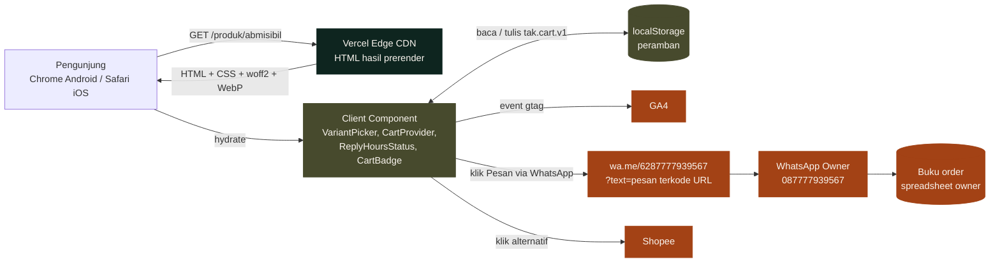
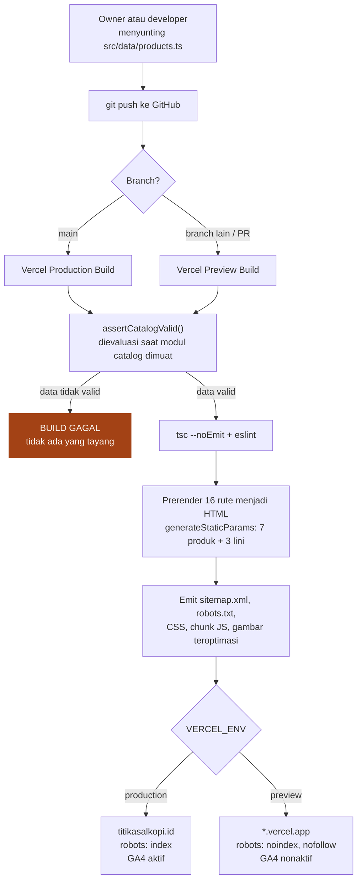
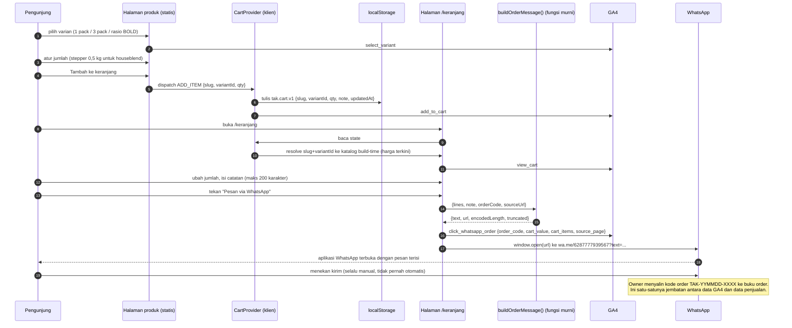
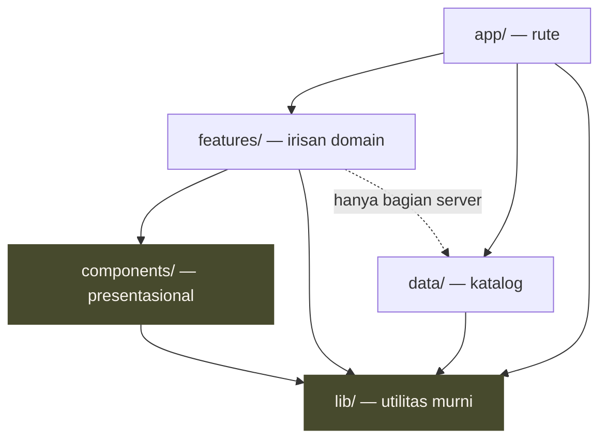

# 03 — Dokumen Arsitektur Teknis
## Titik Asal Kopi — Website titikasalkopi.id (Fase 1)

---

## 0. Kendali Dokumen

| Atribut | Isi |
|---|---|
| Judul | Dokumen Arsitektur Teknis — Website titikasalkopi.id Fase 1 |
| Versi | 1.0 |
| Tanggal | 7 September 2026 |
| Penulis | Software Architect |
| Status | Untuk dieksekusi FE dan BE |
| Dokumen sumber | `docs/00-brand-brief.md`, `docs/00b-ceo-decisions.md`, `docs/02-BRD.md` |
| Dokumen turunan | `docs/04-frontend.md`, `docs/05-backend.md`, `docs/06-qa-test-plan.md` |
| Basis kode | `web/` — Next.js 16.3.4 (App Router), React 19.2.8, TypeScript 5, Tailwind CSS v4, Vercel |

### 0.1 Urutan otoritas dokumen

Bila terjadi pertentangan, urutan yang menang adalah:

1. `docs/00b-ceo-decisions.md` — keputusan CEO terbaru, menutup OQ-01, OQ-02, OQ-07.
2. `docs/00-brand-brief.md` — sumber kebenaran brand, katalog, harga.
3. `docs/02-BRD.md` — kontrak ruang lingkup (50 FR, 16 NFR, 18 BR).
4. Dokumen ini — keputusan teknis dalam batas ketiga dokumen di atas.

### 0.2 Status tiga open question penghambat rilis

Ketiganya **sudah tertutup** oleh `00b-ceo-decisions.md` dan seluruh dokumen ini sudah menyesuaikan:

| OQ | Keputusan | Dampak arsitektur |
|---|---|---|
| **OQ-01** → D-01 | 3 pack wajib satu origin, paket campur tidak ditawarkan | Tidak ada pemilih origin campur di kontrak data maupun UI. `pack3` cukup menjadi varian biasa milik satu produk (Bagian 5) |
| **OQ-02** → D-02 | Houseblend minimum **0,5 kg**, kelipatan **0,5 kg**; harga 0,5 kg dihitung dari harga per kg | `BR-13` direvisi. Kuantitas keranjang houseblend disimpan sebagai bilangan bulat `halfKgUnits`; `pricePerKg` tetap satu-satunya angka tersimpan (ADR-05; Bagian 5, 6, 7) |
| **OQ-07** → D-03 | Jam balas WhatsApp setiap hari 08.00–21.00 WIB | Status "di luar jam balas" dihitung di klien setelah hydration agar halaman tetap statis (ADR-08; Bagian 1.5 dan 6.6) |

### 0.3 Batasan yang tidak dibuka ulang

Stack sudah dikunci dan terpasang: Next.js 16.3.4 App Router, React 19.2.8, TypeScript, Tailwind CSS v4, deploy Vercel. Fase 1 **tidak** memakai basis data, CMS eksternal, maupun payment gateway (keputusan CEO; O-01 dan O-04 pada BRD). Dokumen ini tidak mengusulkan penggantian satu pun dari itu.

---

## 1. Ringkasan Arsitektur

### 1.1 Kalimat inti

Titikasalkopi.id adalah **situs statis penuh**. Seluruh halaman dirender saat build menjadi HTML, disajikan dari CDN Vercel, dan tidak pernah memanggil server aplikasi saat pengunjung membukanya. Satu-satunya bagian yang hidup di peramban adalah keranjang, pemilih varian, konfigurator kilogram, indikator jam balas, dan analitik. Satu-satunya "backend" pada Fase 1 adalah **proses build** — ia membaca modul data produk, memvalidasinya, lalu mencetak HTML, `sitemap.xml`, dan `robots.txt`.

Konsekuensi paling penting dari kalimat itu: **tidak ada runtime server yang perlu dirancang, diamankan, atau dipantau.** Tidak ada API, tidak ada sesi, tidak ada penyimpanan data pribadi. Itu bukan kekurangan arsitektur, melainkan bentuk yang paling tepat untuk katalog 13 SKU yang berubah beberapa kali setahun dan bertransaksi lewat WhatsApp.

### 1.2 Lapisan sistem

| Lapisan | Isi | Berjalan di | Berubah saat |
|---|---|---|---|
| **Sumber data** | `src/data/products.ts` — katalog, harga, atribut origin | Repositori Git | Owner commit |
| **Build** | `next build` — validasi data, prerender 16 rute, sitemap, robots | Vercel CI | Setiap push |
| **Penyajian** | HTML, CSS, JS, font, dan gambar statis | CDN Edge Vercel | Setiap deploy |
| **Klien** | Keranjang, varian, konfigurator kg, jam balas, GA4 | Peramban pengunjung | Interaksi pengunjung |
| **Kanal transaksi** | WhatsApp (`wa.me`), Shopee | Di luar sistem | — |

### 1.3 Alur request pengunjung



Yang perlu digarisbawahi: **tidak ada satu pun panah dari peramban ke server aplikasi milik kita.** Tidak ada `fetch` ke API sendiri dan tidak ada Server Action yang dipanggil dari klien. Panah keluar hanya menuju pihak ketiga.

### 1.4 Alur build dan deploy



Kegagalan validasi menghentikan penayangan alih-alih menayangkan yang salah — ini implementasi langsung FR-43, NFR-12, dan mitigasi R-14.

### 1.5 Alur data checkout WhatsApp



Tiga hal yang wajib dipahami sebelum menulis kode:

- **Kode order dibuat di klien tepat sebelum tautan dibuka**, bukan saat item ditambahkan. Satu klik menghasilkan satu kode, dan kode tidak disimpan ke `localStorage` supaya tidak pernah ada dua chat dengan kode yang sama.
- **Event GA4 dikirim sebelum `window.open`**, bukan sesudah. Setelah aplikasi WhatsApp mengambil alih fokus, halaman bisa dibekukan peramban dan event yang belum terkirim akan hilang.
- **Harga di pesan selalu harga katalog saat halaman dibuka**, bukan harga saat item dimasukkan ke keranjang. Alasannya di ADR-04 dan Bagian 16 (CA-01).

---

## 2. Keputusan Arsitektur (ADR)

Format setiap ADR: konteks, keputusan, konsekuensi, dan alternatif yang ditolak beserta alasan penolakannya.

### ADR-01 — Seluruh rute dirender statis saat build; tidak ada SSR, ISR, maupun revalidate

**Konteks.** Katalog berisi 13 SKU pada 16 rute. Datanya berubah hanya ketika owner menyunting berkas di repositori (keputusan CEO #3). NFR-01 menuntut LCP ≤ 2,5 detik pada Slow 4G dan TTFB ≤ 600 ms; NFR-13 menuntut perubahan tayang ≤ 5 menit setelah disimpan.

**Keputusan.** Setiap rute dirender statis saat build (SSG). Tidak ada `export const revalidate`, tidak ada `unstable_cache`, tidak ada Route Handler `/api/revalidate`, tidak ada `dynamic = "force-dynamic"`. Sebagai pengaman, setiap `page.tsx` menyatakan `export const dynamic = "error"` sehingga pemakaian API dinamis (`cookies()`, `headers()`, `searchParams` tanpa `generateStaticParams`) **menggagalkan build** alih-alih diam-diam mengubah rute menjadi dinamis. Rute berparameter menyatakan `export const dynamicParams = false` supaya slug asing menghasilkan 404 statis.

**Konsekuensi.** TTFB praktis sama dengan latensi CDN, sehingga bagian NFR-01 yang bergantung pada server terpenuhi tanpa upaya khusus. Invalidasi cache dilakukan oleh deploy; build 16 halaman selesai di bawah dua menit sehingga NFR-13 terpenuhi. Tidak ada perbedaan perilaku antara `next dev` dan produksi yang berasal dari caching. Konsekuensi yang harus diterima: apa pun yang bergantung pada waktu atau lokasi pengunjung **wajib dihitung di klien**, karena HTML yang sama disajikan kepada semua orang — inilah alasan ADR-08.

**Alternatif ditolak.**
- *ISR dengan `revalidate: 3600`.* Ditolak: sumber data adalah modul yang ikut di-bundle saat build, sehingga revalidasi tidak akan pernah menghasilkan isi yang berbeda. Ia hanya menambah kompleksitas cache tanpa satu pun manfaat.
- *On-demand revalidation lewat webhook.* Ditolak: memerlukan Route Handler, secret, dan penanganan kegagalan, untuk memecahkan masalah yang sudah dipecahkan deploy otomatis Vercel.
- *SSR untuk halaman keranjang.* Ditolak: keranjang hidup di `localStorage`; server tidak punya dan tidak boleh punya isinya (NFR-16).

### ADR-02 — Sumber data produk berupa modul TypeScript dua lapis: lapis penulisan dan lapis katalog turunan

**Konteks.** FR-41 mensyaratkan satu sumber data di repositori. FR-42 dan NFR-13 mensyaratkan owner non-teknis dapat mengubah harga sendiri dalam ≤ 15 menit. Kedua tuntutan itu menarik ke arah berlawanan: bentuk yang paling ramah dibaca owner (tabel harga per lini, mirip brand brief) bukan bentuk yang paling nyaman dikonsumsi UI (daftar `Product` seragam dengan slug dan varian).

**Keputusan.** Dua lapis di dalam satu folder `src/data/`:

- **Lapis penulisan — `src/data/products.ts`.** Bentuknya mengikuti struktur brand brief: `houseblendBold` (6 rasio), `houseblendBright`, `houseblendFullRobusta`, `singleOriginBeans`, `singleOriginPricing`. Inilah berkas yang disunting owner, dan satu-satunya tempat angka harga ditulis. Struktur yang sudah ada dipertahankan; yang ditambahkan hanya medan yang benar-benar kurang (Bagian 5.7).
- **Lapis katalog turunan — `src/data/catalog.ts`.** Modul yang menyusun `Product[]` seragam dari lapis penulisan, menghitung harga turunan (harga 0,5 kg, harga mulai, penghematan bundling BR-10), dan memanggil `assertCatalogValid()` saat modul dievaluasi. Seluruh UI dan seluruh metadata membaca dari sini, **tidak pernah** dari `products.ts` secara langsung.

**Konsekuensi.** Owner tetap melihat berkas yang menyerupai brand brief; UI tetap mendapat satu bentuk seragam; harga turunan tidak pernah menjadi sumber kebenaran kedua karena selalu dihitung — persis yang diminta D-02 untuk harga 0,5 kg. Biayanya satu berkas transformasi sekitar 150 baris, ditambah aturan "jangan impor `products.ts` di luar `catalog.ts`" yang ditegakkan lint rule (Bagian 4.3).

**Alternatif ditolak.**
- *JSON murni.* Ditolak: kehilangan pemeriksaan tipe saat build, sehingga FR-43 harus dibangun ulang sebagai validator runtime penuh. TypeScript sudah memberi separuh validasi itu tanpa biaya.
- *Satu berkas `Product[]` datar yang ditulis langsung owner.* Ditolak: 13 produk beserta variannya menghasilkan berkas berulang dengan harga tersebar di banyak tempat; risiko salah ketik owner (R-14) justru naik.
- *CMS eksternal atau Google Sheets sebagai sumber.* Ditolak oleh keputusan CEO (O-04). BA-06 pada BRD sudah menempatkan opsi lembar kerja sebagai kandidat Fase 2.

### ADR-03 — Tidak ada basis data dan tidak ada state di sisi server

**Konteks.** BRD Bagian 10 menyatakan Order Inquiry hanya hidup sementara di peramban. NFR-16 melarang penyimpanan data pribadi di server mana pun. O-19 melarang formulir kontak berbasis server.

**Keputusan.** Fase 1 tidak memakai basis data, key-value store, antrean, maupun penyimpanan sesi. Order Inquiry hidup di `localStorage` pengunjung dan berakhir di sana. Identitas pesanan sepenuhnya berupa kode order `TAK-YYMMDD-XXXX` yang tercetak di badan pesan WhatsApp lalu disalin owner ke spreadsheet.

**Konsekuensi.** Permukaan serangan mendekati nol: tidak ada endpoint yang bisa diserang, tidak ada data yang bisa bocor, tidak ada yang perlu di-rate-limit di sisi server (Bagian 12). Konsekuensi yang harus diterima bisnis: keranjang tidak berpindah antarperangkat, dan tidak ada cara memulihkan pesanan yang batal. Keduanya sudah diterima BRD.

**Alternatif ditolak.**
- *Vercel KV atau Postgres untuk menyimpan draft pesanan.* Ditolak: melanggar NFR-16, menambah biaya bulanan, dan memecahkan masalah yang tidak dimiliki roaster dengan puluhan order per bulan.
- *Menyimpan keranjang di cookie agar dapat dibaca server.* Ditolak: cookie ikut pada setiap request sehingga memperlambat halaman statis, dan membuat isi keranjang melewati server — persis yang dilarang NFR-16.

### ADR-04 — State keranjang: React Context dengan `useReducer`, persisten di `localStorage`, harga selalu di-resolve ulang dari katalog

**Konteks.** FR-16 sampai FR-21 menuntut keranjang penuh; FR-20 menuntut persistensi tujuh hari; NFR-12 menuntut 100% harga di situs identik dengan brand brief.

**Keputusan.** Satu `CartProvider` di root layout dengan state dikelola `useReducer`, disimpan ke `localStorage` pada kunci berversi `tak.cart.v1`. **Yang dipersistensikan hanya `{ slug, variantId, qty }` beserta catatan dan stempel waktu — bukan harga dan bukan nama produk.** Harga, nama, dan label varian di-resolve ulang dari katalog build-time setiap kali keranjang dirender.

**Konsekuensi.** Harga yang tampil di keranjang dan yang masuk ke pesan WhatsApp selalu harga terbaru, walaupun keranjang sudah tersimpan enam hari dan owner sempat menaikkan harga. Inilah yang membuat NFR-12 benar-benar 100%, bukan 100% hanya bagi pengunjung baru. Konsekuensi kedua: baris yang produk atau variannya sudah tidak ada di katalog **dibuang saat hydration** dan pengunjung diberi tahu satu kali — perilaku ini wajib, bukan opsional.

Perlu dicatat bahwa keputusan ini **berbeda dari kalimat literal BRD 11.1** yang menyebut setiap baris menyimpan "harga satuan pada saat ditambahkan". Pertentangan tersebut dan alasan memenangkan NFR-12 dicatat di Bagian 16 (CA-01).

**Alternatif ditolak.**
- *Zustand, Jotai, atau Redux Toolkit.* Ditolak: menambah dependensi runtime untuk satu state berisi paling banyak belasan baris. `useReducer` dan Context sudah ada di React dan berbiaya nol byte tambahan — langsung membantu anggaran JS ≤ 150 KB (NFR-03).
- *Menyimpan snapshot harga di `localStorage`.* Ditolak, alasannya di atas.
- *`sessionStorage`.* Ditolak: tidak bertahan setelah tab ditutup, sehingga gagal memenuhi FR-20.

### ADR-05 — Uang dan kuantitas selalu bilangan bulat; houseblend dihitung dalam satuan setengah kilo

**Konteks.** D-02 menurunkan minimum houseblend menjadi 0,5 kg dengan kelipatan 0,5 kg, dan menetapkan harga 0,5 kg **tepat setengah** harga per kg. BR-03 melarang pembulatan sistem dan mensyaratkan seluruh perhitungan memakai bilangan bulat rupiah.

**Keputusan.** Tiga aturan berlaku di seluruh basis kode:

1. Seluruh harga bertipe `number` bilangan bulat rupiah penuh. Tidak ada `float`, tidak ada `toFixed`, tidak ada pustaka desimal.
2. Setiap varian memiliki **satuan pesan** dan **harga satu satuan pesan** (`unitPrice`). Untuk houseblend, satuan pesan adalah **0,5 kg** dan `unitPrice = pricePerKg / 2`. `pricePerKg` tetap satu-satunya angka yang tersimpan di `products.ts`; `unitPrice` selalu dihitung.
3. Kuantitas di keranjang selalu bilangan bulat **jumlah satuan pesan**. Untuk houseblend variabel ini bermakna `halfKgUnits`: nilai 1 berarti 0,5 kg, nilai 5 berarti 2,5 kg, nilai 10 berarti 5 kg. Konversi ke kilogram hanya terjadi **saat menampilkan**, tidak pernah saat menghitung.

Subtotal baris karena itu selalu `qty * unitPrice` — perkalian dua bilangan bulat, seragam untuk seluruh kategori produk tanpa cabang khusus.

**Konsekuensi.** Tidak ada aritmetika pecahan pada uang di mana pun, sesuai perintah eksplisit D-02. Contoh pada BRD tetap benar: BOLD 60:40 sebanyak 5 kg sama dengan `halfKgUnits 10 × Rp100.000 = Rp1.000.000`. Validator build menegakkan `pricePerKg % 1000 === 0` sehingga setengahnya dijamin bilangan bulat dan kelipatan Rp500 — bila kelak owner memasukkan harga ganjil, build gagal alih-alih menampilkan `Rp97.500,5`.

**Alternatif ditolak.**
- *Menyimpan `pricePerHalfKg` sebagai medan kedua di `products.ts`.* Ditolak secara eksplisit oleh D-02: dua sumber kebenaran, dan owner pasti akan lupa mengubah salah satunya.
- *Menyimpan kuantitas sebagai kilogram bertipe `number` pecahan (0,5 dan 1,5).* Ditolak: selain masalah presisi biner klasik, ia memaksa perkalian uang dengan pecahan yang dilarang BR-03.
- *Pustaka `decimal.js` atau `dinero.js`.* Ditolak sebagai over-engineering. Rupiah tidak mengenal sen; bilangan bulat sudah merupakan representasi yang tepat.

### ADR-06 — Gambar produk: berkas statis di repositori, diimpor secara statis, disajikan lewat `next/image`

**Konteks.** NFR-02 menuntut CLS ≤ 0,05; NFR-03 membatasi setiap gambar produk ≤ 150 KB dalam format modern; FR-12 menuntut rasio aspek tetap dan placeholder bergaya brand bila foto belum ada. R-13 memperingatkan foto bisa terlambat dan tidak boleh menahan rilis.

**Keputusan.** *(Direvisi 7 September 2026: format yang benar-benar dipakai adalah `.jpg` di `web/src/images/produk/`, bukan `.webp` di `web/public/produk/` — sumbernya artwork marketing yang sudah ada, dan mengubahnya ke WebP tidak memberi penghematan berarti pada ukuran seukuran ini. Mekanisme impor statisnya tetap persis seperti dijelaskan di bawah.)* Foto produk disimpan di `web/public/produk/<slug>.webp` dan dirujuk lewat **impor statis** dari `src/data/products.ts`, sehingga Next mengetahui lebar dan tinggi asli saat build dan menuliskan `width` serta `height` ke HTML tanpa intervensi FE. Ditampilkan dengan `next/image`, `sizes` eksplisit, rasio aspek dikunci 4:5 lewat wrapper, dan `priority` hanya untuk satu gambar LCP per halaman. Produk tanpa foto memakai `<ProductPlaceholder />` — komponen SVG inline bergaya brand, nol permintaan jaringan, rasio aspek sama.

**Konsekuensi.** CLS dari gambar praktis nol tanpa disiplin manual. Rilis tidak tertahan ketersediaan foto (R-13) karena `image: null` adalah keadaan sah yang dilewatkan validator. Konsekuensi operasional: foto wajib dikompres ke ≤ 150 KB sebelum commit, dijaga oleh satu butir daftar periksa rilis.

**Alternatif ditolak.**
- *Gambar remote dari CDN pihak ketiga atau Cloudinary.* Ditolak: satu vendor, satu env var, dan satu titik gagal tambahan untuk 13 gambar yang berubah dua kali setahun.
- *`unoptimized: true` dan melayani berkas apa adanya.* Ditolak: menghilangkan varian responsif dan konversi AVIF/WebP otomatis yang justru membantu NFR-03 di layar HP.
- *Pipeline optimasi gambar sendiri memakai `sharp` saat build.* Ditolak: menduplikasi apa yang sudah dikerjakan Vercel Image Optimization.

### ADR-07 — Tidak ada formulir inquiry B2B berbasis server; seluruh inquiry lewat deeplink WhatsApp

**Konteks.** Kerangka arsitektur menyebut kemungkinan Route Handler untuk inquiry B2B. Namun BRD O-19 menyatakan tegas bahwa formulir kontak berbasis server dan penyimpanan data pembeli berada **di luar ruang lingkup Fase 1**, sebagai konsekuensi NFR-16. FR-30, FR-39, dan FR-40 seluruhnya berstatus Fase 1b dan seluruhnya berbentuk CTA WhatsApp, bukan formulir.

**Keputusan.** Tidak ada `src/app/api/**`, tidak ada Server Action pengiriman formulir, dan tidak ada integrasi email pada Fase 1a maupun 1b. "Form inquiry B2B" diwujudkan sebagai **komponen klien yang menyusun pesan pembuka bernuansa kedai lalu membuka `wa.me`** — mekanisme yang sama persis dengan checkout, memakai generator pesan yang sama (Bagian 7) dengan templat berbeda. Bila pengunjung ingin menyertakan konteks seperti nama kedai, kebutuhan per bulan, atau kota, itu diketik langsung di WhatsApp, bukan di situs.

**Konsekuensi.** Nol data pribadi tersentuh situs, sehingga NFR-16 terpenuhi secara struktural dan bukan lewat kebijakan. Nol endpoint yang perlu di-rate-limit, divalidasi, atau dilindungi CAPTCHA. Konsekuensi bisnis yang harus disadari: tidak ada arsip inquiry di luar WhatsApp, dan buku order owner tetap satu-satunya catatan (BRD 11.4).

**Alternatif ditolak.**
- *Route Handler `POST /api/inquiry` yang mengirim email lewat penyedia transaksional.* Ditolak: melanggar O-19 dan NFR-16, menambah env var berisi API key, memunculkan kebutuhan rate limiting dan proteksi spam, serta menciptakan kanal balasan kedua yang harus dipantau owner — persis beban yang ingin dikurangi proyek ini.
- *Formulir yang mengirim ke Google Forms atau Formspree.* Ditolak dengan alasan yang sama, ditambah berpindahnya data pengunjung ke pihak ketiga tanpa dasar hukum yang disiapkan.

Bila CEO kelak membuka kembali keputusan ini, jalur teknisnya dicatat sebagai UT-05 di Bagian 15 — untuk dikerjakan saat itu, bukan dibangun sekarang "untuk berjaga-jaga".

### ADR-08 — Status jam balas WhatsApp dihitung di klien setelah hydration

**Konteks.** D-03 menetapkan jam balas 08.00–21.00 WIB dan mewajibkan UI menampilkan status "di luar jam balas" berdasarkan waktu pengunjung yang dikonversi ke WIB. ADR-01 menetapkan seluruh halaman statis, artinya HTML yang sama disajikan sepanjang hari.

**Keputusan.** HTML hasil build **selalu** memuat kalimat janji netral: "Kami membalas setiap hari, 08.00–21.00 WIB." Komponen klien `<ReplyHoursStatus />` menghitung jam WIB setelah hydration dan menambahkan penanda tambahan hanya bila pengunjung berada di luar jam tersebut. Konversi ke WIB memakai aritmetika offset tetap UTC+7 (`getTime() + 7 * 3600 * 1000`, lalu membaca `getUTCHours()`) dan **bukan** `Intl.DateTimeFormat` dengan `timeZone: "Asia/Jakarta"`. Alasannya: WIB tidak mengenal DST sehingga offsetnya tetap, dan aritmetika langsung menghilangkan ketergantungan pada kelengkapan data zona waktu ICU peramban pada perangkat lama (NFR-06).

**Konsekuensi.** Halaman tetap sepenuhnya cacheable di CDN. Tidak ada hydration mismatch karena render pertama di klien identik dengan HTML server (keadaan netral), dan penanda baru muncul pada render berikutnya setelah `useEffect`. Pengunjung dengan JavaScript mati tetap melihat janji jam balas yang benar, hanya tanpa penanda status.

**Alternatif ditolak.**
- *Menghitung di server dengan `dynamic = "force-dynamic"` pada halaman kontak dan keranjang.* Ditolak: mengorbankan sifat statis dua halaman demi satu kalimat, memperburuk TTFB, dan tetap salah bila CDN sempat men-cache respons.
- *Middleware yang menyuntikkan header waktu.* Ditolak: middleware berjalan pada setiap request termasuk aset, sehingga menambah latensi seluruh situs demi satu penanda kosmetik.
- *Menghitung langsung pada render pertama klien tanpa gerbang hydration.* Ditolak: menghasilkan hydration mismatch React yang justru dilarang Bagian 6.6.

### ADR-09 — Validasi data build dijalankan saat modul katalog dievaluasi, tanpa dependensi baru

**Konteks.** FR-43 menuntut build gagal secara eksplisit bila ada produk tanpa harga, slug ganda, tier tidak dikenal, atau harga bukan bilangan bulat rupiah. NFR-12 dan R-14 bergantung padanya.

**Keputusan.** `src/data/validate.ts` berisi `assertCatalogValid(catalog)` yang dipanggil **di lingkup modul** `src/data/catalog.ts`. Karena setiap rute statis mengimpor `catalog.ts`, modul itu pasti dievaluasi di Node saat `next build`, dan `throw` menggagalkan build dengan pesan berbahasa Indonesia yang menyebut nama produk beserta medan yang salah. Tidak ada Zod, tidak ada Ajv, tidak ada skrip prebuild terpisah, dan tidak ada runner TypeScript tambahan.

**Konsekuensi.** Nol dependensi baru, nol konfigurasi, dan gerbangnya tidak dapat dilewati karena tidak ada jalur build yang tidak memuat katalog. Validator juga berjalan di `next dev` sehingga developer melihat kesalahan lebih awal. Konsekuensi kecil: pesan galat tampil sebagai stack trace build Vercel, bukan keluaran berformat rapi — dapat diterima karena pembacanya adalah developer atau BA yang mendampingi owner (BA-06).

**Alternatif ditolak.**
- *Skema Zod.* Ditolak: menambah dependensi runtime 12–14 KB dan lapisan tipe kedua yang harus disinkronkan manual dengan tipe TypeScript yang sudah ada. Untuk 13 SKU, sekitar 60 baris pemeriksaan tulis tangan lebih murah dan lebih mudah dibaca.
- *Skrip `prebuild` terpisah.* Ditolak: memerlukan cara menjalankan TypeScript di luar Next, menambah ketergantungan pada versi Node runner Vercel, dan dapat dilewati bila seseorang menjalankan `next build` langsung.
- *Uji unit yang memvalidasi data.* Ditolak sebagai **gerbang** karena uji tidak berjalan pada build Vercel, tetapi tetap disarankan sebagai pelengkap (Bagian 15).

### ADR-10 — Batas Client Component ditarik sesempit mungkin dan didaftar secara eksplisit

**Konteks.** NFR-03 membatasi JavaScript awal ≤ 150 KB terkompresi. Baseline App Router dengan React 19 sudah memakan sebagian besar anggaran itu sebelum satu baris kode fitur ditulis.

**Keputusan.** Hanya berkas berikut yang boleh membawa direktif `"use client"` pada Fase 1a. Daftar ini bersifat tertutup; menambah anggota memerlukan persetujuan arsitek.

| Komponen | Alasan wajib menjadi Client Component |
|---|---|
| `features/cart/cart-provider.tsx` | `localStorage`, `useReducer` |
| `features/cart/cart-badge.tsx` | membaca state keranjang (FR-17) |
| `features/cart/cart-view.tsx` | mengubah jumlah, menghapus, mengisi catatan (FR-18, FR-23) |
| `features/catalog/variant-picker.tsx` | harga reaktif (FR-11) |
| `features/catalog/kg-configurator.tsx` | stepper 0,5 kg (FR-21, D-02) |
| `features/catalog/ratio-table.tsx` | baris tabel memilih rasio (FR-29) |
| `features/catalog/add-to-cart-button.tsx` | dispatch ke keranjang (FR-16) |
| `features/whatsapp/whatsapp-order-button.tsx` | kode order, event GA4, `window.open` (FR-22, FR-24) |
| `features/whatsapp/ask-about-product-button.tsx` | event GA4 sebelum navigasi (FR-38) |
| `features/contact/reply-hours-status.tsx` | waktu pengunjung (ADR-08, D-03) |
| `features/analytics/analytics-provider.tsx` | pemuatan gtag tertunda (FR-47) |

Semua sisanya — kartu produk, tabel harga statis, header, footer, dan seluruh `page.tsx` — adalah Server Component murni.

**Konsekuensi.** Katalog dan halaman produk mengirim JavaScript hanya untuk tombol dan pemilih varian, bukan untuk seluruh halaman. Konsekuensi disiplin: Client Component **tidak boleh mengimpor `src/data/**`** (Bagian 4.3); ia menerima data yang sudah di-resolve sebagai props dari Server Component.

**Alternatif ditolak.**
- *Menandai `layout.tsx` sebagai client demi kemudahan memasang provider.* Ditolak: menarik seluruh pohon komponen ke bundel klien dan langsung melanggar NFR-03.

### ADR-11 — Generator pesan WhatsApp adalah fungsi murni di `src/lib`, terpisah dari komponen

**Konteks.** NFR-15 membatasi pesan 1.500 karakter setelah pengodean URL dan mensyaratkan pesan tetap terbaca di tiga platform WhatsApp. BRD 11.2 menegaskan tidak ada bagian sistem lain yang boleh menghasilkan pesan pesanan dengan format berbeda.

**Keputusan.** Seluruh penyusunan pesan berada di `src/lib/whatsapp/message.ts` sebagai fungsi murni tanpa akses `window`, tanpa `Date.now()` implisit, dan tanpa state React. Waktu dan sumber keacakan disuntikkan lewat parameter (`now`, `random`) supaya dapat diuji secara deterministik. Komponen tombol hanya memanggil fungsi ini, mengirim event GA4, lalu membuka URL hasilnya.

**Konsekuensi.** Hanya ada satu definisi format pesan di satu berkas; QA dapat mengujinya tanpa merender UI; penambahan templat baru (tanya produk, B2B) berupa fungsi tambahan yang memakai perakit blok yang sama.

**Alternatif ditolak.**
- *Menyusun string di dalam komponen tombol.* Ditolak: format akan bercabang diam-diam antara halaman produk dan halaman keranjang, melanggar BRD 11.2.

### ADR-12 — GA4 dimuat tertunda lewat skrip kecil buatan sendiri, bukan pustaka analitik

**Konteks.** FR-47 menuntut sembilan event terstruktur. NFR-03 membatasi total transfer halaman 600 KB dan JavaScript awal 150 KB. `gtag.js` sendiri berukuran puluhan kilobyte dan mengeksekusi pekerjaan berat pada perangkat kelas menengah (NFR-06).

**Keputusan.** GA4 dimuat oleh `features/analytics/analytics-provider.tsx` yang menyuntikkan `gtag.js` pada **interaksi pertama pengunjung atau setelah jendela idle**, mana yang lebih dulu, dan tidak pernah sebelum event `load`. Kontrak event berada di `src/lib/analytics.ts` sebagai fungsi bertipe (`trackViewItem`, `trackAddToCart`, `trackWhatsAppOrder`, dan seterusnya) yang menjadi no-op bila `NEXT_PUBLIC_GA_ID` kosong. Tidak dipasang pada preview deployment.

**Konsekuensi.** `gtag.js` tidak pernah bersaing dengan LCP dan tidak masuk hitungan jalur kritis Lighthouse. Konsekuensi yang diterima: kunjungan yang ditutup dalam dua detik pertama tanpa interaksi apa pun tidak tercatat. Untuk KPI proyek ini itu tidak merugikan — G-01, G-03, G-04, dan G-07 semuanya mengukur **klik**, bukan pageview mentah, sementara G-05 divalidasi silang dengan GSC yang tidak bergantung pada GA4.

**Alternatif ditolak.**
- *`@next/third-parties/google` dengan strategi bawaan.* Ditolak bukan karena buruk, melainkan karena memuat lebih awal daripada yang dibutuhkan dan menambah dependensi untuk sekitar delapan baris kode.
- *Sentry, LogRocket, atau PostHog.* Ditolak: biaya byte dan biaya langganan tidak sepadan untuk situs statis tanpa server (penggantinya di Bagian 13).

### ADR-13 — Content Security Policy statis tanpa nonce

**Konteks.** Nonce CSP di Next memerlukan header per-request lewat middleware, yang bertabrakan langsung dengan ADR-01 karena halaman sepenuhnya statis dan di-cache CDN.

**Keputusan.** `next.config.ts` menetapkan CSP statis yang mengizinkan `'self'`, `'unsafe-inline'` untuk skrip bootstrap Next dan gaya, serta domain Google Analytics dan Tag Manager. Tanpa nonce dan tanpa middleware. Header keamanan lain — Referrer-Policy, X-Content-Type-Options, frame-ancestors, Permissions-Policy, dan HSTS — ditetapkan penuh (Bagian 12.4).

**Konsekuensi.** Perlindungan XSS dari CSP menjadi parsial. Risiko nyatanya rendah karena situs ini tidak memiliki input tersimpan, konten dari pengguna lain, sesi, maupun kredensial apa pun untuk dicuri. Ini **utang teknis yang diambil secara sadar**; syarat pelunasannya tercatat sebagai UT-03 di Bagian 15: begitu situs menampilkan konten yang berasal dari luar repositori atau menerima input yang dipersistensikan, CSP wajib naik ke nonce dan halaman terkait berhenti statis.

**Alternatif ditolak.**
- *Middleware nonce.* Ditolak untuk Fase 1: mengubah seluruh situs menjadi dinamis demi memitigasi risiko yang tidak dimiliki situs ini.
- *Tidak memasang CSP sama sekali.* Ditolak: Lighthouse Best Practices ≥ 95 (NFR-04) memeriksa keberadaan CSP, dan header lainnya berbiaya nol.

### ADR-14 — Nol dependensi runtime baru pada Fase 1

**Konteks.** `package.json` saat ini berisi tepat tiga dependensi runtime: `next`, `react`, dan `react-dom`. NFR-03 sangat ketat pada bundel JavaScript.

**Keputusan.** Fase 1a dan 1b diselesaikan tanpa menambah satu pun dependensi runtime. Tidak ada pustaka state, form, validasi, tanggal, ikon, animasi, maupun komponen UI. Ikon dibuat sebagai komponen SVG inline — hanya lima yang dibutuhkan: WhatsApp, Instagram, Shopee, keranjang, dan panah. Penambahan dependensi runtime memerlukan persetujuan tertulis arsitek disertai angka dampak terhadap bundel.

**Konsekuensi.** Anggaran JavaScript terjaga, permukaan audit rantai pasok praktis nol, dan upgrade Next tidak pernah terhalang paket pihak ketiga. Konsekuensi yang diterima: beberapa komponen ditulis tangan (stepper, tab, accordion), masing-masing di bawah 60 baris untuk kebutuhan sekecil ini.

**Alternatif ditolak.**
- *shadcn/ui atau Radix.* Ditolak: nilai utamanya adalah primitif aksesibel untuk komponen kompleks seperti combobox dan dialog berlapis, yang tidak satu pun ada dalam ruang lingkup Fase 1.
- *`date-fns` untuk kode order dan jam balas.* Ditolak: dua fungsi yang dibutuhkan berjumlah sekitar dua belas baris memakai `Date` bawaan.

---
## 3. Peta Rute Fase 1a

### 3.1 Ringkasan

Fase 1a menayangkan **16 rute HTML** ditambah tiga berkas hasil build (`sitemap.xml`, `robots.txt`, `opengraph-image`). Slug berbahasa Indonesia dipilih karena bahasa utama situs adalah Bahasa Indonesia dan karena BRD 11.2 sudah mengunci dua di antaranya di dalam contoh pesan WhatsApp: `https://titikasalkopi.id/produk/abmisibil` dan `https://titikasalkopi.id/keranjang`. Kedua path itu tidak boleh diubah.

### 3.2 Tabel rute

Seluruh rute berstatus **Static (SSG)**. Kolom "Rendering" menyebut mekanisme prerendernya.

| # | Path | Rendering | Data yang dibutuhkan | Metadata SEO | FR yang dipenuhi |
|---|---|---|---|---|---|
| 1 | `/` | Static | `catalog.featuredSignature` (4 origin Signature), ringkasan 3 lini houseblend, harga mulai | title: `Titik Asal Kopi — Pilih rasa, temukan asalnya, nikmati setiap momen.`; desc positioning; canonical `/`; OG default; JSON-LD `Organization` | FR-01 (pintu masuk), FR-31 (ringkas), FR-35, FR-37, FR-44, FR-45, FR-46 |
| 2 | `/katalog` | Static | Seluruh `catalog.products` dikelompokkan Single Origin dan Houseblend, beserta `priceFrom` per produk | title: `Katalog Kopi — Single Origin & Houseblend per Kg`; desc menyebut Papua, Kupang, Aceh, Garut, Kerinci; canonical `/katalog`; JSON-LD `BreadcrumbList` | FR-01, FR-02, FR-03, FR-12, FR-44, FR-46 |
| 3–9 | `/produk/[slug]` × 7 | Static + `generateStaticParams`, `dynamicParams = false` | Satu `Product` single origin: origin lengkap, tier, varian 1 pack dan 3 pack, penghematan bundling terhitung, produk terkait (1b) | title: `{name} — Kopi {region}` (mis. `Abmisibil — Kopi Papua, Pegunungan Bintang`); desc memuat proses, MASL, varietas bila ada; canonical `/produk/{slug}`; OG gambar produk; JSON-LD `Product` + `Offer` + `BreadcrumbList` | FR-07, FR-09, FR-10, FR-11, FR-12, FR-16, FR-25, FR-38, FR-44, FR-46, (FR-49 bila ditarik ke 1a) |
| 10 | `/houseblend` | Static | Tiga lini beserta komposisi dan catatan rasa, tabel gabungan sembilan varian dan harga per kg | title: `Houseblend Kopi per Kg — BOLD, BRIGHT, Full Robusta`; desc menyasar "houseblend kopi per kg" dan segmen kedai; canonical `/houseblend`; JSON-LD `BreadcrumbList` | FR-08, FR-27, FR-28, FR-44, FR-46 |
| 11–13 | `/houseblend/[line]` × 3 | Static + `generateStaticParams`, `dynamicParams = false` | Satu lini: komposisi, catatan rasa, daftar varian dengan `pricePerKg` dan `unitPrice` (0,5 kg), konfigurator | title: `Houseblend BOLD — 6 Rasio Arabica:Robusta per Kg`; canonical `/houseblend/{line}`; JSON-LD `Product` + `Offer` | FR-08, FR-10, FR-11, FR-16, FR-21, FR-27, FR-28, FR-29, FR-44, FR-46 |
| 14 | `/cerita-kami` | Static | Salinan teks dari BA, kanal resmi | title: `Cerita Kami — Kopi dari Titik Terbaik Indonesia`; canonical `/cerita-kami` | FR-31, FR-35, FR-44, FR-46 |
| 15 | `/kontak` | Static | Kanal resmi, jam balas D-03, blok 4 langkah | title: `Kontak — WhatsApp, Instagram, Shopee`; canonical `/kontak` | FR-26, FR-35, FR-36, FR-37, FR-44 |
| 16 | `/keranjang` | Static (kerangka) + Client Component | `cartCatalogIndex` yang diserialkan dari server; sisanya `localStorage` | title: `Keranjang`; **`robots: { index: false }`**; canonical `/keranjang` | FR-17, FR-18, FR-19, FR-20, FR-21, FR-22, FR-23, FR-24, FR-25, FR-26 |
| — | `/sitemap.xml` | `app/sitemap.ts`, dievaluasi saat build | Seluruh path publik dari `catalog` | — | FR-45, FR-48 |
| — | `/robots.txt` | `app/robots.ts`, dievaluasi saat build | `VERCEL_ENV` | — | FR-45 |
| — | `/opengraph-image.png` | Aset statis di `src/app/` | — | dipakai sebagai OG default | FR-46 |
| — | `not-found.tsx` | Static | — | `robots: { index: false }` | — |

Slug single origin: `oelbiteno`, `abmisibil`, `sabin`, `pyramid`, `palimping`, `kerinci`, `pondok-baru`.
Slug lini houseblend: `bold`, `bright`, `full-robusta`.

### 3.3 `generateStaticParams` untuk tujuh halaman single origin

```tsx
// src/app/produk/[slug]/page.tsx
import { notFound } from "next/navigation";
import type { Metadata } from "next";
import { singleOriginProducts, findProductBySlug } from "@/data/catalog";
import { buildProductMetadata, productJsonLd } from "@/lib/seo";
import { ProductDetail } from "@/features/catalog/product-detail";

// ADR-01: rute wajib statis. `error` membuat pemakaian API dinamis
// menggagalkan build, bukan diam-diam mengubah rute jadi dinamis.
export const dynamic = "error";
// Slug di luar daftar menghasilkan 404 statis, bukan render on-demand.
export const dynamicParams = false;

export function generateStaticParams(): Array<{ slug: string }> {
  return singleOriginProducts.map((product) => ({ slug: product.slug }));
}

export async function generateMetadata({
  params,
}: PageProps<"/produk/[slug]">): Promise<Metadata> {
  const { slug } = await params; // Next 16: params adalah Promise
  const product = findProductBySlug(slug);
  if (!product) return {};
  return buildProductMetadata(product);
}

export default async function ProductPage({
  params,
}: PageProps<"/produk/[slug]">) {
  const { slug } = await params;
  const product = findProductBySlug(slug);
  if (!product) notFound();

  return (
    <>
      <script
        type="application/ld+json"
        // JSON-LD adalah satu-satunya pemakaian dangerouslySetInnerHTML yang
        // diizinkan; lihat Bagian 12.2 untuk aturan escaping-nya.
        dangerouslySetInnerHTML={{ __html: productJsonLd(product) }}
      />
      <ProductDetail product={product} />
    </>
  );
}
```

Bentuk yang sama dipakai `src/app/houseblend/[line]/page.tsx` dengan `houseblendLines.map((line) => ({ line: line.slug }))`.

Hasil build yang diharapkan pada log Vercel: `● /produk/[slug]` dengan tujuh path terdaftar dan `● /houseblend/[line]` dengan tiga path. Bila salah satunya muncul sebagai `ƒ (Dynamic)`, build harus ditolak — itu berarti ada API dinamis yang lolos.

---

## 4. Struktur Folder dan Aturan Ketergantungan

### 4.1 Target struktur `web/src/`

```
web/src/
├── app/                                  # rute — tipis, hanya merakit
│   ├── layout.tsx                        # font, provider, header, footer
│   ├── page.tsx                          # beranda
│   ├── globals.css                       # token desain (sudah ada)
│   ├── not-found.tsx
│   ├── sitemap.ts
│   ├── robots.ts
│   ├── opengraph-image.png
│   ├── katalog/page.tsx
│   ├── produk/[slug]/page.tsx
│   ├── houseblend/page.tsx
│   ├── houseblend/[line]/page.tsx
│   ├── cerita-kami/page.tsx
│   ├── kontak/page.tsx
│   └── keranjang/page.tsx
│
├── features/                             # irisan domain — UI + logika fiturnya
│   ├── catalog/
│   │   ├── product-card.tsx              # server
│   │   ├── product-grid.tsx              # server
│   │   ├── product-detail.tsx            # server
│   │   ├── product-placeholder.tsx       # server, SVG inline
│   │   ├── variant-picker.tsx            # client
│   │   ├── kg-configurator.tsx           # client — stepper 0,5 kg
│   │   ├── ratio-table.tsx               # client — FR-29
│   │   └── add-to-cart-button.tsx        # client
│   ├── cart/
│   │   ├── cart-provider.tsx             # client — Context + useReducer
│   │   ├── cart-reducer.ts               # murni
│   │   ├── cart-storage.ts               # murni — serialisasi & migrasi
│   │   ├── cart-selectors.ts             # murni — resolve + total
│   │   ├── cart-badge.tsx                # client
│   │   ├── cart-view.tsx                 # client
│   │   └── cart-note-field.tsx           # client
│   ├── whatsapp/
│   │   ├── whatsapp-order-button.tsx     # client
│   │   └── ask-about-product-button.tsx  # client
│   ├── contact/
│   │   ├── reply-hours-status.tsx        # client — D-03
│   │   └── order-steps.tsx               # server — FR-26
│   └── analytics/
│       └── analytics-provider.tsx        # client — pemuat gtag tertunda
│
├── components/                           # presentasional, bebas domain
│   ├── ui/                               # button, badge, container, section, prose, stepper
│   ├── icons/                            # svg inline: whatsapp, instagram, shopee, cart, arrow
│   └── layout/                           # site-header, site-footer, sticky-whatsapp
│
├── data/                                 # sumber kebenaran katalog
│   ├── products.ts                       # LAPIS PENULISAN — disunting owner
│   ├── catalog.ts                        # LAPIS TURUNAN — dibaca seluruh aplikasi
│   ├── validate.ts                       # FR-43
│   └── types.ts                          # kontrak tipe Bagian 5
│
└── lib/                                  # utilitas murni, bebas React
    ├── site.ts                           # konstanta brand (sudah ada)
    ├── format.ts                         # rupiah, kilogram, kuantitas
    ├── seo.ts                            # builder Metadata + JSON-LD
    ├── analytics.ts                      # kontrak event GA4
    ├── reply-hours.ts                    # aritmetika WIB (D-03)
    └── whatsapp/
        ├── message.ts                    # generator pesan (Bagian 7)
        └── order-code.ts                 # TAK-YYMMDD-XXXX
```

### 4.2 Lapisan yang sengaja TIDAK dibuat

Berikut ini ditolak secara eksplisit supaya tidak muncul diam-diam dalam PR:

| Lapisan | Alasan ditolak |
|---|---|
| `services/`, `repositories/`, `adapters/` | Abstraksi untuk sumber data yang bisa ditukar. Sumber data kita adalah satu modul TypeScript dan tidak akan ditukar pada Fase 1. Menambah indireksi tanpa satu pun implementasi kedua |
| `hooks/` global | Tunggu sampai ada tiga hook yang benar-benar dipakai lintas fitur. Sebelum itu, hook tinggal di sebelah komponen yang memakainya |
| `types/` global | Tipe hidup bersama datanya (`data/types.ts`) atau bersama fungsinya. Folder tipe global menjadi tempat sampah dan mendorong impor melingkar |
| `constants/` | Sudah ada `lib/site.ts`. Dua tempat konstanta akan langsung berbeda isinya |
| Berkas `index.ts` barrel | Menghambat tree-shaking, memperbesar bundel klien, dan menjadi sumber impor melingkar. Impor selalu ke path berkas langsung |
| `utils/` | Nama yang tidak berarti apa-apa. Setiap utilitas masuk ke berkas bernama sesuai perannya di `lib/` |
| State machine / `context/` terpisah dari fiturnya | Satu-satunya state adalah keranjang; ia tinggal di `features/cart/` bersama UI-nya |

### 4.3 Aturan ketergantungan

Arah impor hanya boleh satu arah, dari atas ke bawah:



Aturan tegas, berlaku untuk FE maupun BE:

1. **`lib/` tidak mengimpor apa pun dari `app/`, `features/`, `components/`, atau `data/`.** Ia adalah daun dan wajib bebas React kecuali secara eksplisit disebut komponen.
2. **`components/` tidak mengimpor `data/` maupun `features/`.** Ia menerima segalanya lewat props. Kalau sebuah komponen butuh mengenal produk, tempatnya bukan di sini melainkan di `features/catalog/`.
3. **`features/` boleh mengimpor `components/`, `lib/`, dan `data/catalog.ts` — tetapi hanya dari berkas Server Component.**
4. **Berkas dengan `"use client"` DILARANG mengimpor `@/data/*`.** Ini aturan paling penting untuk NFR-03: satu impor saja menarik seluruh katalog beserta validator ke bundel klien. Client Component menerima data yang sudah di-resolve sebagai props.
5. **Hanya `data/catalog.ts` yang boleh mengimpor `data/products.ts`.** Ini yang menjaga ADR-02 tetap berlaku dan mencegah komponen membaca lapis penulisan mentah.
6. **Tidak ada impor melingkar.** Karena tidak ada barrel file, ini nyaris otomatis terpenuhi.

Ditegakkan lewat `eslint.config.mjs` dengan `no-restricted-imports`:

```js
// eslint.config.mjs — potongan aturan ketergantungan
{
  files: ["src/components/**/*.{ts,tsx}", "src/lib/**/*.{ts,tsx}"],
  rules: {
    "no-restricted-imports": ["error", {
      patterns: [
        { group: ["@/data/*"], message: "components/ dan lib/ tidak boleh mengenal katalog. Terima lewat props." },
        { group: ["@/features/*"], message: "Arah impor hanya satu arah: features -> components/lib." },
      ],
    }],
  },
},
{
  // Semua berkas kecuali data/catalog.ts dilarang menyentuh lapis penulisan.
  files: ["src/**/*.{ts,tsx}"],
  ignores: ["src/data/catalog.ts", "src/data/validate.ts"],
  rules: {
    "no-restricted-imports": ["error", {
      patterns: [
        { group: ["@/data/products"], message: "Baca dari @/data/catalog, bukan dari lapis penulisan (ADR-02)." },
      ],
    }],
  },
}
```

Aturan nomor 4 tidak bisa ditegakkan ESLint dengan mudah karena bergantung pada direktif `"use client"`. Penegakannya lewat **tinjauan kode** dan lewat pemeriksaan ukuran bundel pada daftar periksa rilis: bila `First Load JS` sebuah rute melonjak di atas 150 KB, penyebab pertama yang dicari adalah pelanggaran aturan ini.

---

## 5. Kontrak Data

### 5.1 Prinsip

Empat prinsip yang menjelaskan seluruh bentuk tipe di bawah ini:

1. **Harga melekat pada varian, tidak pernah pada produk** (BRD 10.2). "Harga mulai" pada kartu katalog adalah nilai terkecil dari daftar varian, dihitung, bukan disimpan.
2. **Satu produk wajib memiliki minimal satu varian** (BR-04 lewat BRD 10.2). Ditegakkan validator.
3. **Satuan pesan menyeragamkan aritmetika** (ADR-05). Setiap varian punya `unitPrice` bilangan bulat untuk satu satuan pesan, dan kuantitas selalu bilangan bulat jumlah satuan pesan.
4. **Tidak ada atribut yang dikarang** (FR-07). Medan yang tidak disebut brand brief bernilai `null` dan disembunyikan UI, bukan diisi tebakan.

### 5.2 Tipe inti — `src/data/types.ts`

```ts
/** Rupiah penuh, bilangan bulat. Tidak pernah pecahan (BR-03, ADR-05). */
export type PriceIDR = number;

/** Tier harga SINGLE ORIGIN saja. Pada lini BRIGHT, "Signature"/"Reguler"
 *  adalah NAMA VARIAN, bukan tier — lihat BR-15 dan validator. */
export type Tier = "signature" | "reguler";

export type ProductCategory = "single-origin" | "houseblend";

export type HouseblendLineSlug = "bold" | "bright" | "full-robusta";

export type ProductStatus = "available" | "out-of-stock";

/**
 * Satuan pesan sebuah varian.
 * - "pack"    : 1 kemasan 200 gr           -> qty = jumlah pack
 * - "paket"   : 1 bundel berisi 3 × 200 gr -> qty = jumlah paket (BR-12, D-01)
 * - "half-kg" : 0,5 kg houseblend          -> qty = halfKgUnits (D-02)
 */
export type OrderUnit = "pack" | "paket" | "half-kg";

export type Variant = {
  /** Stabil dan permanen; dipakai sebagai kunci baris keranjang. */
  id: string;
  /** Label siap tampil, mis. "3 pack (200 gr)" atau "60% Arabica : 40% Robusta". */
  label: string;
  unit: OrderUnit;
  /** Harga SATU satuan pesan, bilangan bulat. Untuk half-kg = pricePerKg / 2. */
  unitPrice: PriceIDR;
  /**
   * Hanya untuk unit "half-kg": harga per kg — satu-satunya angka yang benar-benar
   * tersimpan di products.ts. `unitPrice` di atas SELALU turunan darinya (D-02).
   */
  pricePerKg?: PriceIDR;
  /** Jumlah kemasan 200 gr di dalam satu satuan pesan. 1 untuk pack, 3 untuk paket. */
  packsPerUnit?: number;
  /** Selalu 1 pada Fase 1. Disediakan agar konfigurator tidak menghardcode angka. */
  minQty: number;
  step: number;
};

export type Origin = {
  /** Desa atau lokasi spesifik bila disebut brief, selain itu null. */
  place: string | null;
  /** Wilayah lebih luas, mis. "Pegunungan Bintang, Papua". Selalu ada. */
  region: string;
  /** Provinsi, dipakai metadata SEO. */
  province: string;
  process: string | null;
  processedBy: string | null;
  altitudeMasl: number | null;
  varietals: string[] | null;
};

export type ProductImage = {
  /** Hasil impor statis next/image; membawa width dan height (ADR-06). */
  src: import("next/image").StaticImageData;
  /** Alt deskriptif wajib, Bahasa Indonesia (NFR-07). */
  alt: string;
};

export type Product = {
  /** Slug URL permanen (FR-09). Pola: ^[a-z0-9]+(-[a-z0-9]+)*$ */
  slug: string;
  name: string;
  category: ProductCategory;
  /** Hanya single-origin. WAJIB undefined untuk houseblend (BR-15). */
  tier?: Tier;
  /** Hanya houseblend. */
  line?: HouseblendLineSlug;
  /** Hanya single-origin. */
  origin?: Origin;
  /** Satu kalimat untuk kartu katalog dan meta description. */
  summary: string;
  /** Paragraf untuk halaman detail. Untuk houseblend memuat komposisi (FR-27). */
  description: string;
  /** Label pendek, bukan paragraf (FR-10). null bila brief tidak menyebut. */
  tastingNotes: string[] | null;
  /** Minimal satu (BR-04). Urutan sesuai urutan tampil. */
  variants: Variant[];
  /** null diperbolehkan; UI memakai ProductPlaceholder (FR-12, R-13). */
  image: ProductImage | null;
  /** Medan disediakan sejak 1a; UI-nya baru dipakai 1b (FR-14). */
  status: ProductStatus;
  /**
   * Kata kunci pemasaran untuk metadata, BUKAN klaim atribut origin.
   * Contoh Pondok Baru: ["kopi Gayo", "kopi Aceh", "kopi Bener Meriah"].
   * Wajib disetujui owner; lihat Catatan arsitek CA-04.
   */
  searchTerms: string[];
};
```

### 5.3 Turunan yang dihitung, bukan disimpan

```ts
// src/data/catalog.ts — potongan
import type { PriceIDR, Product, Variant } from "./types";

/** Harga terendah antar varian; dipakai kartu katalog "mulai dari" (BRD 10.2). */
export function priceFrom(product: Product): PriceIDR {
  return Math.min(...product.variants.map((v) => v.unitPrice));
}

/** Harga 0,5 kg SELALU turunan dari pricePerKg (D-02). */
export function halfKgPrice(pricePerKg: PriceIDR): PriceIDR {
  return pricePerKg / 2; // dijamin bulat oleh validator: pricePerKg % 1000 === 0
}

/**
 * Penghematan bundling 3 pack (BR-10). WAJIB dihitung, tidak boleh ditulis
 * sebagai angka di konten: Signature Rp25.000, Reguler Rp20.000.
 */
export function bundleSaving(product: Product): PriceIDR | null {
  const single = product.variants.find((v) => v.unit === "pack");
  const bundle = product.variants.find((v) => v.unit === "paket");
  if (!single || !bundle || !bundle.packsPerUnit) return null;
  return single.unitPrice * bundle.packsPerUnit - bundle.unitPrice;
}
```

### 5.4 Tipe keranjang

```ts
// src/features/cart/cart-types.ts

/** YANG DIPERSISTENSIKAN. Sengaja tanpa harga dan tanpa nama (ADR-04). */
export type CartItem = {
  slug: string;
  variantId: string;
  /** Bilangan bulat jumlah satuan pesan. Untuk houseblend ini adalah halfKgUnits. */
  qty: number;
};

export type CartState = {
  items: CartItem[];
  /** Catatan pembeli, maksimal 200 karakter (FR-23). */
  note: string;
  /** Epoch ms sentuhan terakhir; dasar kedaluwarsa 7 hari (FR-20). */
  updatedAt: number;
  /** false sampai localStorage selesai dibaca. Kunci anti hydration mismatch. */
  hydrated: boolean;
};

/** HASIL RESOLVE saat render. Tidak pernah disimpan. */
export type ResolvedCartLine = {
  slug: string;
  variantId: string;
  qty: number;
  productName: string;
  categoryLabel: string;   // "Single Origin, Signature" | "Houseblend BOLD"
  variantLabel: string;
  unit: OrderUnit;
  unitPrice: PriceIDR;     // harga TERKINI dari katalog
  pricePerKg?: PriceIDR;   // hanya houseblend, untuk tampilan "x Rp200.000/kg"
  lineTotal: PriceIDR;     // qty * unitPrice, bilangan bulat
  href: string;            // "/produk/abmisibil"
};

export type ResolvedCart = {
  lines: ResolvedCartLine[];
  /** Jumlah satuan pesan seluruh baris; angka untuk badge header (FR-17). */
  itemCount: number;
  /** Subtotal produk, BELUM termasuk ongkir (BR-18). */
  subtotal: PriceIDR;
  note: string;
  /** Baris yang dibuang karena produk/varian tidak lagi ada di katalog. */
  droppedCount: number;
};
```

### 5.5 Payload inquiry (checkout WhatsApp)

Meskipun tidak pernah dikirim ke server, bentuknya tetap dikontrakkan supaya generator pesan dan analitik bicara tentang hal yang sama.

```ts
// src/lib/whatsapp/message.ts — bagian tipe

export type OrderCode = string; // pola: TAK-YYMMDD-XXXX

export type OrderInquiryPayload = {
  orderCode: OrderCode;
  lines: ResolvedCartLine[];
  subtotal: PriceIDR;
  /** Sudah dibersihkan (Bagian 12.1) dan dipangkas 200 karakter. */
  note: string;
  /** URL halaman asal, jadi penanda sumber di badan pesan (FR-24). */
  sourceUrl: string;
};

/** Payload "Tanya produk ini" (FR-38) — tanpa kode order, karena belum ada pesanan. */
export type AskInquiryPayload = {
  productName: string;
  categoryLabel: string;
  variantLabel: string;
  unitPrice: PriceIDR;
  unit: OrderUnit;
  sourceUrl: string;
};

/** Payload CTA B2B (FR-30, Fase 1b). Tetap deeplink, bukan formulir (ADR-07). */
export type B2BInquiryPayload = {
  lineName: string; // "Houseblend BOLD"
  sourceUrl: string;
};
```

### 5.6 Aturan validasi build — `src/data/validate.ts`

Daftar pemeriksaan yang wajib ada. Setiap pelanggaran melempar `Error` berbahasa Indonesia yang menyebut slug produk dan medan bermasalah (FR-43).

| # | Pemeriksaan | Sumber aturan |
|---|---|---|
| V-01 | Slug unik di seluruh katalog | FR-09, FR-43 |
| V-02 | Slug cocok `^[a-z0-9]+(-[a-z0-9]+)*$` | FR-09 |
| V-03 | Setiap produk punya ≥ 1 varian | BR-04, BRD 10.2 |
| V-04 | `unitPrice` dan `pricePerKg` adalah bilangan bulat > 0 | BR-03, BR-04, FR-43 |
| V-05 | `pricePerKg % 1000 === 0` untuk seluruh varian `half-kg` | D-02, ADR-05 |
| V-06 | `unitPrice === pricePerKg / 2` untuk seluruh varian `half-kg` | D-02 |
| V-07 | `tier` hanya boleh ada pada `category === "single-origin"` | BR-15 |
| V-08 | `line` hanya boleh ada pada `category === "houseblend"` | BR-15 |
| V-09 | `tier` bernilai salah satu dari `"signature" \| "reguler"` | FR-43 |
| V-10 | Setiap single origin punya tepat satu varian `pack` dan satu `paket`, dengan `packsPerUnit` 1 dan 3 | BR-08, BR-09, D-01 |
| V-11 | Harga single origin sama untuk seluruh biji ber-tier sama | BR-09 |
| V-12 | `bundleSaving()` bernilai positif untuk setiap single origin | BR-10 |
| V-13 | `id` varian unik dalam satu produk | FR-43 |
| V-14 | Bila `image !== null`, `alt` tidak kosong dan bukan sekadar nama produk | NFR-07 |
| V-15 | Jumlah produk yang tayang cocok dengan hitungan brand brief: 7 single origin dan 3 lini berisi total 9 varian houseblend | BRD Bagian 12 |

Pemeriksaan V-15 sengaja bersifat "pagar hitungan": bila owner tidak sengaja menghapus satu rasio BOLD, build gagal alih-alih menayangkan katalog yang diam-diam berkurang.

### 5.7 Perbaikan yang perlu dilakukan pada `web/src/data/products.ts` yang sudah ada

Berkas yang ada sudah benar untuk apa yang dicakupnya — harga akurat, bilangan bulat, metadata yang tidak disebut brief bernilai `null`. Yang kurang adalah medan yang dibutuhkan FR-09, FR-12, FR-14, FR-44, dan D-02. Semua tambahan di bawah bersifat aditif; **tidak ada angka harga yang berubah**.

**Kekurangan yang teridentifikasi**

| # | Kekurangan | Akibat bila dibiarkan | FR/BR terkait |
|---|---|---|---|
| K-01 | Tidak ada `slug` eksplisit; `id` dipakai sebagai kunci tanpa jaminan bentuk URL | Slug tidak terjamin permanen dan tidak tervalidasi | FR-09, FR-43 |
| K-02 | Houseblend tidak punya identitas produk — hanya daftar varian lepas | `/houseblend/[line]` tidak punya sumber nama, deskripsi, dan komposisi | FR-08, FR-27 |
| K-03 | Tidak ada `status` | FR-14 pada 1b menjadi perubahan skema, bukan perubahan tampilan seperti yang dijanjikan | FR-14 |
| K-04 | Tidak ada `image` | Tidak ada tempat menaruh foto dan alt-nya | FR-12, NFR-02 |
| K-05 | `region` menggabungkan wilayah dan provinsi dalam satu string | Metadata SEO tidak bisa menyusun "Kopi Papua, Pegunungan Bintang" secara terprogram | FR-44 |
| K-06 | Tidak ada `searchTerms` | Kata kunci target G-06 seperti "kopi Gayo" tidak punya tempat yang sah tanpa mengarang atribut origin | FR-44, G-06 |
| K-07 | Tidak ada catatan rasa untuk lini houseblend sebagai bagian produk | Catatan rasa hanya ada sebagai konstanta lepas, tidak terikat produk | FR-10, FR-27 |
| K-08 | Tidak ada apa pun terkait satuan 0,5 kg | Keputusan D-02 tidak terwakili di data | D-02, FR-21 |
| K-09 | `beanPrice()` mengembalikan harga tanpa konteks satuan | Pemanggil bisa salah menafsirkan 3 pack sebagai 3 × harga satuan | BR-12 |

**Perubahan yang diminta pada `products.ts`** (bentuk diff; hanya bagian yang berubah)

```diff
 export type SingleOriginBean = {
   id: string;
+  /** Slug URL permanen (FR-09). Umumnya sama dengan id, tapi ditulis eksplisit
+   *  supaya perubahan id internal tidak pernah memutus URL yang sudah dibagikan. */
+  slug: string;
   name: string;
   tier: Tier;
   origin: string | null;
-  region: string;
+  /** Wilayah, mis. "Pegunungan Bintang". TANPA provinsi. */
+  region: string;
+  /** Provinsi, mis. "Papua". Dipisah supaya metadata SEO bisa merakit judul. */
+  province: string;
   process: string | null;
   processedBy?: string;
   altitudeMasl: number | null;
   varietals: string[] | null;
+  /** null bila brand brief tidak menyebut catatan rasa. JANGAN dikarang (FR-07). */
+  tastingNotes: string[] | null;
+  /** Foto produk; null bila belum tersedia — placeholder brand dipakai (R-13). */
+  image: { src: StaticImageData; alt: string } | null;
+  /** "available" | "out-of-stock". Medan disiapkan sejak 1a (FR-14). */
+  status: ProductStatus;
+  /** Kata kunci pemasaran untuk metadata. BUKAN klaim atribut origin (CA-04). */
+  searchTerms: string[];
 };
```

```diff
+/* Identitas produk untuk tiga lini houseblend — sebelumnya tidak ada (K-02). */
+export type HouseblendLine = {
+  slug: "bold" | "bright" | "full-robusta";
+  name: string;              // "Houseblend BOLD"
+  composition: string;       // "Arabica Natural & Fine Robusta Natural"
+  description: string;       // paragraf FR-27
+  tastingNotes: string[] | null;
+  image: { src: StaticImageData; alt: string } | null;
+  status: ProductStatus;
+  searchTerms: string[];
+};
+
+export const houseblendLines: HouseblendLine[] = [
+  {
+    slug: "bold",
+    name: "Houseblend BOLD",
+    composition: "Arabica Natural & Fine Robusta Natural",
+    description: "...",
+    tastingNotes: [...HOUSEBLEND_BOLD_NOTES],
+    image: null,
+    status: "available",
+    searchTerms: ["houseblend kopi per kg", "blend arabica robusta"],
+  },
+  // bright, full-robusta
+];
```

```diff
-/** Semua single origin dijual dalam kemasan 200 gr. */
 export const SINGLE_ORIGIN_PACK_GRAMS = 200;
+
+/**
+ * Houseblend dijual per 0,5 kg, kelipatan 0,5 kg (D-02, merevisi BR-13).
+ * Satuan pesan internal adalah "half-kg"; harga per 0,5 kg SELALU dihitung
+ * dari pricePerKg di catalog.ts — jangan menuliskannya sebagai data.
+ */
+export const HOUSEBLEND_MIN_HALF_KG_UNITS = 1;   // = 0,5 kg
+export const HOUSEBLEND_STEP_HALF_KG_UNITS = 1;  // = 0,5 kg
```

```diff
-/** Harga sebuah biji untuk ukuran bundel tertentu. */
-export function beanPrice(
-  bean: SingleOriginBean,
-  size: keyof TierPricing = "pack1",
-): PriceIDR {
-  return singleOriginPricing[bean.tier][size];
-}
+/* beanPrice() DIPINDAHKAN ke catalog.ts sebagai bagian penyusunan Variant.
+   Alasannya (K-09): mengembalikan angka telanjang tanpa satuan mengundang
+   pemanggil menyimpulkan bahwa 3 pack = 3 × harga satuan, padahal BR-10
+   menyatakan itu harga paket. Di catalog.ts angka selalu keluar bersama
+   `unit` dan `packsPerUnit`. */
```

**Yang TIDAK diubah**: seluruh angka harga, `houseblendBold`, `houseblendBright`, `houseblendFullRobusta`, `singleOriginPricing`, dan gaya penulisan berkas. Owner tetap melihat berkas yang sama bentuknya.

---
## 6. Desain State Keranjang

### 6.1 Bentuk state dan aksi

State keranjang sengaja dibuat sekecil mungkin: tiga medan data ditambah satu penanda hydration. Segala sesuatu yang bisa dihitung — subtotal, jumlah item, label, harga — dihitung saat render dan tidak pernah disimpan (ADR-04).

```ts
// src/features/cart/cart-reducer.ts
import type { CartItem, CartState } from "./cart-types";

export const MAX_NOTE_LENGTH = 200; // FR-23
export const MAX_QTY_PER_LINE = 99;
export const MAX_LINES = 30;

export const EMPTY_CART: CartState = {
  items: [],
  note: "",
  updatedAt: 0,
  hydrated: false,
};

export type CartAction =
  /** Dikirim sekali setelah localStorage dibaca. Satu-satunya cara `hydrated` jadi true. */
  | { type: "HYDRATE"; payload: Omit<CartState, "hydrated"> }
  /** qty adalah jumlah satuan pesan; untuk houseblend = halfKgUnits (ADR-05). */
  | { type: "ADD_ITEM"; slug: string; variantId: string; qty: number }
  | { type: "SET_QTY"; slug: string; variantId: string; qty: number }
  | { type: "REMOVE_ITEM"; slug: string; variantId: string }
  | { type: "SET_NOTE"; note: string }
  | { type: "CLEAR" }
  /** Membuang baris yang produk/variannya tidak ada lagi di katalog. */
  | { type: "PRUNE"; validKeys: ReadonlySet<string> };

export const lineKey = (slug: string, variantId: string) => `${slug}::${variantId}`;

const clampQty = (n: number) =>
  Math.max(1, Math.min(MAX_QTY_PER_LINE, Math.trunc(n) || 1));

export function cartReducer(state: CartState, action: CartAction): CartState {
  switch (action.type) {
    case "HYDRATE":
      return { ...action.payload, hydrated: true };

    case "ADD_ITEM": {
      const qty = clampQty(action.qty);
      const idx = state.items.findIndex(
        (i) => i.slug === action.slug && i.variantId === action.variantId,
      );
      // FR-16: varian yang sama menambah jumlah pada baris yang ada,
      // bukan membuat baris baru.
      if (idx >= 0) {
        const items = state.items.slice();
        items[idx] = { ...items[idx], qty: clampQty(items[idx].qty + qty) };
        return { ...state, items, updatedAt: Date.now() };
      }
      if (state.items.length >= MAX_LINES) return state;
      const item: CartItem = { slug: action.slug, variantId: action.variantId, qty };
      return { ...state, items: [...state.items, item], updatedAt: Date.now() };
    }

    case "SET_QTY": {
      // qty <= 0 berarti hapus baris (FR-18).
      if (action.qty <= 0) {
        return cartReducer(state, {
          type: "REMOVE_ITEM",
          slug: action.slug,
          variantId: action.variantId,
        });
      }
      const items = state.items.map((i) =>
        i.slug === action.slug && i.variantId === action.variantId
          ? { ...i, qty: clampQty(action.qty) }
          : i,
      );
      return { ...state, items, updatedAt: Date.now() };
    }

    case "REMOVE_ITEM": {
      const items = state.items.filter(
        (i) => !(i.slug === action.slug && i.variantId === action.variantId),
      );
      return { ...state, items, updatedAt: Date.now() };
    }

    case "SET_NOTE":
      return {
        ...state,
        note: action.note.slice(0, MAX_NOTE_LENGTH),
        updatedAt: Date.now(),
      };

    case "CLEAR":
      return { ...EMPTY_CART, hydrated: true, updatedAt: Date.now() };

    case "PRUNE": {
      const items = state.items.filter((i) =>
        action.validKeys.has(lineKey(i.slug, i.variantId)),
      );
      if (items.length === state.items.length) return state;
      return { ...state, items, updatedAt: Date.now() };
    }

    default:
      return state;
  }
}
```

Reducer ini murni, tidak menyentuh `localStorage`, dan dapat diuji QA tanpa DOM.

### 6.2 Persistensi, versi skema, dan data rusak

```ts
// src/features/cart/cart-storage.ts
import type { CartItem, CartState } from "./cart-types";
import { EMPTY_CART, MAX_LINES, MAX_NOTE_LENGTH, MAX_QTY_PER_LINE } from "./cart-reducer";

/**
 * Kunci membawa nomor versi. Kalau bentuk data harus berubah tidak kompatibel,
 * NAIKKAN nomor di kunci (tak.cart.v2) dan tulis migrasi di migrate() di bawah.
 * Kunci lama ditinggalkan begitu saja — tidak ada yang perlu diselamatkan dari
 * keranjang berumur maksimal 7 hari.
 */
const STORAGE_KEY = "tak.cart.v1";
const SCHEMA_VERSION = 1 as const;

/** FR-20: bertahan 7 hari, lalu dikosongkan otomatis. */
export const CART_TTL_MS = 7 * 24 * 60 * 60 * 1000;

type PersistedCart = {
  v: typeof SCHEMA_VERSION;
  items: CartItem[];
  note: string;
  updatedAt: number;
};

function isValidItem(x: unknown): x is CartItem {
  if (typeof x !== "object" || x === null) return false;
  const i = x as Record<string, unknown>;
  return (
    typeof i.slug === "string" &&
    i.slug.length > 0 &&
    i.slug.length < 80 &&
    typeof i.variantId === "string" &&
    i.variantId.length > 0 &&
    i.variantId.length < 80 &&
    typeof i.qty === "number" &&
    Number.isInteger(i.qty) &&
    i.qty >= 1 &&
    i.qty <= MAX_QTY_PER_LINE
  );
}

/**
 * Membaca keranjang dari localStorage.
 * Mengembalikan keadaan kosong pada SETIAP kondisi tidak normal:
 * storage tidak tersedia (Safari private mode), JSON rusak, versi tidak dikenal,
 * bentuk tidak sesuai, atau sudah lewat 7 hari. Tidak pernah melempar.
 */
export function readCart(now: number = Date.now()): Omit<CartState, "hydrated"> {
  const empty = { items: [], note: "", updatedAt: 0 };
  let raw: string | null = null;
  try {
    raw = window.localStorage.getItem(STORAGE_KEY);
  } catch {
    return empty; // storage diblokir; keranjang jalan di memori saja
  }
  if (!raw) return empty;

  let parsed: unknown;
  try {
    parsed = JSON.parse(raw);
  } catch {
    clearCart(); // data rusak — buang, jangan biarkan menghantui sesi berikutnya
    return empty;
  }

  if (typeof parsed !== "object" || parsed === null) {
    clearCart();
    return empty;
  }
  const data = parsed as Partial<PersistedCart>;

  if (data.v !== SCHEMA_VERSION) {
    // Versi tidak dikenal (lebih tua ATAU lebih baru, mis. pengunjung membuka
    // deploy lama setelah deploy baru). Buang; tidak ada yang berharga di sini.
    clearCart();
    return empty;
  }

  if (typeof data.updatedAt !== "number" || now - data.updatedAt > CART_TTL_MS) {
    clearCart(); // FR-20: kedaluwarsa 7 hari
    return empty;
  }

  const items = Array.isArray(data.items)
    ? data.items.filter(isValidItem).slice(0, MAX_LINES)
    : [];
  const note = typeof data.note === "string" ? data.note.slice(0, MAX_NOTE_LENGTH) : "";

  return { items, note, updatedAt: data.updatedAt };
}

export function writeCart(state: Omit<CartState, "hydrated">): void {
  const payload: PersistedCart = {
    v: SCHEMA_VERSION,
    items: state.items,
    note: state.note,
    updatedAt: state.updatedAt || Date.now(),
  };
  try {
    window.localStorage.setItem(STORAGE_KEY, JSON.stringify(payload));
  } catch {
    // QuotaExceeded atau storage diblokir. Diabaikan dengan sengaja:
    // keranjang tetap bekerja di memori untuk sesi berjalan.
  }
}

export function clearCart(): void {
  try {
    window.localStorage.removeItem(STORAGE_KEY);
  } catch {
    /* diabaikan dengan sengaja */
  }
}

export const CART_STORAGE_KEY = STORAGE_KEY;
```

Ringkasan penanganan keadaan tidak normal — QA wajib menguji keenamnya:

| Kondisi | Perilaku |
|---|---|
| `localStorage` tidak tersedia (Safari private, storage diblokir) | Keranjang bekerja di memori; tidak ada galat yang terlihat pengunjung |
| JSON rusak / dipotong | Kunci dihapus, keranjang kosong |
| `v` bukan 1 (lebih tua maupun lebih baru) | Kunci dihapus, keranjang kosong |
| Lebih dari 7 hari sejak `updatedAt` | Kunci dihapus, keranjang kosong (FR-20) |
| Item bentuknya salah (`qty` pecahan, `slug` bukan string) | Item bersangkutan dibuang, sisanya dipertahankan |
| Kuota penyimpanan penuh | Penulisan gagal diam-diam; sesi berjalan tetap normal |

### 6.3 Provider dan pencegahan hydration mismatch

```tsx
// src/features/cart/cart-provider.tsx
"use client";

import {
  createContext,
  useContext,
  useEffect,
  useMemo,
  useReducer,
  type Dispatch,
  type ReactNode,
} from "react";
import { cartReducer, EMPTY_CART, lineKey, type CartAction } from "./cart-reducer";
import { CART_STORAGE_KEY, readCart, writeCart } from "./cart-storage";
import type { CartState } from "./cart-types";

const StateContext = createContext<CartState>(EMPTY_CART);
const DispatchContext = createContext<Dispatch<CartAction>>(() => {});

export function CartProvider({
  children,
  validKeys,
}: {
  children: ReactNode;
  /**
   * Daftar "slug::variantId" yang sah, diserialkan dari katalog build-time oleh
   * Server Component induk. Ukurannya sekitar 600 byte untuk 13 SKU. Ini yang
   * memungkinkan pruning tanpa melanggar aturan "client tidak impor @/data".
   */
  validKeys: readonly string[];
}) {
  // Render pertama di klien SENGAJA identik dengan HTML server: keranjang kosong,
  // hydrated = false. Tidak ada pembacaan localStorage saat render.
  const [state, dispatch] = useReducer(cartReducer, EMPTY_CART);

  const validKeySet = useMemo(() => new Set(validKeys), [validKeys]);

  // Efek berjalan SETELAH hydration selesai, jadi tidak mungkin menimbulkan mismatch.
  useEffect(() => {
    const stored = readCart();
    dispatch({ type: "HYDRATE", payload: stored });
    dispatch({ type: "PRUNE", validKeys: validKeySet });
  }, [validKeySet]);

  // Tulis balik setiap perubahan, tetapi TIDAK sebelum hydration —
  // tanpa penjaga ini, render pertama akan menimpa keranjang tersimpan dengan kosong.
  useEffect(() => {
    if (!state.hydrated) return;
    writeCart({ items: state.items, note: state.note, updatedAt: state.updatedAt });
  }, [state.hydrated, state.items, state.note, state.updatedAt]);

  // Sinkronisasi antartab: dua tab terbuka tidak boleh saling menimpa.
  useEffect(() => {
    function onStorage(event: StorageEvent) {
      if (event.key !== CART_STORAGE_KEY) return;
      dispatch({ type: "HYDRATE", payload: readCart() });
      dispatch({ type: "PRUNE", validKeys: validKeySet });
    }
    window.addEventListener("storage", onStorage);
    return () => window.removeEventListener("storage", onStorage);
  }, [validKeySet]);

  return (
    <StateContext.Provider value={state}>
      <DispatchContext.Provider value={dispatch}>{children}</DispatchContext.Provider>
    </StateContext.Provider>
  );
}

export const useCart = () => useContext(StateContext);
export const useCartDispatch = () => useContext(DispatchContext);
export { lineKey };
```

### 6.4 Aturan anti hydration mismatch di App Router

Empat aturan yang tidak boleh dilanggar. Ketiganya yang pertama adalah penyebab paling umum galat hydration di App Router:

1. **Jangan pernah membaca `localStorage` saat render**, termasuk di dalam inisialisasi `useState`/`useReducer`. HTML server tidak punya akses ke sana, sehingga render pertama klien akan berbeda. Bacalah di `useEffect`.
2. **Render pertama klien harus identik dengan HTML server.** Karena itu `EMPTY_CART` dipakai sebagai state awal di kedua sisi, dan `hydrated: false` menjadi penandanya.
3. **Komponen yang menampilkan angka dari keranjang wajib menghormati `hydrated`.** Contoh badge keranjang (FR-17):

```tsx
// src/features/cart/cart-badge.tsx
"use client";
import { useCart } from "./cart-provider";

export function CartBadge() {
  const { items, hydrated } = useCart();
  const count = items.reduce((sum, i) => sum + i.qty, 0);

  // Sebelum hydration: render bentuk yang SAMA PERSIS dengan HTML server.
  // Ruang badge tetap dipesan agar tidak ada layout shift (NFR-02, CLS <= 0,05).
  return (
    <span className="relative inline-flex" aria-live="polite">
      <CartIcon aria-hidden />
      <span className="sr-only">
        {hydrated ? `Keranjang, ${count} item` : "Keranjang"}
      </span>
      <span
        className="absolute -right-1 -top-1 grid h-5 min-w-5 place-items-center
                   rounded-full bg-rust text-[0.7rem] font-semibold text-base"
        // Slot selalu ada di DOM; hanya isinya yang muncul setelah hydration.
        style={{ visibility: hydrated && count > 0 ? "visible" : "hidden" }}
      >
        {hydrated && count > 0 ? count : ""}
      </span>
    </span>
  );
}
```

4. **Jangan memakai `suppressHydrationWarning` untuk menutupi masalah ini.** Ia menyembunyikan gejala tanpa memperbaiki penyebab, dan pada halaman keranjang bisa membuat angka salah tampil permanen.

### 6.5 Resolve harga saat render

```ts
// src/features/cart/cart-selectors.ts
import type { CartItem, ResolvedCart, ResolvedCartLine } from "./cart-types";

/** Indeks ringan yang dikirim Server Component halaman /keranjang sebagai props. */
export type CartCatalogIndex = Record<
  string, // lineKey: "slug::variantId"
  Omit<ResolvedCartLine, "qty" | "lineTotal" | "slug" | "variantId">
>;

export function resolveCart(
  items: readonly CartItem[],
  note: string,
  index: CartCatalogIndex,
): ResolvedCart {
  const lines: ResolvedCartLine[] = [];
  let dropped = 0;

  for (const item of items) {
    const meta = index[`${item.slug}::${item.variantId}`];
    if (!meta) {
      dropped += 1; // produk/varian sudah tidak ada di katalog (ADR-04)
      continue;
    }
    lines.push({
      ...meta,
      slug: item.slug,
      variantId: item.variantId,
      qty: item.qty,
      // Dua bilangan bulat dikalikan. Tidak pernah ada pecahan (ADR-05, BR-03).
      lineTotal: item.qty * meta.unitPrice,
    });
  }

  return {
    lines,
    itemCount: lines.reduce((n, l) => n + l.qty, 0),
    subtotal: lines.reduce((n, l) => n + l.lineTotal, 0),
    note,
    droppedCount: dropped,
  };
}
```

Bila `droppedCount > 0`, halaman keranjang menampilkan satu pesan netral: "Beberapa item tidak lagi tersedia dan sudah dikeluarkan dari keranjang." Tidak ada dialog dan tidak ada aksi yang diminta dari pengunjung.

### 6.6 Konfigurator 0,5 kg (FR-21, D-02)

Kuantitas di UI adalah `halfKgUnits` bilangan bulat; kilogram hanya muncul saat ditampilkan.

```ts
// src/lib/format.ts — tambahan

/** 1 -> "0,5"; 3 -> "1,5"; 10 -> "5". Tidak pernah dipakai untuk menghitung uang. */
export function formatKgFromHalfUnits(halfKgUnits: number): string {
  const whole = Math.floor(halfKgUnits / 2);
  const hasHalf = halfKgUnits % 2 === 1;
  if (!hasHalf) return String(whole);
  return whole === 0 ? "0,5" : `${whole},5`;
}

/** Label kuantitas siap tampil per satuan pesan. */
export function formatQuantity(unit: OrderUnit, qty: number): string {
  switch (unit) {
    case "pack":
      return `${qty} pack`;
    case "paket":
      return `${qty} paket`;
    case "half-kg":
      return `${formatKgFromHalfUnits(qty)} kg`;
  }
}
```

Perilaku stepper: nilai awal 2 (= 1 kg, jumlah pesan paling lazim), tombol kurang nonaktif pada nilai 1 (= 0,5 kg, minimum D-02), setiap ketukan mengubah satu satuan (= 0,5 kg). Kolom angka boleh diketik langsung dan menerima "0,5", "1", "1,5" lalu dikonversi ke `halfKgUnits` dengan pembulatan ke kelipatan terdekat; nilai di luar rentang dijepit ke batas.

### 6.7 Status jam balas WhatsApp (D-03)

```ts
// src/lib/reply-hours.ts — fungsi murni, tanpa React, tanpa Intl

export const REPLY_HOURS = { startHour: 8, endHour: 21 } as const; // 08.00-21.00 WIB
export const REPLY_HOURS_LABEL = "Setiap hari, 08.00–21.00 WIB";

const WIB_OFFSET_MS = 7 * 60 * 60 * 1000; // WIB = UTC+7, tanpa DST

/** Jam WIB (0–23) dari sebuah instant, dihitung dengan aritmetika offset. */
export function wibHour(now: Date = new Date()): number {
  return new Date(now.getTime() + WIB_OFFSET_MS).getUTCHours();
}

/** Batas: 08.00.00 sudah di dalam jam balas; 21.00.00 sudah di luar. */
export function isWithinReplyHours(now: Date = new Date()): boolean {
  const h = wibHour(now);
  return h >= REPLY_HOURS.startHour && h < REPLY_HOURS.endHour;
}
```

```tsx
// src/features/contact/reply-hours-status.tsx
"use client";
import { useEffect, useState } from "react";
import { isWithinReplyHours, REPLY_HOURS_LABEL } from "@/lib/reply-hours";

export function ReplyHoursStatus() {
  // null = belum hydrated. Render pertama klien identik dengan HTML statis.
  const [within, setWithin] = useState<boolean | null>(null);

  useEffect(() => {
    const update = () => setWithin(isWithinReplyHours());
    update();
    // Menit ganjil tidak penting; satu pemeriksaan per menit sudah cukup dan
    // membuat penanda berubah sendiri bila halaman dibiarkan terbuka melewati 21.00.
    const id = window.setInterval(update, 60_000);
    return () => window.clearInterval(id);
  }, []);

  return (
    <p className="text-[0.95rem] text-olive">
      <span>Kami membalas {REPLY_HOURS_LABEL}.</span>
      {within === false && (
        <span className="mt-1 block rounded-md bg-coffee px-3 py-2 text-base">
          Di luar jam balas — pesan tetap masuk dan dibalas mulai pukul 08.00 WIB.
        </span>
      )}
    </p>
  );
}
```

Komponen ini dipasang di tiga tempat sesuai D-03: halaman Kontak, blok checkout pada halaman Keranjang, dan footer. Halaman tetap statis sepenuhnya (ADR-01, ADR-08).

---

## 7. Generator Pesan WhatsApp

### 7.1 Kode order

```ts
// src/lib/whatsapp/order-code.ts

/**
 * Alfabet sengaja TANPA 0, O, 1, I, dan L. Kode ini disalin manual owner ke
 * spreadsheet (BRD 11.4); menghilangkan karakter yang mudah tertukar mengurangi
 * kesalahan salin tanpa melanggar syarat "alfanumerik huruf besar".
 * 32^4 = 1.048.576 kombinasi — cukup jauh di atas volume order yang diharapkan.
 */
const ALPHABET = "ABCDEFGHJKMNPQRSTUVWXYZ23456789";

const pad2 = (n: number) => String(n).padStart(2, "0");

function defaultRandom(): number {
  if (typeof crypto !== "undefined" && "getRandomValues" in crypto) {
    return crypto.getRandomValues(new Uint32Array(1))[0] / 2 ** 32;
  }
  return Math.random();
}

/**
 * Kode order TAK-YYMMDD-XXXX (FR-24).
 * YYMMDD memakai tanggal LOKAL pembeli sesuai BRD 11.1 langkah 3.
 * `now` dan `random` disuntikkan agar fungsi ini deterministik saat diuji (ADR-11).
 */
export function createOrderCode(
  now: Date = new Date(),
  random: () => number = defaultRandom,
): string {
  const yy = pad2(now.getFullYear() % 100);
  const mm = pad2(now.getMonth() + 1);
  const dd = pad2(now.getDate());
  let suffix = "";
  for (let i = 0; i < 4; i += 1) {
    suffix += ALPHABET[Math.floor(random() * ALPHABET.length)];
  }
  return `TAK-${yy}${mm}${dd}-${suffix}`;
}
```

### 7.2 Tanda tangan fungsi generator

```ts
// src/lib/whatsapp/message.ts

/** NFR-15: panjang maksimum SETELAH pengodean URL. */
export const WA_MAX_ENCODED_LENGTH = 1500;

export type WhatsAppMessage = {
  /** Teks mentah, sebelum pengodean. Dipakai juga untuk pratinjau saat pengujian. */
  text: string;
  /** URL siap buka: https://wa.me/6287777939567?text=... */
  url: string;
  /** Panjang setelah encodeURIComponent — inilah angka yang diuji NFR-15. */
  encodedLength: number;
  /** true bila rincian diringkas agar muat dalam batas 1.500 karakter. */
  truncated: boolean;
  orderCode: string;
};

/** FR-22, FR-23, FR-24 — pesan checkout dari keranjang. */
export function buildOrderMessage(payload: OrderInquiryPayload): WhatsAppMessage;

/** FR-38 — "Tanya produk ini". Tanpa kode order, karena belum ada pesanan. */
export function buildAskMessage(payload: AskInquiryPayload): WhatsAppMessage;

/** FR-30 (Fase 1b) — CTA konsultasi blend untuk segmen kedai. */
export function buildB2BMessage(payload: B2BInquiryPayload): WhatsAppMessage;
```

### 7.3 Implementasi

```ts
// src/lib/whatsapp/message.ts (lanjutan)
import { formatIDR, formatQuantity } from "@/lib/format";
import { site, whatsapp } from "@/lib/site";
import type { OrderInquiryPayload, ResolvedCartLine, WhatsAppMessage } from "./types";

const OPENING = `Halo ${site.name}, saya ingin memesan:`;
const SHIPPING_NOTICE =
  "(Belum termasuk ongkos kirim. Total akhir dikonfirmasi lewat chat.)"; // BR-18
const SOURCE_MARKER = `Dikirim dari ${site.domain}`; // FR-24

function encodedLength(text: string): number {
  return encodeURIComponent(text).length;
}

function toUrl(text: string): string {
  return `${whatsapp.link}?text=${encodeURIComponent(text)}`;
}

/** Harga satuan siap tampil. Houseblend memakai harga per kg agar mudah dicek pembeli. */
function unitPriceLabel(line: ResolvedCartLine): string {
  return line.unit === "half-kg" && line.pricePerKg
    ? `${formatIDR(line.pricePerKg)}/kg`
    : formatIDR(line.unitPrice);
}

/** Bentuk penuh sesuai BRD 11.2. */
function fullLine(line: ResolvedCartLine, index: number): string {
  return [
    `${index + 1}. ${line.productName} (${line.categoryLabel})`,
    `   Varian: ${line.variantLabel}`,
    `   Jumlah: ${formatQuantity(line.unit, line.qty)} x ${unitPriceLabel(line)}`,
    `   Subtotal: ${formatIDR(line.lineTotal)}`,
  ].join("\n");
}

/** Bentuk ringkas, dipakai hanya bila bentuk penuh melewati batas NFR-15. */
function compactLine(line: ResolvedCartLine, index: number): string {
  return (
    `${index + 1}. ${line.productName} — ${line.variantLabel} — ` +
    `${formatQuantity(line.unit, line.qty)} x ${unitPriceLabel(line)} = ` +
    `${formatIDR(line.lineTotal)}`
  );
}

function assemble(
  payload: OrderInquiryPayload,
  renderLine: (l: ResolvedCartLine, i: number) => string,
  maxLines: number,
  noteLimit: number,
): string {
  const shown = payload.lines.slice(0, maxLines);
  const hidden = payload.lines.length - shown.length;

  const blocks: string[] = [
    OPENING,
    `Kode order: ${payload.orderCode}`,
    shown.map(renderLine).join(renderLine === fullLine ? "\n\n" : "\n"),
  ];

  if (hidden > 0) {
    blocks.push(`(+${hidden} item lainnya — rinciannya saya kirim menyusul.)`);
  }

  blocks.push(`Subtotal pesanan: ${formatIDR(payload.subtotal)}\n${SHIPPING_NOTICE}`);

  const note = payload.note.trim().slice(0, noteLimit);
  if (note) blocks.push(`Catatan: ${note}`);

  blocks.push(`${SOURCE_MARKER}\n${payload.sourceUrl}`);

  return blocks.join("\n\n");
}

export function buildOrderMessage(payload: OrderInquiryPayload): WhatsAppMessage {
  const n = payload.lines.length;

  /**
   * Tangga peringkasan NFR-15. Blok yang TIDAK PERNAH dibuang pada tingkat mana pun:
   * salam, kode order, subtotal, pernyataan ongkir, dan penanda sumber —
   * kelimanya wajib menurut BRD 11.2 dan menjadi dasar KPI G-01/G-04.
   */
  const ladder: Array<{ render: typeof fullLine; maxLines: number; noteLimit: number }> = [
    { render: fullLine, maxLines: n, noteLimit: 200 },     // 1. bentuk penuh
    { render: compactLine, maxLines: n, noteLimit: 200 },  // 2. rincian diringkas
    { render: compactLine, maxLines: n, noteLimit: 80 },   // 3. catatan dipangkas
    { render: compactLine, maxLines: 8, noteLimit: 80 },   // 4. item dibatasi
    { render: compactLine, maxLines: 4, noteLimit: 60 },   // 5. batas terakhir
  ];

  let text = "";
  let truncated = false;

  for (let i = 0; i < ladder.length; i += 1) {
    const step = ladder[i];
    text = assemble(payload, step.render, step.maxLines, step.noteLimit);
    truncated = i > 0;
    if (encodedLength(text) <= WA_MAX_ENCODED_LENGTH) break;
  }

  return {
    text,
    url: toUrl(text),
    encodedLength: encodedLength(text),
    truncated,
    orderCode: payload.orderCode,
  };
}
```

Catatan pengodean. `encodeURIComponent` sudah menangani baris baru menjadi `%0A`, spasi menjadi `%20`, dan seluruh karakter non-ASCII. Yang perlu diperhatikan: **satu baris baru menjadi tiga karakter setelah dikodekan**, sehingga bentuk penuh BRD 11.2 yang lapang secara visual berbiaya besar terhadap anggaran 1.500. Itulah alasan tangga peringkasan dimulai dengan mengubah bentuk baris, bukan dengan membuang item. `waLink()` yang sudah ada di `src/lib/site.ts` melakukan pengodean yang sama dan boleh dipakai sebagai pengganti `toUrl`.

### 7.4 Contoh keluaran

**Keranjang berisi dua baris** (Abmisibil 3 pack; BOLD 60:40 sebanyak 5 kg — `halfKgUnits = 10`, `unitPrice = 100.000`):

```
Halo Titik Asal Kopi, saya ingin memesan:

Kode order: TAK-260907-4KP2

1. Abmisibil (Single Origin, Signature)
   Varian: 3 pack (200 gr)
   Jumlah: 1 paket x Rp350.000
   Subtotal: Rp350.000

2. Houseblend BOLD
   Varian: 60% Arabica : 40% Robusta
   Jumlah: 5 kg x Rp200.000/kg
   Subtotal: Rp1.000.000

Subtotal pesanan: Rp1.350.000
(Belum termasuk ongkos kirim. Total akhir dikonfirmasi lewat chat.)

Catatan: tolong digiling untuk V60, kirim ke Bandung.

Dikirim dari titikasalkopi.id
https://titikasalkopi.id/keranjang
```

Panjang mentah 434 karakter, panjang terkode 528 — jauh di bawah batas 1.500, `truncated: false`.

**Pesanan 0,5 kg** (varian minimum baru menurut D-02; `halfKgUnits = 1`, `unitPrice = 87.500`):

```
1. Houseblend Full Robusta
   Varian: Full Robusta
   Jumlah: 0,5 kg x Rp175.000/kg
   Subtotal: Rp87.500
```

**Bentuk ringkas** (tingkat 2 tangga peringkasan, muncul saat keranjang panjang):

```
Halo Titik Asal Kopi, saya ingin memesan:

Kode order: TAK-260907-9QT7

1. Abmisibil — 3 pack (200 gr) — 1 paket x Rp350.000 = Rp350.000
2. Sabin — 1 pack (200 gr) — 2 pack x Rp125.000 = Rp250.000
3. Houseblend BOLD — 70% Arabica : 30% Robusta — 2,5 kg x Rp210.000/kg = Rp525.000
...

Subtotal pesanan: Rp1.125.000
(Belum termasuk ongkos kirim. Total akhir dikonfirmasi lewat chat.)

Dikirim dari titikasalkopi.id
https://titikasalkopi.id/keranjang
```

**"Tanya produk ini"** (FR-38, `buildAskMessage`):

```
Halo Titik Asal Kopi, saya ingin bertanya tentang Abmisibil (Single Origin, Signature) — Rp125.000 / 1 pack.

Dikirim dari titikasalkopi.id
https://titikasalkopi.id/produk/abmisibil
```

### 7.5 Kontrak pemakaian oleh komponen tombol

```tsx
// src/features/whatsapp/whatsapp-order-button.tsx — bagian penting
const handleClick = () => {
  const orderCode = createOrderCode();                 // satu klik = satu kode
  const message = buildOrderMessage({
    orderCode,
    lines: cart.lines,
    subtotal: cart.subtotal,
    note: sanitizeNote(cart.note),                     // Bagian 12.1
    sourceUrl: `${site.url}${pathname}`,
  });

  // WAJIB sebelum window.open: setelah WhatsApp mengambil fokus,
  // halaman bisa dibekukan peramban dan event yang tertunda hilang.
  trackWhatsAppOrder({
    order_code: orderCode,
    cart_value: cart.subtotal,
    cart_items: cart.itemCount,
    source_page: pathname,
  });

  window.open(message.url, "_blank", "noopener,noreferrer");
};
```

---
## 8. Batas FE dan BE, serta Kepemilikan Berkas

### 8.1 Apa arti "backend" pada arsitektur tanpa basis data

Pada Fase 1 tidak ada server aplikasi. Karena itu peran BE bukan menulis API, melainkan **memiliki lapisan data dan seluruh permukaan yang dihasilkan build**. Pembagiannya mengikuti RACI pada BRD 6.2: BE bertanggung jawab atas berkas data produk, validasi build, metadata, dan sitemap; FE bertanggung jawab atas antarmuka, keranjang, generator pesan WhatsApp, dan aksesibilitas.

### 8.2 Permukaan server yang ada dan yang sengaja tidak ada

| Permukaan | Status Fase 1 | Berjalan kapan | Pemilik |
|---|---|---|---|
| `app/sitemap.ts` | **Ada** — FR-45 | Saat build | BE |
| `app/robots.ts` | **Ada** — FR-45, sadar `VERCEL_ENV` | Saat build | BE |
| `app/opengraph-image.png` | **Ada** — aset statis, FR-46 | Saat build | BE |
| `src/data/validate.ts` | **Ada** — FR-43, gerbang build | Saat build | BE |
| Route Handler `app/api/**` | **TIDAK ADA** | — | — |
| Server Action | **TIDAK ADA** | — | — |
| Endpoint inquiry B2B | **TIDAK ADA** — ADR-07, O-19 | — | — |
| `app/api/revalidate` | **TIDAK ADA** — ADR-01 | — | — |
| Middleware | **TIDAK ADA** — ADR-08, ADR-13 | — | — |
| OG image dinamis (`ImageResponse`) | **TIDAK pada 1a** — lihat Bagian 10.5 | — | — |

Yang murni klien: keranjang, pemilih varian, konfigurator kilogram, tabel rasio interaktif, pembuatan kode order, penyusunan dan pembukaan tautan WhatsApp, status jam balas, serta seluruh event GA4.

### 8.3 Peta kepemilikan berkas

Ini bagian paling penting dari dokumen ini bagi kelancaran kerja paralel. Aturannya sederhana dan tidak ada pengecualian: **seorang developer hanya menyunting berkas yang dimilikinya.** Kebutuhan perubahan pada berkas milik orang lain diajukan sebagai permintaan, bukan diedit sendiri.

**Dimiliki BE — FE tidak menyunting**

| Berkas / folder | Isi |
|---|---|
| `web/src/data/products.ts` | Lapis penulisan katalog, seluruh angka harga |
| `web/src/data/catalog.ts` | Lapis turunan, penyusun `Product[]`, harga terhitung |
| `web/src/data/validate.ts` | Validasi build V-01…V-15 |
| `web/src/data/types.ts` | Kontrak tipe Bagian 5 |
| `web/src/lib/site.ts` | Konstanta brand, `waLink()` |
| `web/src/lib/format.ts` | `formatIDR`, `formatKgFromHalfUnits`, `formatQuantity` |
| `web/src/lib/seo.ts` | `buildProductMetadata`, `buildPageMetadata`, seluruh JSON-LD |
| `web/src/lib/analytics.ts` | Kontrak event GA4 bertipe |
| `web/src/app/sitemap.ts`, `web/src/app/robots.ts` | FR-45 |
| `web/src/app/opengraph-image.png` | OG default |
| `web/public/produk/**` | Berkas foto produk terkompresi |
| `web/next.config.ts` | Header keamanan, konfigurasi gambar |
| `web/eslint.config.mjs` | Aturan ketergantungan Bagian 4.3 |
| `web/package.json` | Skrip; penambahan dependensi butuh persetujuan arsitek |
| `docs/05-backend.md`, `web/README.md` | Dokumentasi data dan panduan owner (FR-42) |

**Dimiliki FE — BE tidak menyunting**

| Berkas / folder | Isi |
|---|---|
| `web/src/app/**/page.tsx` | Seluruh halaman |
| `web/src/app/layout.tsx`, `not-found.tsx` | Kerangka global |
| `web/src/app/globals.css` | Token desain dan gaya global |
| `web/src/components/**` | Seluruh komponen presentasional dan ikon |
| `web/src/features/**` | Seluruh irisan domain: catalog, cart, whatsapp, contact, analytics |
| `web/src/lib/whatsapp/**` | Generator pesan dan kode order (RACI: FE) |
| `web/src/lib/reply-hours.ts` | Aritmetika WIB (D-03) |
| `docs/04-frontend.md` | Dokumentasi frontend |

**Titik singgung yang perlu protokol**

Ada tiga tempat yang secara alami disentuh keduanya. Ketiganya diselesaikan lewat urutan kerja, bukan lewat negosiasi harian:

| Titik singgung | Masalahnya | Protokol |
|---|---|---|
| `export const generateMetadata` di dalam `page.tsx` | Isinya wewenang BE, tetapi berkasnya milik FE | BE menulis `buildProductMetadata()` dan sejenisnya di `lib/seo.ts`. Pada commit kerangka hari pertama, FE menuliskan satu baris delegasi di setiap `page.tsx` dan **tidak pernah menyentuhnya lagi**. Perubahan metadata selanjutnya cukup di `lib/seo.ts` |
| Pemanggilan event GA4 di dalam komponen | Kontraknya milik BE, pemanggilnya milik FE | BE menetapkan tanda tangan fungsi di `lib/analytics.ts` pada hari pertama. FE memanggilnya. Menambah event baru diminta ke BE, bukan ditulis inline |
| `web/src/data/types.ts` sebagai kontrak bersama | FE butuh tipe untuk props, BE memiliki bentuknya | Milik BE, **dibekukan di akhir hari pertama**. Perubahan setelah itu wajib diumumkan di kanal tim sebelum di-commit karena langsung merusak build FE |

### 8.4 Urutan kerja hari pertama yang mencegah bentrok

Kerja paralel di satu repositori hanya aman bila kerangka berkas sudah ada lebih dulu. Karena itu hari pertama dijalankan berurutan, bukan paralel:

```mermaid
gantt
    dateFormat X
    axisFormat %s
    title Hari 1 — berurutan, baru setelah itu paralel
    section BE
    Bekukan data/types.ts + tanda tangan lib/analytics.ts + lib/seo.ts :done, be1, 0, 3
    section FE
    Commit kerangka: 16 page.tsx placeholder + delegasi metadata + layout :active, fe1, 3, 6
    section Paralel
    BE isi catalog, validate, sitemap, robots, seo   :be2, 6, 14
    FE isi komponen, keranjang, whatsapp, halaman     :fe2, 6, 14
```

Aturan Git yang menyertainya: satu branch per developer per fitur, PR kecil, rebase sebelum merge, dan **tidak ada commit yang menyentuh berkas milik peran lain**. Konflik merge pada proyek sekecil ini seharusnya nol; bila terjadi, itu tanda peta kepemilikan dilanggar dan perlu dibahas, bukan diselesaikan diam-diam dengan "terima punya saya".

---

## 9. Strategi Performa

### 9.1 Anggaran per halaman

Angka target di bawah lebih ketat daripada NFR-03 supaya ada ruang aman. Kolom "Batas NFR" adalah angka yang menggagalkan rilis.

| Sumber daya | Target | Batas NFR | Catatan |
|---|---|---|---|
| Dokumen HTML | ≤ 20 KB (br) | — | Halaman katalog paling besar; JSON-LD ikut terhitung |
| CSS | ≤ 12 KB (br) | — | Tailwind v4 hanya mengemit kelas yang dipakai |
| JavaScript pemuatan pertama | ≤ 120 KB (br) | **150 KB** (NFR-03) | Baseline Next 16 + React 19 sudah mengambil sebagian besar; itulah sebabnya ADR-10 dan ADR-14 ada |
| Font (3 keluarga, subset latin) | ≤ 110 KB | — | Diukur pada pemuatan pertama; setelah itu dari cache |
| Gambar di atas lipatan | ≤ 150 KB | **150 KB per gambar** (NFR-03) | Satu gambar `priority` per halaman |
| Gambar lain | lazy, ≤ 100 KB masing-masing | 150 KB | `loading="lazy"` bawaan `next/image` |
| GA4 (`gtag.js`) | 0 KB pada jalur kritis | — | Dimuat setelah interaksi atau idle (ADR-12) |
| **Total pemuatan pertama** | **≤ 450 KB** | **600 KB** (NFR-03) | Beranda dan katalog adalah halaman yang diukur |

Anggaran per halaman:

| Halaman | Gambar di atas lipatan | Client Component | Perkiraan total |
|---|---|---|---|
| `/` | 1 hero atau 1 kartu produk | CartBadge, ReplyHoursStatus | ≈ 380 KB |
| `/katalog` | 2 kartu pertama `priority`, sisanya lazy | CartBadge | ≈ 420 KB |
| `/produk/[slug]` | 1 foto produk | CartBadge, VariantPicker, AddToCart, AskAboutProduct | ≈ 400 KB |
| `/houseblend` | 0–1 | CartBadge, RatioTable | ≈ 340 KB |
| `/keranjang` | 0 (thumbnail kecil saja) | CartBadge, CartView, WhatsAppOrderButton, ReplyHoursStatus | ≈ 330 KB |

### 9.2 Penanganan font

Tiga keluarga font adalah pos pengeluaran terbesar setelah JavaScript, dan konfigurasi yang ada sekarang di `layout.tsx` memuat lebih banyak daripada yang dibutuhkan. Yang wajib diubah:

```tsx
// src/app/layout.tsx — konfigurasi font yang disarankan
const jakarta = Plus_Jakarta_Sans({
  variable: "--font-jakarta",
  subsets: ["latin"],       // TANPA latin-ext: situs berbahasa Indonesia
  weight: ["400", "600"],   // batasi; tanpa ini variabel font memuat seluruh rentang
  display: "swap",
  preload: true,            // dipakai untuk teks isi, termasuk di atas lipatan
});

const barlowCondensed = Barlow_Condensed({
  variable: "--font-barlow-condensed",
  subsets: ["latin"],
  weight: ["600", "700"],   // turun dari tiga bobot ke dua
  display: "swap",
  preload: true,
});

const fraunces = Fraunces({
  variable: "--font-fraunces",
  subsets: ["latin"],
  weight: ["600"],          // satu bobot saja; ini font variabel dan paling berat
  axes: ["SOFT", "WONK"],   // hanya sumbu yang benar-benar dipakai desain
  display: "swap",
  preload: true,            // Fraunces dipakai untuk h1 beranda, jadi ia di jalur LCP
});
```

Aturan yang menyertainya:

- `next/font/google` **meng-host sendiri** berkas font dari domain kita, sehingga tidak ada permintaan ke `fonts.gstatic.com` dan tidak ada koneksi pihak ketiga di jalur kritis.
- `display: "swap"` ditambah `adjustFontFallback` (aktif secara bawaan) menjaga CLS ≤ 0,05 (NFR-02) karena metrik fallback disamakan otomatis.
- **Jangan menambah keluarga font keempat.** Bila pengukuran menunjukkan tiga keluarga menembus anggaran, urutan pemangkasan yang disarankan: turunkan Fraunces menjadi hanya dipakai pada `h1` beranda dan nama kategori, atau ganti perannya dengan Barlow Condensed. Keputusan itu milik FE bersama BA karena menyentuh identitas brand (NFR-11).

### 9.3 Penanganan gambar produk

Aturan operasional, bukan sekadar aturan kode:

1. Setiap foto dikompres ke WebP kualitas 75–80, sisi terpanjang 1200 px, **≤ 150 KB**, sebelum di-commit ke `web/public/produk/`. Ini pekerjaan BE bersama pemilik aset (D-02 pada BRD).
2. Dirujuk lewat impor statis sehingga `width` dan `height` masuk ke HTML otomatis (ADR-06) — inilah yang membuat CLS praktis nol tanpa disiplin manual.
3. `sizes` wajib eksplisit di setiap pemakaian. Untuk grid katalog dua kolom di HP: `sizes="(max-width: 640px) 50vw, (max-width: 1024px) 33vw, 300px"`.
4. `priority` hanya untuk satu gambar per halaman, yaitu kandidat LCP. Lebih dari satu justru memperlambat karena berebut bandwidth.
5. Rasio aspek dikunci di wrapper (`aspect-[4/5]`), bukan di gambar, supaya placeholder dan foto menempati ruang yang sama persis (FR-12).
6. `next.config.ts` menyetel `images.formats = ["image/avif", "image/webp"]` agar AVIF dipakai bila peramban mendukung.
7. Produk tanpa foto memakai `<ProductPlaceholder />` — SVG inline bergaya brand tanpa permintaan jaringan sama sekali.

### 9.4 Apa yang boleh menjadi Client Component

Daftar tertutup ada di ADR-10. Kriteria yang dipakai untuk menilai permintaan tambahan: sebuah komponen hanya boleh menjadi Client Component bila ia **membutuhkan state pengunjung, API peramban, atau event handler**. Menampilkan data — betapapun banyaknya — tidak pernah menjadi alasan yang sah.

Dua pola yang wajib dipakai FE:

- **Turunkan `"use client"` sedalam mungkin.** Pada halaman detail produk, yang menjadi klien adalah `<VariantPicker>` dan `<AddToCartButton>`, bukan `<ProductDetail>`. Sisa halaman tetap HTML tanpa JavaScript.
- **Kirim Server Component sebagai `children`.** Bila sebuah Client Component perlu membungkus isi yang berat (misalnya panel varian yang memuat deskripsi panjang), isinya dikirim sebagai `children` dari Server Component induk sehingga tidak ikut ke bundel klien.

### 9.5 Cara mengukur dan kapan menolak rilis

- `next build` mencetak kolom `First Load JS` per rute. Bila ada rute melewati 150 KB, rilis ditahan sampai penyebabnya ditemukan — penyebab pertama yang dicari selalu pelanggaran aturan ketergantungan nomor 4 (Bagian 4.3).
- Lighthouse mobile dijalankan tiga kali dan diambil median, pada kelima halaman yang disebut NFR-04.
- Panel Network dengan cache dikosongkan, profil Slow 4G dan CPU throttling 4×, untuk memverifikasi angka 600 KB dan LCP 2,5 detik.
- Setelah trafik cukup, data lapangan Core Web Vitals di Google Search Console menjadi rujukan yang lebih benar daripada angka lab.

---

## 10. Strategi SEO Teknis

### 10.1 Metadata per rute

Seluruh metadata dirakit oleh `src/lib/seo.ts` milik BE. `metadataBase` sudah tersetel di `layout.tsx` sehingga seluruh URL relatif otomatis menjadi absolut.

```ts
// src/lib/seo.ts — bentuk builder
import type { Metadata } from "next";
import { site } from "./site";
import type { Product } from "@/data/types";

export function buildProductMetadata(product: Product): Metadata {
  const title =
    product.category === "single-origin" && product.origin
      ? `${product.name} — Kopi ${product.origin.province}, ${product.origin.region}`
      : `${product.name} — Kopi per Kg`;

  const path = product.category === "single-origin"
    ? `/produk/${product.slug}`
    : `/houseblend/${product.slug}`;

  return {
    title,
    description: product.summary, // wajib menyebut daerah asal (FR-44)
    keywords: product.searchTerms,
    alternates: { canonical: path },
    openGraph: {
      type: "website",
      locale: "id_ID",
      siteName: site.name,
      title,
      description: product.summary,
      url: path,
      images: product.image
        ? [{ url: product.image.src.src, width: 1200, height: 1500, alt: product.image.alt }]
        : undefined, // jatuh ke opengraph-image.png milik root
    },
    twitter: { card: "summary_large_image", title, description: product.summary },
  };
}
```

Judul contoh yang dihasilkan, sesuai FR-44:

| Rute | Title |
|---|---|
| `/produk/abmisibil` | Abmisibil — Kopi Papua, Pegunungan Bintang |
| `/produk/oelbiteno` | Oelbiteno — Kopi NTT, Kupang |
| `/produk/pondok-baru` | Pondok Baru — Kopi Aceh, Bener Meriah |
| `/houseblend/bold` | Houseblend BOLD — 6 Rasio Arabica:Robusta per Kg |
| `/katalog` | Katalog Kopi — Single Origin & Houseblend per Kg |

Template `%s | Titik Asal Kopi` sudah aktif di `layout.tsx` dan dipertahankan.

### 10.2 `sitemap.xml`

```ts
// src/app/sitemap.ts
import type { MetadataRoute } from "next";
import { site } from "@/lib/site";
import { singleOriginProducts, houseblendLines } from "@/data/catalog";

export default function sitemap(): MetadataRoute.Sitemap {
  const staticPaths = ["", "/katalog", "/houseblend", "/cerita-kami", "/kontak"];
  // /keranjang sengaja TIDAK masuk sitemap: tidak ada isi yang layak diindeks.
  const now = new Date();

  return [
    ...staticPaths.map((path) => ({
      url: `${site.url}${path}`,
      lastModified: now,
      changeFrequency: "monthly" as const,
      priority: path === "" ? 1 : 0.8,
    })),
    ...singleOriginProducts.map((p) => ({
      url: `${site.url}/produk/${p.slug}`,
      lastModified: now,
      changeFrequency: "monthly" as const,
      priority: 0.9,
    })),
    ...houseblendLines.map((l) => ({
      url: `${site.url}/houseblend/${l.slug}`,
      lastModified: now,
      changeFrequency: "monthly" as const,
      priority: 0.9,
    })),
  ];
}
```

`lastModified` memakai waktu build. Untuk katalog yang berubah beberapa kali setahun, itu sudah cukup jujur; menyimpan tanggal perubahan per produk berarti menambah medan yang harus dipelihara owner tanpa manfaat peringkat yang nyata.

### 10.3 `robots.txt` yang sadar lingkungan

```ts
// src/app/robots.ts
import type { MetadataRoute } from "next";
import { site } from "@/lib/site";

export default function robots(): MetadataRoute.Robots {
  const isProduction = process.env.VERCEL_ENV === "production";

  // Preview deployment TIDAK BOLEH terindeks. Tanpa penjaga ini, URL *.vercel.app
  // bisa muncul di Google dan bersaing dengan domain asli (duplicate content).
  if (!isProduction) {
    return { rules: [{ userAgent: "*", disallow: "/" }] };
  }

  return {
    rules: [{ userAgent: "*", allow: "/", disallow: ["/keranjang"] }],
    sitemap: `${site.url}/sitemap.xml`,
    host: site.url,
  };
}
```

### 10.4 JSON-LD

Structured data (FR-49) berstatus Fase 1b pada BRD. **Rekomendasi arsitek: tarik `Product` dan `BreadcrumbList` ke Fase 1a.** Alasannya, seluruh datanya sudah tersedia di `catalog.ts` dan implementasinya adalah satu fungsi yang mengembalikan string JSON — biayanya mendekati nol, sementara manfaatnya (rich result harga di hasil pencarian) langsung menyentuh KPI G-05 dan G-06. Ini dicatat sebagai CA-03 di Bagian 16.

```ts
// src/lib/seo.ts — JSON-LD
import { priceFrom } from "@/data/catalog";

/** Escape `<` mencegah string data menutup tag <script> lebih awal (Bagian 12.2). */
const safeJson = (value: unknown) =>
  JSON.stringify(value).replace(/</g, "\\u003c");

export function productJsonLd(product: Product): string {
  return safeJson({
    "@context": "https://schema.org",
    "@type": "Product",
    name: product.name,
    description: product.summary,
    brand: { "@type": "Brand", name: site.name },
    category: product.category === "single-origin" ? "Single Origin Coffee" : "Coffee Blend",
    image: product.image ? `${site.url}${product.image.src.src}` : undefined,
    offers: product.variants.map((v) => ({
      "@type": "Offer",
      name: v.label,
      price: v.unitPrice,          // bilangan bulat rupiah (ADR-05)
      priceCurrency: "IDR",
      availability:
        product.status === "available"
          ? "https://schema.org/InStock"
          : "https://schema.org/OutOfStock",
      url: `${site.url}/produk/${product.slug}`,
    })),
  });
}

export function organizationJsonLd(): string {
  return safeJson({
    "@context": "https://schema.org",
    "@type": "Organization",
    name: site.name,
    url: site.url,
    description: site.description,
    sameAs: [instagram.url, shopee.url],
    contactPoint: {
      "@type": "ContactPoint",
      contactType: "sales",
      telephone: `+${whatsapp.international}`,
      availableLanguage: ["id"],
      hoursAvailable: {
        "@type": "OpeningHoursSpecification",
        dayOfWeek: ["Monday","Tuesday","Wednesday","Thursday","Friday","Saturday","Sunday"],
        opens: "08:00",
        closes: "21:00",
      }, // D-03
    },
  });
}
```

**`LocalBusiness` sengaja tidak dipakai.** Skema itu mensyaratkan `address` berupa alamat fisik yang bisa dikunjungi, dan brand brief tidak memuat alamat roastery mana pun. Menerbitkan `LocalBusiness` tanpa alamat menghasilkan structured data tidak valid yang diabaikan Google; menerbitkannya dengan alamat karangan melanggar prinsip "tidak mengarang" yang sama dengan FR-07 dan FR-31. Karena itu beranda memakai `Organization` sesuai yang sebenarnya diminta FR-49, dan `LocalBusiness` masuk backlog dengan syarat pelunasan: owner menyediakan alamat resmi yang bersedia ditampilkan publik (Bagian 15, BT-04).

`BreadcrumbList` dipasang pada `/katalog`, `/produk/[slug]`, dan `/houseblend/[line]` dengan jalur `Beranda → Katalog → Produk`.

### 10.5 Canonical dan Open Graph

- **Canonical**: setiap halaman menyatakan `alternates.canonical` berupa path relatif; `metadataBase` mengubahnya menjadi absolut ke `https://titikasalkopi.id`. Ini yang mencegah versi `www`, versi dengan parameter pelacak, dan URL preview bersaing dengan versi resmi.
- **Domain kanonis**: `titikasalkopi.id` tanpa `www`; `www` dialihkan permanen di pengaturan domain Vercel (Bagian 14.2).
- **Open Graph**: halaman produk memakai fotonya sendiri; sisanya jatuh ke `src/app/opengraph-image.png` — satu berkas statis 1200×630 bergaya brand.
- **OG image dinamis lewat `ImageResponse` ditolak untuk Fase 1a.** Untuk 16 halaman yang isinya jarang berubah, satu berkas statis ditambah tujuh foto produk memberi hasil yang sama sambil menghindari `next/og`, berkas font tambahan di pipeline build, dan waktu build yang lebih lama. Ia menjadi kandidat wajar bila kelak jumlah halaman produk melewati sekitar lima puluh.
- **Twitter Card** memakai `summary_large_image` di seluruh halaman; ini yang menghasilkan kartu pratinjau besar saat tautan ditempel di WhatsApp dan Instagram (FR-46, NFR-10).

### 10.6 Google Search Console

Verifikasi memakai metadata Next, bukan berkas HTML yang mudah tertinggal saat refactor:

```ts
// src/app/layout.tsx — tambahan pada objek metadata
verification: {
  google: process.env.GOOGLE_SITE_VERIFICATION,
},
```

Setelah domain terverifikasi, `https://titikasalkopi.id/sitemap.xml` dikirimkan lewat GSC (FR-48, D-03 pada BRD).

---

## 11. Aksesibilitas — WCAG 2.1 AA dengan Palet Brand

### 11.1 Cara angka di bawah dihitung

Rasio kontras dihitung dengan rumus resmi WCAG 2.1: luminansi relatif tiap warna dihitung dari kanal sRGB yang sudah dilinearkan, lalu rasio = (L_terang + 0,05) ÷ (L_gelap + 0,05). Ambangnya: **4,5:1 untuk teks normal**, **3:1 untuk teks besar** (≥ 24 px reguler atau ≥ 18,66 px bold), dan **3:1 untuk komponen antarmuka dan grafik non-teks** (kriteria 1.4.11). Angka-angka ini dihitung, bukan diperkirakan.

### 11.2 Hasil perhitungan pasangan warna utama

| # | Pasangan | Hex | Rasio | Teks normal (4,5:1) | Teks besar (3:1) | Elemen UI (3:1) |
|---|---|---|---|---|---|---|
| 1 | Hijau primary di atas cream | `#0E251F` / `#F9F4EE` | **14,74:1** | **LULUS** | LULUS | LULUS |
| 2 | Cream di atas rust | `#F9F4EE` / `#A34215` | **5,74:1** | **LULUS** | LULUS | LULUS |
| 3 | Cream di atas olive | `#F9F4EE` / `#474A2D` | **8,40:1** | **LULUS** | LULUS | LULUS |
| 4 | **Gold di atas cream** | `#AC6D04` / `#F9F4EE` | **3,88:1** | **GAGAL** | LULUS | LULUS |

Pasangan keempat adalah satu-satunya dari empat pasangan utama yang **gagal** untuk teks normal. Ia kurang 0,62 poin dari ambang 4,5:1. Tidak ada cara menutupinya dengan ukuran font reguler, `font-weight` sedang, atau bayangan teks.

### 11.3 Perhitungan lengkap seluruh palet

Semua kombinasi yang mungkin dipakai, dihitung dengan rumus yang sama:

| Pasangan | Hex | Rasio | Teks normal | Teks besar / UI | Putusan pemakaian |
|---|---|---|---|---|---|
| Hijau primary di cream | `#0E251F` / `#F9F4EE` | 14,74:1 | LULUS | LULUS | Warna teks utama situs |
| Hijau primary di surface | `#0E251F` / `#FDF8F2` | 15,26:1 | LULUS | LULUS | Teks di dalam kartu |
| Espresso di cream | `#2C1100` / `#F9F4EE` | 16,17:1 | LULUS | LULUS | Bebas dipakai |
| Olive di cream | `#474A2D` / `#F9F4EE` | 8,40:1 | LULUS | LULUS | Teks sekunder — aman |
| Coffee di cream | `#7F4321` / `#F9F4EE` | 7,04:1 | LULUS | LULUS | Harga dan aksen teks |
| Rust di cream | `#A34215` / `#F9F4EE` | 5,74:1 | LULUS | LULUS | Label kategori, tautan |
| Clay di cream | `#954E24` / `#F9F4EE` | 5,66:1 | LULUS | LULUS | Aman |
| **Gold di cream** | `#AC6D04` / `#F9F4EE` | **3,88:1** | **GAGAL** | LULUS | Hanya teks besar atau elemen non-teks |
| **Gold di surface** | `#AC6D04` / `#FDF8F2` | **4,02:1** | **GAGAL** | LULUS | Sama; jarak ke ambang makin kecil tapi tetap gagal |
| Cream di hijau primary | `#F9F4EE` / `#0E251F` | 14,74:1 | LULUS | LULUS | Blok gelap, footer |
| Cream di deep green | `#F9F4EE` / `#063026` | 13,17:1 | LULUS | LULUS | Aman |
| Cream di olive | `#F9F4EE` / `#474A2D` | 8,40:1 | LULUS | LULUS | Aman |
| Cream di coffee | `#F9F4EE` / `#7F4321` | 7,04:1 | LULUS | LULUS | Aman |
| Cream di clay | `#F9F4EE` / `#954E24` | 5,66:1 | LULUS | LULUS | Aman |
| Cream di espresso | `#F9F4EE` / `#2C1100` | 16,17:1 | LULUS | LULUS | Aman |
| **Cream di gold** | `#F9F4EE` / `#AC6D04` | **3,88:1** | **GAGAL** | LULUS | **Tombol gold berlabel teks normal DILARANG** |
| **Gold di hijau primary** | `#AC6D04` / `#0E251F` | **3,79:1** | **GAGAL** | LULUS | Hanya untuk teks besar atau garis aksen |
| **Hijau primary di gold** | `#0E251F` / `#AC6D04` | **3,79:1** | **GAGAL** | LULUS | Sama |
| **Hijau primary di rust** | `#0E251F` / `#A34215` | **2,57:1** | **GAGAL** | **GAGAL** | **Dilarang sepenuhnya** — termasuk untuk ikon dan border |

Pemakaian transparansi juga dihitung, karena `bg-rust/10` dan `text-primary/60` menghasilkan warna yang benar-benar berbeda:

| Pemakaian | Warna efektif di atas cream | Rasio | Putusan |
|---|---|---|---|
| Cream 80% di hijau primary (`text-base opacity-80`) | — | 9,87:1 | LULUS untuk teks normal |
| Cream 70% di hijau primary | — | 7,84:1 | LULUS |
| Cream 60% di hijau primary | — | 6,11:1 | LULUS |
| `text-primary/70` di cream | — | 5,77:1 | LULUS |
| **`text-primary/60` di cream** | — | **4,20:1** | **GAGAL** untuk teks normal — jangan turun di bawah 70% |
| **`ring-primary/10`** (dipakai di `page.tsx` saat ini) | — | **1,22:1** | **GAGAL** kriteria 1.4.11 bila garis itu satu-satunya pembeda batas komponen |
| `ring-primary/25` | — | 1,68:1 | GAGAL |
| `ring-primary/40` | — | 2,41:1 | GAGAL |
| `ring-rust` penuh di cream | — | 5,74:1 | LULUS — pakai ini untuk indikator fokus |

### 11.4 Konsekuensi yang mengikat untuk FE

**Empat aturan gold.** Gold `#AC6D04` gagal untuk teks normal pada setiap latar yang mungkin dipakainya. Karena itu:

1. Gold **tidak boleh** menjadi warna teks berukuran di bawah 24 px reguler atau 18,66 px bold.
2. Gold **tidak boleh** menjadi latar tombol yang berlabel teks normal. Ini melanggar `src/app/page.tsx` yang ada sekarang: tombol CTA WhatsApp memakai `bg-gold` dengan `text-base` (cream) pada ukuran teks reguler — rasionya 3,88:1 dan **gagal**. Perbaikan yang ditetapkan: **ganti latar tombol utama menjadi `bg-rust`** (cream di rust = 5,74:1, lulus) atau `bg-coffee` (7,04:1, lulus). Gold tetap boleh dipakai sebagai garis aksen tipis, ikon dekoratif, atau angka besar.
3. Bila desain benar-benar menuntut gold sebagai penekanan tekstual, ia hanya sah pada heading berukuran display — dan pada ukuran itu ambangnya 3:1, yang dilewati dengan 3,88:1.
4. Menambah varian gold yang lebih gelap **tidak diizinkan** tanpa persetujuan pemilik brand, karena NFR-11 melarang nilai warna di luar berkas token dan di luar brand brief. Bila pemilik brand kelak menyetujuinya, itu perubahan brand brief, bukan perubahan kode.

**Aturan garis dan batas.** `ring-primary/10` yang dipakai kerangka saat ini menghasilkan 1,22:1. Itu boleh bertahan sebagai **hiasan** selama batas kartu juga dinyatakan oleh perbedaan latar (`bg-surface` di atas `bg-base`) dan oleh jarak. Ia **tidak boleh** menjadi satu-satunya penanda batas komponen interaktif seperti kotak input atau tombol berbatas.

**Indikator fokus.** Semua elemen fokusable memakai `focus-visible:outline-2 focus-visible:outline-offset-2 focus-visible:outline-rust` — rust di atas cream mencapai 5,74:1, jauh melewati ambang 3:1 untuk indikator fokus. `outline: none` tanpa pengganti dilarang tanpa pengecualian.

### 11.5 Sisa kewajiban WCAG 2.1 AA (NFR-07)

| Aspek | Cara memenuhi |
|---|---|
| Navigasi papan ketik penuh | Seluruh kontrol adalah `<button>`, `<a>`, atau `<input>` asli. Tidak ada `<div onClick>`. Baris tabel rasio yang bisa dipilih (FR-29) diimplementasikan sebagai `<input type="radio">` yang disembunyikan secara visual di dalam `<label>` sepenuh baris — dengan begitu ia otomatis dapat difokus, dapat dipilih dengan panah, dan terbaca pembaca layar sebagai grup pilihan |
| Tanpa jebakan fokus | Tidak ada modal pada Fase 1a. Bila kelak ada, ia wajib memakai `<dialog>` asli |
| Urutan heading | Satu `<h1>` per halaman, tingkat tidak melompat. Diperiksa otomatis oleh axe |
| Teks alternatif gambar | `alt` deskriptif wajib pada setiap `ProductImage`, divalidasi V-14 saat build. Placeholder memakai `aria-hidden` karena ia dekoratif |
| Nama yang terbaca pembaca layar | Tombol ikon wajib punya `<span className="sr-only">`. Badge keranjang memakai `aria-live="polite"` (Bagian 6.4) |
| Target sentuh ≥ 44 × 44 px | Ditetapkan sebagai kelas utilitas standar untuk seluruh tombol, termasuk tombol plus/minus stepper 0,5 kg. Jarak antartarget ≥ 8 px (NFR-05) |
| Perubahan dinamis diumumkan | Subtotal keranjang di dalam wilayah `aria-live="polite"`; pesan "beberapa item dikeluarkan" juga |
| Bahasa halaman | `<html lang="id">` sudah tersetel di kerangka |
| Tanpa penggeseran horizontal 320–1920 px | Tabel rasio dibungkus `overflow-x-auto` dengan penanda visual tepi geser (NFR-05) |

Pemeriksaan otomatis axe atau Lighthouse Accessibility wajib nol pelanggaran serius, ditambah satu kali penelusuran manual alur beli lengkap hanya dengan papan ketik.

---
## 12. Keamanan dan Privasi

### 12.1 Penanganan input formulir

Situs ini hanya memiliki dua input dari pengunjung, dan tidak satu pun dikirim ke server:

| Input | Batas | Penanganan |
|---|---|---|
| Catatan pembeli di keranjang (FR-23) | 200 karakter | Dibersihkan sebelum masuk pesan WhatsApp (kode di bawah) |
| Jumlah pada konfigurator dan stepper | 1–99 satuan pesan | Dijepit ke bilangan bulat pada reducer (`clampQty`, Bagian 6.1) |

```ts
// src/lib/whatsapp/sanitize.ts
import { MAX_NOTE_LENGTH } from "@/features/cart/cart-reducer";

/**
 * Membersihkan catatan pembeli sebelum ditanam ke badan pesan WhatsApp.
 * Tiga hal yang dicegah:
 * 1. Karakter kontrol yang membuat pesan tampil rusak di WhatsApp Web.
 * 2. Baris baru yang memecah tata letak blok pesan BRD 11.2.
 * 3. Pemalsuan penanda — pengunjung mengetik "Kode order: TAK-260101-AAAA"
 *    atau "Dikirim dari titikasalkopi.id" ke dalam catatan, yang akan mencemari
 *    buku order dan menggelembungkan KPI G-01 dan G-04 secara diam-diam.
 */
export function sanitizeNote(raw: string): string {
  return raw
    .replace(/[\u0000-\u0008\u000B\u000C\u000E-\u001F\u007F]/g, "")
    .replace(/\r\n?/g, "\n")
    .split("\n")
    .filter((line) => !/^\s*(kode\s*order\s*:|dikirim\s+dari)/i.test(line))
    .join(" ")
    .replace(/\s{2,}/g, " ")
    .trim()
    .slice(0, MAX_NOTE_LENGTH);
}
```

Pembatasan 200 karakter ditegakkan di tiga tempat sekaligus — atribut `maxLength` pada input, `SET_NOTE` pada reducer, dan `sanitizeNote` pada generator pesan — karena yang pertama saja bisa dilewati dan yang ketiga adalah gerbang terakhir sebelum teks meninggalkan situs.

### 12.2 Pencegahan injeksi pada keluaran

- **`dangerouslySetInnerHTML` hanya diizinkan untuk JSON-LD**, dan isinya wajib melewati `safeJson()` yang meng-escape `<` menjadi `\u003c` (Bagian 10.4). Tanpa itu, sebuah nilai data yang memuat `</script>` bisa menutup tag lebih awal dan mengubah sisa JSON menjadi markup.
- Tidak ada `innerHTML`, tidak ada `eval`, tidak ada pemuatan skrip dinamis selain `gtag.js` dari domain yang di-whitelist CSP.
- Nilai apa pun yang masuk ke atribut `href` berasal dari konstanta repositori atau dari `encodeURIComponent`. Tidak ada URL yang dirakit dari input pengunjung tanpa pengodean.
- Seluruh tautan keluar memakai `rel="noopener noreferrer"` dan `target="_blank"`.

### 12.3 Rate limiting

Tidak ada endpoint server, sehingga **tidak ada yang bisa maupun perlu di-rate-limit di sisi server** — ini konsekuensi langsung ADR-03 dan ADR-07, dan merupakan alasan tambahan mengapa formulir server ditolak. Membangun rate limiter untuk sistem tanpa endpoint adalah over-engineering murni.

Yang tetap dipasang adalah satu pembatas sederhana di sisi klien, dan alasannya bukan keamanan melainkan kualitas data:

```ts
// Tombol "Pesan via WhatsApp" dinonaktifkan 2 detik setelah diklik.
// Tanpa ini, ketukan ganda pada layar sentuh menghasilkan DUA kode order dan
// DUA event click_whatsapp_order untuk satu pesanan — yang langsung merusak
// akurasi KPI G-01 dan G-03.
const [busy, setBusy] = useState(false);
const handleClick = () => {
  if (busy) return;
  setBusy(true);
  window.setTimeout(() => setBusy(false), 2000);
  /* ... buat kode order, kirim event, buka wa.me ... */
};
```

### 12.4 Header keamanan di `next.config.ts`

```ts
// web/next.config.ts
import type { NextConfig } from "next";

const isProduction = process.env.VERCEL_ENV === "production";

/**
 * CSP statis tanpa nonce (ADR-13). 'unsafe-inline' pada script-src dibutuhkan
 * oleh skrip bootstrap inline Next; menghilangkannya menuntut nonce per-request
 * lewat middleware, yang akan membatalkan sifat statis seluruh situs.
 * Utang teknis ini tercatat sebagai UT-03 beserta syarat pelunasannya.
 */
const contentSecurityPolicy = [
  "default-src 'self'",
  "base-uri 'self'",
  "object-src 'none'",
  "frame-ancestors 'none'",
  "form-action 'self'",
  "img-src 'self' data: blob: https://www.google-analytics.com",
  "script-src 'self' 'unsafe-inline' https://www.googletagmanager.com",
  "connect-src 'self' https://www.google-analytics.com https://*.analytics.google.com https://*.googletagmanager.com",
  "style-src 'self' 'unsafe-inline'",
  "font-src 'self' data:", // next/font meng-host sendiri; tidak ada domain font eksternal
  "manifest-src 'self'",
  "upgrade-insecure-requests",
].join("; ");

const securityHeaders = [
  { key: "Content-Security-Policy", value: contentSecurityPolicy },
  { key: "X-Content-Type-Options", value: "nosniff" },
  { key: "X-Frame-Options", value: "DENY" },
  { key: "Referrer-Policy", value: "strict-origin-when-cross-origin" },
  {
    key: "Permissions-Policy",
    value: "camera=(), microphone=(), geolocation=(), payment=(), usb=(), interest-cohort=()",
  },
  // NFR-09. Vercel sudah memaksa HTTPS; header ini membuat peramban ikut menegakkannya.
  ...(isProduction
    ? [{
        key: "Strict-Transport-Security",
        value: "max-age=63072000; includeSubDomains; preload",
      }]
    : []),
];

const nextConfig: NextConfig = {
  images: {
    formats: ["image/avif", "image/webp"],
    // Tidak ada remotePatterns: seluruh gambar berasal dari repositori (ADR-06).
  },
  poweredByHeader: false,
  async headers() {
    return [{ source: "/:path*", headers: securityHeaders }];
  },
};

export default nextConfig;
```

Catatan: `frame-ancestors 'none'` sengaja dipasang bersama `X-Frame-Options: DENY` karena sebagian peramban lama hanya mengenal yang kedua.

### 12.5 Privasi dan data pribadi (NFR-16)

Yang **tidak pernah** dikumpulkan situs: nama, alamat, nomor telepon, alamat surel, dan data pembayaran. Identitas pembeli diketahui owner dari akun WhatsApp pengirim, dan meminta ulang data itu di situs hanya menambah hambatan sekaligus kewajiban perlindungan data (BRD 11.3, O-17, O-19).

Yang disimpan di perangkat pengunjung: satu kunci `localStorage` bernama `tak.cart.v1` berisi slug produk, id varian, jumlah, catatan bebas, dan stempel waktu. Isinya tidak pernah meninggalkan perangkat kecuali ketika pengunjung sendiri menekan tombol yang membuka WhatsApp.

Konfigurasi GA4 yang mengikat:

```ts
gtag("config", GA_ID, {
  anonymize_ip: true,
  allow_google_signals: false,           // tanpa data demografi dan remarketing
  allow_ad_personalization_signals: false,
  send_page_view: true,
});
```

Tidak ada parameter event yang boleh memuat data yang dapat mengidentifikasi orang. `order_code` bukan data pribadi: ia acak, tidak berumur panjang, dan tidak tertaut ke identitas apa pun di sisi kita.

**Pemberitahuan analitik.** NFR-16 mensyaratkan pemberitahuan singkat. Yang dipasang adalah satu kalimat permanen di footer beserta tautan ke paragraf penjelasan di halaman Kontak, ditambah satu tautan "matikan analitik" yang menyetel `tak.analytics.optout` di `localStorage` dan mencegah `gtag.js` dimuat. Total sekitar sepuluh baris kode.

**Consent Management Platform ditolak.** Banner persetujuan yang memblokir tampilan merusak LCP, menaikkan CLS, memperburuk konversi Persona A, dan tidak diminta oleh satu pun FR. Untuk situs berbahasa Indonesia yang menyasar pembeli Indonesia, pemberitahuan pasif dengan opsi menolak sudah proporsional. Bila kelak situs menyasar pengunjung Uni Eropa, keputusan ini wajib ditinjau ulang — dicatat sebagai UT-06.

---

## 13. Observability Minimal

### 13.1 Event GA4 yang wajib terpasang

Seluruh event dipanggil lewat fungsi bertipe di `src/lib/analytics.ts`; tidak ada pemanggilan `gtag()` langsung dari komponen. Fungsi menjadi no-op bila `NEXT_PUBLIC_GA_ID` kosong, sehingga preview dan pengembangan lokal tidak mencemari data.

| Event | Dipicu di | Parameter wajib | KPI yang bergantung |
|---|---|---|---|
| `view_item_list` | `/katalog` saat halaman dibuka | `item_list_name` | G-03 (penyebut funnel) |
| `view_item` | `/produk/[slug]`, `/houseblend/[line]` | `product_id`, `item_category`, `item_variant` (varian bawaan) | **G-03** |
| `select_variant` | `VariantPicker`, `RatioTable` | `product_id`, `variant` | G-08 (rasio pemilihan 3 pack) |
| `add_to_cart` | `AddToCartButton` | `product_id`, `item_variant`, `quantity`, `value` | **G-08** |
| `view_cart` | `/keranjang` | `cart_value`, `cart_items` | G-03 |
| `click_whatsapp_order` | Tombol pesan di keranjang | `order_code`, `cart_value`, `cart_items`, `source_page` | **G-01, G-03, G-04** — ditandai **konversi** di GA4 |
| `click_whatsapp_ask` | "Tanya produk ini" (FR-38) | `product_id`, `variant`, `source_page` | **G-01, G-03** |
| `click_whatsapp_b2b` | CTA kedai (Fase 1b) | `line`, `source_page` | **G-01, G-07** |
| `click_shopee` | Tautan Shopee mana pun (FR-25) | `product_id` bila ada, `source_page` | Pembanding kanal |
| `exception` | Penangkap galat global (13.3) | `description`, `fatal: false` | Kesehatan teknis |

Tiga aturan pemasangan yang tidak boleh dilanggar:

1. **Event klik dikirim sebelum navigasi**, tanpa `await`. Setelah WhatsApp atau Shopee mengambil alih, halaman bisa dibekukan dan event tertunda hilang.
2. **`source_page` selalu diisi `pathname`**, bukan `document.referrer`. Ini yang membuat G-03 bisa dipilah per halaman.
3. **`click_whatsapp_order` ditandai sebagai konversi di antarmuka GA4** (FR-47). Ini pekerjaan konfigurasi, bukan kode, dan masuk daftar periksa rilis.

Dua hal yang **tidak** dibangun pada Fase 1a, sesuai penurunan US-31 pada BRD 5.3: dasbor ringkas dan laporan tersimpan per produk (FR-50). Membangun pelaporan sebelum ada data adalah pekerjaan tanpa objek.

### 13.2 Verifikasi sebelum rilis

Setiap event diverifikasi lewat GA4 DebugView dengan menjalankan alur beli lengkap satu kali di perangkat nyata. Bukti berupa tangkapan layar DebugView masuk ke `docs/06-qa-test-plan.md`.

### 13.3 Error tracking

Tanpa server, satu-satunya galat yang mungkin terjadi adalah galat JavaScript di peramban pengunjung. Penangkapnya sederhana dan menumpang GA4 yang sudah ada:

```ts
// dipasang di analytics-provider.tsx, setelah gtag siap
window.addEventListener("error", (e) => {
  trackException(`${e.message} @ ${e.filename}:${e.lineno}`);
});
window.addEventListener("unhandledrejection", (e) => {
  trackException(`unhandledrejection: ${String(e.reason).slice(0, 120)}`);
});
```

Ditambah tiga sumber sinyal yang berbiaya nol:

| Sinyal | Sumber | Untuk apa |
|---|---|---|
| Kegagalan build | Notifikasi Vercel ke surel/Slack owner dan developer | Menangkap kesalahan sunting owner (R-14) sebelum ada yang tayang salah |
| Log runtime | Dasbor Vercel | Praktis kosong pada situs statis; ketiadaan log justru sinyal sehat |
| Uptime | Layanan pemantauan gratis (misalnya UptimeRobot) dengan interval 5 menit ke `https://titikasalkopi.id/` | **NFR-08** menuntut deteksi ≤ 5 menit; dasbor Vercel sendiri tidak mengirim pemberitahuan ke owner |

**Sentry ditolak.** Untuk situs statis tanpa server, dengan basis kode di bawah lima ribu baris dan tanpa alur transaksi yang bisa gagal secara diam-diam, penambahan 30–40 KB JavaScript pemantau langsung memakan anggaran NFR-03 demi galat yang jumlahnya diperkirakan nol per bulan. Ia menjadi wajar bila kelak ada Route Handler atau alur pembayaran (Bagian 15, BT-06).

---

## 14. Konfigurasi Deployment Vercel

### 14.1 Environment variables

Prinsip yang dipakai: **env var hanya untuk rahasia dan untuk hal yang berbeda antar-lingkungan.** Konstanta brand — nama, domain, nomor WhatsApp, tautan Instagram dan Shopee — tetap di `src/lib/site.ts` karena ia data yang berversi, dapat ditinjau di PR, dan tidak pernah berbeda antara preview dan produksi. Memindahkannya ke env var hanya memindahkan sumber kebenaran ke tempat yang tidak bisa di-review.

| Nama | Lingkungan | Wajib | Isi | Dipakai di |
|---|---|---|---|---|
| `NEXT_PUBLIC_GA_ID` | **Production saja** | Ya untuk FR-47 | `G-XXXXXXXXXX` dari akun GA4 brand (D-03 pada BRD) | `features/analytics/analytics-provider.tsx` |
| `GOOGLE_SITE_VERIFICATION` | **Production saja** | Ya untuk FR-48 | Token verifikasi GSC | `app/layout.tsx` (metadata, saat build) |
| `VERCEL_ENV` | Otomatis dari Vercel | — | `production` / `preview` / `development` | `app/robots.ts`, `next.config.ts` |

Tiga variabel, dan tidak satu pun rahasia yang bernilai dicuri — konsekuensi langsung dari tidak adanya server dan tidak adanya integrasi pihak ketiga yang menulis data (ADR-03, ADR-07). `.env*` tetap masuk `.gitignore` sebagai kebiasaan, bukan karena ada yang perlu dilindungi.

Menyengaja tidak dipakai: `NEXT_PUBLIC_SITE_URL`. URL kanonis harus selalu menunjuk `https://titikasalkopi.id` bahkan dari preview, supaya tidak ada URL preview yang mengklaim dirinya kanonis. Karena itu ia konstanta repositori, bukan env var.

### 14.2 Domain

| Aspek | Konfigurasi |
|---|---|
| Domain utama | `titikasalkopi.id` (apex), ditetapkan sebagai **Primary Domain** di Vercel |
| Varian `www` | `www.titikasalkopi.id` ditambahkan lalu dikonfigurasi sebagai **Redirect 308** ke apex, agar tidak ada duplikat konten |
| DNS | Arahkan apex ke Vercel sesuai instruksi dasbor (A record atau nameserver Vercel). Dicatat sebagai dependensi D-01 pada BRD |
| HTTPS | Sertifikat otomatis Vercel, diperbarui otomatis; HTTP dialihkan otomatis ke HTTPS (NFR-09) |
| HSTS | Dipasang lewat header di `next.config.ts`, hanya pada produksi (Bagian 12.4) |

### 14.3 Pengaturan proyek

| Pengaturan | Nilai |
|---|---|
| Root Directory | `web` |
| Framework Preset | Next.js (terdeteksi otomatis) |
| Install Command | `npm ci` |
| Build Command | `npm run build` (bawaan) |
| Node.js Version | 22.x |
| Production Branch | `main` |
| Deployment Protection (preview) | Aktif bila tersedia pada paket yang dipakai; bila tidak, `robots.ts` sudah menahan pengindeksan |

### 14.4 Preview deployment

Setiap PR menghasilkan URL pratinjau. Tiga hal yang membedakannya dari produksi, seluruhnya otomatis dari `VERCEL_ENV`:

1. `robots.txt` berisi `Disallow: /` — preview tidak pernah terindeks (Bagian 10.3).
2. `NEXT_PUBLIC_GA_ID` tidak disetel, sehingga GA4 tidak dimuat dan data uji tidak mencemari KPI.
3. Header `Strict-Transport-Security` tidak dipasang.

Preview inilah yang dipakai QA menjalankan daftar periksa BRD Bagian 12, dan yang dipakai BA menunjukkan hasil ke CEO sebelum merge.

### 14.5 Rollback dan pemulihan

Ini adalah rencana pemulihan bencana untuk seluruh sistem, dan ia muat dalam satu paragraf. Bila sebuah deploy menayangkan harga salah atau merusak halaman, tindakannya adalah **Instant Rollback** pada dasbor Vercel ke deployment sebelumnya — berlaku dalam hitungan detik, tanpa build ulang. Karena tidak ada basis data, tidak ada migrasi yang perlu dibalik dan tidak ada state yang bisa tertinggal tidak konsisten. Setelah rollback, penyebabnya diperbaiki di repositori dan di-deploy ulang seperti biasa. Prosedur ini masuk `docs/05-backend.md` dan wajib dilatih sekali bersama owner sebelum rilis, bersamaan dengan latihan mengubah harga (A-06 pada BRD).

---

## 15. Backlog Teknis dan Utang Teknis

### 15.1 Backlog teknis (pekerjaan yang belum dilakukan, bukan kompromi)

| ID | Pekerjaan | Kapan | Alasan belum dikerjakan |
|---|---|---|---|
| BT-01 | Uji unit untuk `cartReducer`, `resolveCart`, `buildOrderMessage`, `createOrderCode`, dan `isWithinReplyHours` memakai `node:test` bawaan | Fase 1a, minggu ketiga | Zero dependensi baru (ADR-14). Kelima fungsi ini murni dan paling mahal bila salah; sisanya diuji manual oleh QA |
| BT-02 | Skrip pemeriksa ukuran berkas di `public/produk/**` yang gagal bila ada gambar > 150 KB | Fase 1a | Sekarang dijaga daftar periksa manual; otomatisasi menyusul setelah foto asli masuk |
| BT-03 | Menarik `Product` dan `BreadcrumbList` JSON-LD ke Fase 1a | Fase 1a bila disetujui BA | Lihat CA-03; biayanya mendekati nol, manfaatnya menyentuh KPI 1a |
| BT-04 | `LocalBusiness` JSON-LD | Setelah owner menyediakan alamat resmi | Skema mensyaratkan alamat fisik yang belum ada di brand brief (Bagian 10.4) |
| BT-05 | Filter katalog (FR-04) dan pencarian (FR-05) | Fase 1b | BA-08 pada BRD; ditinjau ulang setelah data GA4 menunjukkan pengunjung benar-benar tersesat |
| BT-06 | Error tracking berdedikasi (Sentry atau sejenis) | Saat Route Handler pertama muncul | Tidak ada yang perlu dipantau pada situs statis (Bagian 13.3) |
| BT-07 | Ekspor katalog ke lembar kerja sebagai antarmuka penyuntingan owner | Fase 2, bila A-06 gagal | BA-06 pada BRD sudah menetapkan ini sebagai jalur, bukan dasbor admin |

### 15.2 Utang teknis yang diambil dengan sadar

Setiap butir di bawah adalah kompromi yang dipilih, bukan kelalaian. Kolom terakhir adalah syarat yang membuatnya wajib dibayar.

| ID | Utang | Alasan diambil | Syarat pelunasan |
|---|---|---|---|
| **UT-01** | Katalog di-bundle ke setiap halaman; mengubah harga menuntut deploy | Sesuai keputusan CEO #3 dan menghilangkan seluruh kompleksitas basis data | Bila katalog melewati sekitar 100 SKU, atau bila owner perlu mengubah harga lebih sering daripada mingguan |
| **UT-02** | Tidak ada uji otomatis sama sekali sampai BT-01 selesai | Fase 1a tiga minggu; QA manual dengan daftar periksa BRD Bagian 12 sudah menutup risiko rilis pertama | Segera setelah rilis 1a, sebelum Fase 1b dimulai |
| **UT-03** | CSP memakai `'unsafe-inline'` tanpa nonce (ADR-13) | Nonce menuntut middleware dan membatalkan sifat statis seluruh situs | Begitu situs menampilkan konten dari luar repositori, menerima input yang dipersistensikan, atau menambahkan embed pihak ketiga |
| **UT-04** | Ukuran gambar dijaga daftar periksa manual, bukan gerbang otomatis | 13 gambar yang jarang berubah | Saat jumlah gambar melewati sekitar 30, atau saat satu rilis lolos dengan gambar kelebihan ukuran |
| **UT-05** | Tidak ada jalur inquiry selain WhatsApp (ADR-07) | O-19 dan NFR-16 | Hanya bila CEO membatalkan O-19. Jalur teknisnya: Route Handler dengan validasi input, honeypot, rate limit berbasis IP di edge, dan penerus surel — beserta kebijakan retensi data tertulis. Tidak dibangun sebelum keputusan itu ada |
| **UT-06** | Analitik memakai pemberitahuan pasif, bukan consent gate | Proporsional untuk pasar Indonesia; banner memblokir merusak LCP dan konversi | Bila situs mulai menyasar pengunjung Uni Eropa atau bila penasihat hukum brand meminta |
| **UT-07** | `lastModified` pada sitemap memakai waktu build, bukan waktu perubahan per produk | Menghindari medan tanggal yang harus dipelihara owner | Bila GSC menunjukkan masalah kesegaran indeks pada halaman produk |
| **UT-08** | Kode order dibuat murni di klien tanpa pemeriksaan tabrakan | 32^4 kombinasi per hari terhadap puluhan order per bulan; tabrakan praktis mustahil | Bila volume order harian melewati sekitar 500 |

### 15.3 Yang sengaja tidak dibangun, meskipun BRD menyiratkannya

Bagian ini ada supaya tidak ada yang membangunnya diam-diam "karena tersirat di BRD".

| Yang tersirat | Mengapa ditolak |
|---|---|
| Lapisan API atau BFF antara UI dan data | Tidak ada apa pun untuk diperantarai. Data adalah modul yang sudah ada di proses build yang sama |
| Basis data untuk 13 SKU | Modul TypeScript berisi 13 produk dibaca lebih cepat, tervalidasi lebih ketat oleh compiler, dan lebih mudah di-review dalam PR daripada tabel apa pun |
| Sistem tema atau design system berlapis | Sepuluh warna dan tiga keluarga font sudah muat di satu berkas `globals.css` yang sudah ada dan sudah bekerja |
| Abstraksi "provider produk" agar sumber data bisa ditukar | Tidak ada rencana menukarnya. Menambah antarmuka dengan satu implementasi adalah biaya tanpa manfaat |
| State management global untuk seluruh aplikasi | Hanya ada satu state, yaitu keranjang, dan ia sudah punya Context sendiri |
| Filter berfaset, pencarian, dan rekomendasi pada 13 SKU | BA-08 pada BRD sudah menyatakannya; arsitektur ini menguatkan: ketiganya adalah pola toko ratusan SKU |
| Pembangkitan OG image dinamis untuk 16 halaman | Satu berkas statis ditambah tujuh foto produk memberi hasil yang sama (Bagian 10.5) |
| Consent Management Platform | Merusak LCP dan konversi untuk kewajiban yang belum berlaku pada konteks ini (UT-06) |
| Dasbor admin | Ditolak keputusan CEO (O-04) dan diperkuat BA-06 |

---

## 16. Catatan Arsitek

Bagian ini memuat pertentangan yang saya temukan antara BRD dan apa yang masuk akal secara teknis, beserta rekomendasi. Tidak satu pun dari ini adalah penolakan terhadap kebutuhan bisnis; semuanya adalah usulan agar kebutuhan itu benar-benar tercapai.

**CA-01 — BRD 11.1 dan NFR-12 saling bertentangan soal harga di keranjang.** BRD 11.1 menyatakan setiap baris keranjang menyimpan "harga satuan pada saat ditambahkan". NFR-12 menuntut 100% harga di situs identik dengan brand brief. Dengan persistensi tujuh hari (FR-20), keduanya tidak bisa benar bersamaan: pengunjung yang menyusun keranjang pada hari Senin dan menekan pesan pada hari Sabtu setelah owner menaikkan harga akan mengirim pesan berisi harga lama, dan owner harus mengoreksinya lewat chat — persis pekerjaan manual yang ingin dihapus proyek ini. **Rekomendasi: menangkan NFR-12.** Simpan hanya slug, id varian, dan jumlah; resolve harga saat render (ADR-04). Kalimat BRD 11.1 sebaiknya diubah menjadi "setiap baris menyimpan produk, varian, dan jumlah; harga selalu diambil dari katalog terbaru".

**CA-02 — Kriteria penerimaan "seluruh kombinasi warna brand memenuhi kontras WCAG 2.1 AA" tidak bisa dipenuhi apa adanya.** Perhitungan pada Bagian 11.3 menunjukkan gold `#AC6D04` mencapai 3,88:1 di atas cream — di bawah ambang 4,5:1 untuk teks normal — dan kombinasi hijau di atas rust hanya 2,57:1. Palet brand memang mengandung pasangan yang gagal, dan itu normal untuk palet mana pun. **Rekomendasi: ubah kalimat kriteria pada BRD Bagian 12 menjadi "seluruh kombinasi warna yang DIPAKAI di situs memenuhi kontras WCAG 2.1 AA sesuai ukuran teksnya", dan tambahkan aturan gold pada Bagian 11.4 sebagai lampiran yang mengikat.** Tanpa perubahan itu, QA secara teknis wajib memblokir rilis karena butir yang mustahil dicentang. Yang juga harus dicatat: kerangka `src/app/page.tsx` yang ada sekarang **sudah melanggar** aturan ini pada tombol CTA WhatsApp (`bg-gold` dengan label cream) dan wajib diperbaiki FE.

**CA-03 — FR-49 (structured data) diturunkan ke Fase 1b padahal biayanya mendekati nol dan KPI yang dilayaninya ada di Fase 1a.** G-05 dan G-06 diukur sejak bulan pertama, dan rich result harga pada hasil pencarian adalah salah satu pendorong klik organik yang paling murah. Seluruh datanya sudah tersedia di `catalog.ts`. **Rekomendasi: tarik `Product`, `Offer`, `Organization`, dan `BreadcrumbList` ke Fase 1a** (BT-03). `FAQPage` tetap di 1b karena FAQ-nya sendiri memang belum ada.

**CA-04 — "kopi Gayo" adalah target KPI G-06 tetapi tidak ada produk yang menyebut Gayo.** Pondok Baru berasal dari Bener Meriah, Aceh — yang secara geografis berada di dataran tinggi Gayo — tetapi brand brief tidak pernah menuliskan kata "Gayo", dan FR-07 melarang mengarang atribut origin. **Rekomendasi: tambahkan medan `searchTerms` yang terpisah tegas dari atribut origin** (Bagian 5.2), isi untuk Pondok Baru dengan `["kopi Gayo", "kopi Aceh", "kopi Bener Meriah"]`, dan **minta owner mengonfirmasi secara tertulis** bahwa Pondok Baru memang dipasarkan sebagai kopi Gayo. Bila owner tidak mengonfirmasi, target G-06 untuk kata kunci "kopi Gayo" harus dicoret karena tidak ada halaman yang berhak memenanginya.

**CA-05 — Definisi pengukuran NFR-03 perlu disepakati sebelum QA menguji, bukan sesudah.** "Total transfer halaman ≤ 600 KB" bisa berarti dua hal yang berbeda puluhan kilobyte: dengan atau tanpa `gtag.js` pihak ketiga. Karena ADR-12 menunda pemuatan GA4 sampai setelah interaksi, angka pada pemuatan pertama tidak memuatnya sama sekali. **Rekomendasi: sepakati bahwa NFR-03 diukur pada pemuatan pertama sampai event `load`, sehingga skrip yang sengaja ditunda tidak dihitung** — sekaligus pastikan QA tidak menganggap ini celah, karena Lighthouse tetap menilai keseluruhan.

**CA-06 — FR-21 dan BR-13 pada BRD masih menuliskan aturan 1 kg yang sudah dibatalkan D-02.** Dokumen ini sudah mengikuti D-02 (minimum 0,5 kg, kelipatan 0,5 kg), tetapi teks BRD belum diperbarui. **Rekomendasi: terbitkan BRD v1.1 yang merevisi FR-21, BR-13, dan BR-17**, karena QA menulis test case dari BRD dan akan menguji aturan lama bila teksnya dibiarkan. Contoh perhitungan pada BRD (BOLD 60:40 sebanyak 5 kg = Rp1.000.000) tetap benar dan tidak perlu diubah.

**CA-07 — NFR-15 menyebut "menyertakan tautan keranjang" saat pesan diringkas, tetapi tautan itu tidak berguna bagi owner.** Keranjang hidup di `localStorage` perangkat pembeli; ketika owner membuka `titikasalkopi.id/keranjang` dari chat, ia melihat keranjangnya sendiri yang kosong. **Rekomendasi: pahami klausul itu sebagai penanda sumber, bukan sebagai mekanisme pemulihan pesanan**, dan pastikan tangga peringkasan (Bagian 7.3) selalu mempertahankan nama produk dan jumlah setiap baris. Bila kelak benar-benar dibutuhkan berbagi keranjang, mekanismenya adalah menyandikan isi keranjang ke dalam URL — bukan Fase 1.

**CA-08 — BR-16 memerlukan pembeda yang tidak bisa ditegakkan kode.** Full Robusta dan BOLD 20:80 berharga sama persis Rp175.000/kg, sehingga pada kartu katalog keduanya menampilkan angka identik dan pembeli kedai akan bertanya mana yang lebih baik — persis masalah yang ingin dipecahkan proyek ini. Validator tidak bisa menolong karena tidak ada yang salah secara data. **Rekomendasi: jadikan penulisan paragraf pembeda untuk kedua produk sebagai butir konten yang wajib selesai sebelum rilis (tanggung jawab BA bersama owner)**, dan tampilkan kedua produk pada bagian katalog yang berbeda agar tidak bersebelahan.

**CA-09 — NFR-08 menuntut deteksi gangguan ≤ 5 menit tetapi tidak ada FR yang membiayainya.** Vercel tidak mengirim pemberitahuan gangguan ke owner, dan dasbornya tidak dilihat siapa pun setiap lima menit. **Rekomendasi: pemasangan pemantau uptime gratis dijadikan butir eksplisit pada daftar periksa rilis dengan pemilik yang jelas (BE), bukan diasumsikan ada.** Biayanya nol dan waktunya sekitar sepuluh menit; tanpa itu NFR-08 tidak dapat dinyatakan lulus.

**CA-10 — "Owner mengubah harga dalam ≤ 15 menit" mengasumsikan build tidak pernah gagal.** Justru gerbang FR-43 dirancang untuk gagal ketika owner salah ketik — dan itu memang perilaku yang benar. Tetapi bagi owner, "build gagal" tanpa penjelasan berarti perubahan tidak tayang tanpa ia tahu alasannya. **Rekomendasi: panduan FR-42 wajib memuat satu bagian "kalau perubahan tidak tayang", pesan galat validator ditulis dalam Bahasa Indonesia yang bisa dibaca non-teknis, dan notifikasi kegagalan build Vercel diarahkan juga ke surel owner, bukan hanya ke developer.**

---

## 17. Keterlacakan Ringkas

| Bagian dokumen ini | FR / NFR / BR / Keputusan yang dijawab |
|---|---|
| 1 Ringkasan dan diagram | FR-22, FR-24, NFR-01, NFR-16 |
| 2 ADR-01…ADR-14 | Keputusan CEO 1–5, NFR-01, NFR-03, NFR-12, NFR-13, NFR-16, O-01, O-04, O-19, D-02, D-03 |
| 3 Peta rute | FR-01…FR-03, FR-07…FR-12, FR-16…FR-29, FR-31, FR-35…FR-38, FR-44…FR-46 |
| 4 Struktur folder dan aturan impor | NFR-03, NFR-11 |
| 5 Kontrak data | FR-07, FR-09, FR-10, FR-11, FR-12, FR-14, FR-41, FR-43, BR-03…BR-16, D-01, D-02 |
| 6 State keranjang | FR-16…FR-21, FR-23, NFR-12, NFR-16, D-02, D-03 |
| 7 Generator pesan WhatsApp | FR-22, FR-23, FR-24, FR-38, NFR-15, BR-18 |
| 8 Batas FE/BE dan kepemilikan berkas | RACI BRD 6.2, O-19 |
| 9 Performa | NFR-01, NFR-02, NFR-03, NFR-04, NFR-06 |
| 10 SEO teknis | FR-44, FR-45, FR-46, FR-48, FR-49, NFR-10 |
| 11 Aksesibilitas | NFR-05, NFR-07, NFR-11 |
| 12 Keamanan dan privasi | NFR-09, NFR-16, O-17, O-19 |
| 13 Observability | FR-47, FR-50, NFR-08, G-01…G-08 |
| 14 Deployment | FR-48, NFR-08, NFR-09, NFR-13, D-01 dan D-03 pada BRD |
| 15 Backlog dan utang teknis | FR-04, FR-05, FR-06, FR-49, FR-50 |
| 16 Catatan arsitek | Pertentangan pada BRD 11.1, Bagian 12, FR-21, FR-49, BR-13, BR-16, BR-17, NFR-03, NFR-08, NFR-15 |

---

## 18. Persetujuan

| Peran | Nama | Tanda tangan | Tanggal |
|---|---|---|---|
| Penyusun — Software Architect | | | 7 September 2026 |
| Diketahui — Business Analyst | | | |
| Diketahui — Frontend Developer | | | |
| Diketahui — Backend Developer | | | |
| Diketahui — QA | | | |
